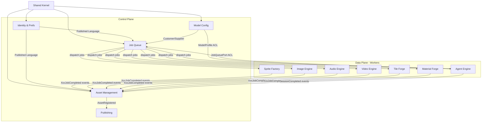

# Documento de Ingeniería Inversa Completa: Sorceress → Rust + Tauri v2

> Versión 1.0 — Abril 2026
> Documento consolidado con toda la investigación: modelos IA, arquitectura Tauri v2, diseño DDD bounded contexts, algoritmos, UX, y hoja de ruta.

---

## Estructura del Documento

Este documento combina 4 fuentes de investigación en un único archivo:

1. **Documento Maestro** (1,368 líneas) — Síntesis organizada con análisis y recomendaciones
2. **Modelos IA Game Tools** (622 líneas) — Investigación profunda de modelos por categoría
3. **Arquitectura Tauri v2** (1,749 líneas) — Stack técnico detallado
4. **DDD Bounded Contexts** (1,776 líneas) — Diseño de dominio completo

**Total: 5,515 líneas de investigación consolidadas.**

---

# Documento de Ingeniería Inversa: Sorceress → Aplicación Rust + Tauri v2

> Versión 1.0 — Abril 2026
> Documento autocontenido de arquitectura, diseño y hoja de ruta para construir un clon funcional de Sorceress usando Rust, Tauri v2 y DDD.

---

## Tabla de Contenidos

1. [Resumen Ejecutivo](#1-resumen-ejecutivo)
2. [Inventario Completo de Features](#2-inventario-completo-de-features)
3. [Modelos de IA — Estado del Arte (Abril 2026)](#3-modelos-de-ia--estado-del-arte-abril-2026)
4. [Arquitectura del Sistema](#4-arquitectura-del-sistema)
5. [Stack Tecnológico Detallado](#5-stack-tecnológico-detallado)
6. [Flujo de Datos por Feature](#6-flujo-de-datos-por-feature)
7. [UX y Diseño de Interfaz](#7-ux-y-diseño-de-interfaz)
8. [Roadmap de Desarrollo](#8-roadmap-de-desarrollo)
9. [Riesgos y Mitigaciones](#9-riesgos-y-mitigaciones)
10. [Referencias](#10-referencias)

---

## 1. Resumen Ejecutivo

### Que es Sorceress

Sorceress es una suite de herramientas creativas con IA orientada a game developers independientes. Su propuesta de valor central es reunir en una sola aplicación desktop todas las tareas de producción de assets que normalmente requieren docenas de herramientas distintas: generación de imágenes, sprites, tilesets, materiales PBR, efectos de sonido, música, voz, y codificación asistida por agentes. El usuario objetivo es el desarrollador indie que trabaja solo o en equipos pequeños y necesita producir assets de calidad sin los recursos de un estudio grande.

La arquitectura de Sorceress combina procesamiento local (modelos de IA que corren en la GPU del usuario) con llamadas a APIs cloud de pago según la capacidad del hardware disponible. Esta dualidad local/cloud permite que la herramienta funcione en hardware modesto usando APIs externas y en hardware potente (RTX 3090/4090 o superior) usando modelos completamente locales. La monetización original de Sorceress mezcla un tier gratuito limitado con suscripciones Pro y créditos de uso para las operaciones que consumen más recursos.

Sorceress no es únicamente un wrapper de APIs: incorpora flujos de trabajo completos específicos para game dev, como el pipeline Auto-Sprite (video → spritesheet con metafile para Godot/Unity), la generación de tilesets seamless con Wang tiles, la creación de materiales PBR desde una sola imagen, y un coding agent que puede generar sistemas completos de código para motores de juego con preview en tiempo real. Esta especialización de dominio es lo que distingue a Sorceress de herramientas de IA genéricas como Midjourney o ChatGPT.

### Que vamos a construir

Vamos a construir una aplicación desktop multiplataforma (Windows, macOS, Linux) que replica la funcionalidad core de Sorceress usando un stack completamente open source y sin dependencias de licencias propietarias. La aplicación se llamará igual internamente en el código base. El frontend será una aplicación web embebida en Tauri v2 (usando React o SvelteKit), el backend será Rust puro con un workspace de crates separados por dominio, y el procesamiento pesado de IA estará delegado a workers independientes que se comunican con el proceso principal via IPC.

La estrategia de construcción sigue los principios de Domain-Driven Design: cada dominio funcional (sprites, imágenes, audio, video, tiles, materiales, agente de código) vive en su propio bounded context con su propio lenguaje ubicuo, sus propias entidades y sus propias reglas de negocio. El proceso principal de Tauri actúa como Control Plane (orquestación, UI, base de datos) y los workers son el Data Plane (procesamiento pesado, inferencia de modelos). Esta separación garantiza que un fallo en la inferencia de un modelo no derrumbe la aplicación entera.

Para los modelos de IA se priorizarán modelos open source con licencias Apache 2.0 o MIT para máxima libertad comercial: FLUX.1-schnell para imagen, BiRefNet para background removal, AudioLDM 2 para SFX, Kokoro-82M para TTS, y Qwen3 14B para coding. Cuando la calidad local no sea suficiente o el hardware del usuario no soporte los modelos, el sistema fallback automáticamente a APIs de pago (FLUX.2 API, ElevenLabs (suite unificada), DeepSeek-V3.2 API, Claude Sonnet 4.6) con costos transparentes para el usuario.

### Stack tecnológico elegido y por qué

| Capa | Tecnología | Razón de la elección |
|------|------------|----------------------|
| Framework desktop | Tauri v2 (Rust) | Binarios de 2-5 MB vs 150 MB de Electron; seguridad por defecto; Rust nativo |
| Frontend | React + Vite o SvelteKit | Ecosistema robusto; SvelteKit compila a JS vanilla sin runtime |
| UI components | shadcn/ui + Tailwind CSS | Componentes copiables sin vendor lock-in; accesibilidad; dark mode nativo |
| Canvas | PixiJS (sprite viewer) + Konva.js (editor interactivo) | WebGL para performance; Canvas2D para edición con layers |
| State management | Zustand (React) / Svelte Stores | Mínimo boilerplate; sin Redux overhead |
| Backend Rust | Workspace con crates por dominio | Separación de concerns; compilación incremental; sin dependencias cruzadas |
| Inferencia local | candle (HuggingFace) + ort (ONNX Runtime) | Pure Rust; soporte CUDA/Metal; compatible con safetensors y GGUF |
| LLM grandes | llama.cpp como sidecar | Mejor optimización de cuantización GGUF para modelos 7B-70B |
| GPU compute | wgpu | Cross-platform; WebGPU compatible; sin dependencia CUDA directa para shaders |
| Base de datos | SQLite via sqlx | Persistencia local sin servidor; SQL expresivo; migraciones; ACID |
| HTTP server local | axum | Ergonómico; tokio nativo; usado por los workers para exponer REST API |
| IPC workers | Unix Domain Sockets / Named Pipes | Sin overhead de red; framing JSON-lines; simple de implementar |

La elección de Tauri frente a Electron no es ideológica sino práctica: el binario base de Tauri ocupa ~3 MB frente a ~150 MB de Electron, el uso de memoria es significativamente menor porque usa el WebView nativo del sistema operativo, y Rust proporciona garantías de memoria en tiempo de compilación que reducen drásticamente las clases de bugs en producción.

### Estimación de esfuerzo

| Fase | Semanas | Desarrolladores | Complejidad |
|------|---------|-----------------|-------------|
| Fase 0: Fundaciones | 1-2 | 1-2 | Media |
| Fase 1: Core Tools (sin IA) | 3-6 | 2 | Alta |
| Fase 2: IA Integration | 7-10 | 2-3 | Muy Alta |
| Fase 3: Coding Agent | 11-14 | 2-3 | Muy Alta |
| Fase 4: Publishing y Polish | 15-18 | 2 | Media |
| **Total** | **18 semanas** | **2-3 personas** | — |

Para un desarrollador solo con experiencia en Rust y React/Svelte, multiplicar el tiempo estimado por 1.5x (27 semanas). Para un equipo de 4+, las fases 2 y 3 pueden ejecutarse en paralelo reduciendo a ~14 semanas.

---

## 2. Inventario Completo de Features

La siguiente tabla compila todas las features identificadas en Sorceress, organizadas por categoría funcional. Las categorías corresponden directamente a los bounded contexts del sistema (ver sección 4).

| # | Feature | Categoría | Tipo | Complejidad | Prioridad |
|---|---------|-----------|------|-------------|-----------|
| 1 | **Auto-Sprite** | Sprite Factory | Pro | Alta | P0 |
| 2 | **Sprite Sheet Slicer** | Sprite Factory | Free | Media | P0 |
| 3 | **Pixel Art Converter** | Sprite Factory | Pro | Media | P1 |
| 4 | **3D to 2D Renderer** | Sprite Factory | Pro | Alta | P2 |
| 5 | **Image Generation** | Image Engine | Credit | Alta | P0 |
| 6 | **Background Removal** | Image Engine | Pro | Media | P0 |
| 7 | **Outpainting / Image Expansion** | Image Engine | Credit | Alta | P1 |
| 8 | **Inpainting** | Image Engine | Credit | Alta | P1 |
| 9 | **Image-to-Video** | Video Engine | Credit | Muy Alta | P2 |
| 10 | **Quick Sprites (Video Gen → Sprite)** | Video Engine | Credit | Muy Alta | P2 |
| 11 | **SFX Generation** | Audio Engine | Credit | Alta | P1 |
| 12 | **Music Generation** | Audio Engine | Credit | Alta | P1 |
| 13 | **Speech / Voice Generation** | Audio Engine | Credit | Alta | P1 |
| 14 | **Tile Generator** | Tile Forge | Credit | Alta | P1 |
| 15 | **Seamless Texture Generator** | Tile Forge | Credit | Alta | P1 |
| 16 | **PBR Material Generator** | Material Forge | Credit | Muy Alta | P2 |
| 17 | **AI Coding Agent** | Agent Engine | Pro | Muy Alta | P1 |
| 18 | **Project Manager** | Asset Management | Free | Baja | P0 |
| 19 | **Asset Library / Browser** | Asset Management | Free | Media | P0 |
| 20 | **Model Configuration** | Model Config | Free | Media | P0 |
| 21 | **Game Publishing / Arcade** | Publishing | Pro | Alta | P3 |

### Descripciones detalladas

**1. Auto-Sprite**: Convierte un video (MP4, GIF, WEBM) en un spritesheet optimizado con metafile para motores de juego. El proceso incluye extracción de frames a FPS configurable, deduplicación perceptual de frames similares, packing óptimo en atlas, y generación de metadatos en formato Aseprite, Godot (.tres), Unity (.json) o TexturePacker. Soporta detección automática de regiones de sprite con fondo transparente.

**2. Sprite Sheet Slicer**: Herramienta para cortar spritesheets existentes en sprites individuales. Permite slicing manual por grid (filas/columnas, padding, offsets) o detección automática de sprites por bounding box de contenido. Exporta frames individuales o reorganiza el atlas con mejor compactación. Esencial para trabajar con assets comprados o descargados.

**3. Pixel Art Converter**: Transforma cualquier imagen de alta resolución en pixel art estilizado. El pipeline aplica downscale con nearest-neighbor, cuantización de color (algoritmo Wu o k-means), dithering seleccionable (Floyd-Steinberg, Bayer, Atkinson), realce de bordes opcional (Sobel), y generación de paleta exportable. También soporta aplicar una paleta predefinida (Pico-8, GameBoy, NES) para coherencia visual entre assets.

**4. 3D to 2D Renderer**: Renderiza modelos 3D (GLTF/GLB, OBJ) desde múltiples ángulos para generar sprites 2D isométricos o top-down. Configura cámara ortográfica o perspectiva, iluminación, y exporta frames de animación si el modelo tiene rig. Reduce drásticamente el tiempo de producción de sprite sets para juegos con perspectiva isométrica.

**5. Image Generation**: Generación de imágenes de game art desde prompt de texto. Soporta múltiples estilos presets (pixel art, cartoon, painterly, sci-fi, fantasy), ajuste de resolución, batch de variantes con distintos seeds, y selección del modelo a usar (local o cloud). El prompt se enriquece automáticamente con keywords de game art según el estilo seleccionado.

**6. Background Removal**: Eliminación del fondo de imágenes de forma automática usando modelos de segmentación semántica. Produce una imagen RGBA con canal alpha preciso alrededor del objeto principal. Soporta refino manual de la máscara con herramienta de pincel. Funciona especialmente bien en sprites de personajes y objetos sobre fondo uniforme, y también en imágenes complejas con fondos naturales.

**7. Outpainting / Image Expansion**: Extiende el canvas de una imagen más allá de sus bordes originales generando contenido coherente con el contexto visual. Permite expandir en cualquier dirección y cualquier cantidad de píxeles. Útil para crear fondos panorámicos a partir de una imagen base o para ajustar proporciones de un asset sin rehacerlo desde cero.

**8. Inpainting**: Rellena o edita regiones específicas de una imagen indicadas por una máscara. El modelo genera contenido coherente con el resto de la imagen. Casos de uso incluyen eliminar objetos, cambiar texturas de partes específicas, o corregir artefactos en imágenes generadas.

**9. Image-to-Video**: Genera un clip de video animado a partir de una imagen estática, con control de movimiento y estilo visual. Los clips son cortos (2-8 segundos) y están diseñados para ser usados como base para extraer spritesheets animados. Actualmente solo viable via APIs cloud (Kling, Wan, Veo) dado el VRAM requerido por los modelos locales.

**10. Quick Sprites**: Pipeline combinado que ejecuta Image-to-Video seguido de Auto-Sprite en un solo paso. El usuario define el personaje o elemento (via prompt o imagen), el número de frames y el FPS deseado, y obtiene directamente un spritesheet listo para usar. Abstrae completamente la complejidad de los pasos intermedios.

**11. SFX Generation**: Genera efectos de sonido para juegos desde una descripción textual (ej: "footstep on gravel", "sword clash metal", "magic spell cast"). Produce archivos WAV/OGG de corta duración (0.5-5 segundos). Soporta presets de categorías comunes (pasos, impactos, magia, interfaz, ambiental) y ajuste de parámetros (duración, variación aleatoria, seed).

**12. Music Generation**: Genera música de fondo para juegos desde una descripción de estilo y mood (ej: "upbeat adventure loop, 120 BPM, chiptune"). Produce loops de 15-60 segundos diseñados para reproducción continua sin cortes perceptibles. La mayor limitación técnica actual es la ausencia de modelos open source con licencia comercial libre que igualen la calidad de Suno/Udio.

**13. Speech / Voice Generation**: Síntesis de voz para diálogos de personajes, narración o tutoriales. Soporta múltiples perfiles de voz, ajuste de velocidad y entonación, y clonación de voz a partir de una muestra de referencia de 10-15 segundos. Produce archivos WAV/OGG listos para integrar en el motor de juego.

**14. Tile Generator**: Genera tiles individuales desde prompt de texto, con control del estilo visual, bioma o ambiente (bosque, mazmorra, cielo), y categoría (suelo, muro, decoración). Los tiles se generan garantizando que sean seamless por defecto. Permite generar variantes de un tile base (dañado, mojado, cubierto de nieve) con coherencia visual.

**15. Seamless Texture Generator**: Genera texturas tileable desde prompt o imagen de referencia. Aplica técnicas de mirror padding, ControlNet tile y verificación de tileabilidad automática. Soporta texturas PBR simples (solo albedo) o completas (albedo + normal + roughness). También puede hacer seamless una textura existente que no lo sea.

**16. PBR Material Generator**: Genera sets completos de mapas PBR (albedo, normal, roughness, metallic, ambient occlusion, height) desde un prompt de texto o imagen de referencia. Los mapas son coherentes entre sí y listos para usar en Godot, Unity o Unreal. El pipeline infiere los mapas derivados (normal desde depth, roughness desde luminance del albedo) cuando no se generan directamente.

**17. AI Coding Agent**: Agente de IA conversacional que genera, edita y refactoriza código para motores de juego (Godot GDScript, Unity C#, HTML5/Phaser). El agente mantiene el contexto del workspace, genera un plan de pasos visible al usuario, ejecuta los cambios en un sandbox, muestra diffs coloreados de cada modificación, crea checkpoints para rollback, y puede delegar a otros engines (ej: pedir al Image Engine que genere una textura que el código necesita).

**18. Project Manager**: Gestión del ciclo de vida de proyectos: crear, abrir, renombrar, archivar. Cada proyecto tiene un directorio raíz en el filesystem del usuario donde todos los assets se organizan. Soporta múltiples proyectos abiertos simultáneamente en diferentes ventanas.

**19. Asset Library / Browser**: Navegador de todos los assets del proyecto con filtrado por tipo, tags, fecha y origen (importado, generado, derivado). Muestra previews en miniatura, metadata completa, y el árbol de linaje (de qué asset se derivó este). Permite organizar assets en colecciones y exportar selecciones.

**20. Model Configuration**: Panel de configuración para gestionar los modelos de IA disponibles: registrar API keys (almacenadas en el keychain del OS), configurar rutas de modelos locales, definir reglas de routing (qué modelo usar para qué operación y calidad), y ver el uso de quota por proveedor.

**21. Game Publishing / Arcade**: Empaqueta el juego en un formato jugable y lo publica en plataformas de distribución (itch.io, GameJolt) o genera un embed web. Incluye una vista de arcade donde el usuario puede jugar su juego directamente dentro de Sorceress. Es el context más downstream y el de menor prioridad en el MVP.

---

## 3. Modelos de IA — Estado del Arte (Abril 2026)

Esta sección sintetiza las opciones disponibles por categoría de feature, con análisis y veredicto para el MVP. El criterio principal es: **licencia Apache 2.0 o MIT primero**, luego calidad, luego viabilidad en hardware del usuario promedio (16-24 GB VRAM).

### 3.1 Image Generation

| Tipo | Nombre | Params | VRAM | Licencia | Calidad |
|------|--------|--------|------|----------|---------|
| Open source | FLUX.1-schnell | 12B | 12 GB (8 GB Q4) | Apache 2.0 | 4/5 |
| Open source | FLUX.1-dev | 12B | 16 GB | No comercial | 4.5/5 |
| Open source | SD 3.5 Large | 8B | 16 GB | Stability (libre <$1M) | 4/5 |
| Open source | SD 3.5 Medium | 2.5B | 8 GB | Stability | 3.5/5 |
| API | fal.ai FLUX schnell | — | — | — (API) | 4/5 |
| API | BFL FLUX1.1 pro Ultra | — | — | — (API) | 5/5 |
| API | FLUX.2 [pro] (Black Forest Labs) | — | — | — (API) | 4.5/5 ($0.03/img) |
| API | FLUX.2 [max] (Black Forest Labs) | — | — | — (API) | 5/5 ($0.07/img) |
| Clasico | Perlin noise + L-systems | — | — | — | N/A |

**Libreria Rust**: `candle` (HuggingFace) para inferencia local via safetensors/GGUF; `ort` (ONNX Runtime) para modelos exportados; `reqwest` + `serde_json` para APIs.

**Nota (nov 2025 – ene 2026)**: FLUX.2 [pro] ($0.03/img) y FLUX.2 [max] ($0.07/img) son los modelos top de pago de Black Forest Labs. FLUX.1 Kontext introduce un nuevo paradigma de edicion in-context (inpainting guiado por instruccion de lenguaje natural) especialmente util para edicion iterativa de sprites.

**Veredicto MVP**: FLUX.1-schnell como modelo local principal. Es la unica opcion que combina licencia Apache 2.0, calidad ≥4/5 y convergencia en 1-4 pasos (vs 20-50 pasos de SD 1.x). En hardware con <12 GB VRAM, usar version Q4 cuantizada (~8 GB) o hacer fallback a FLUX.2 [pro] via API ($0.03/imagen). No usar FLUX.1-dev en produccion: su licencia no-comercial crea riesgo legal.

### 3.2 Background Removal

| Tipo | Nombre | Params | VRAM | Licencia | Calidad |
|------|--------|--------|------|----------|---------|
| Open source | BiRefNet | ~100M | 4 GB | MIT | 4.5/5 |
| Open source | BiRefNet-lite | ~50M | 2 GB | MIT | 4/5 |
| Open source | SAM 2.1 Large | ~310M | 4 GB | Apache 2.0 | 5/5 |
| Open source | SAM 2.1 Base+ | ~80M | 2 GB | Apache 2.0 | 4.5/5 |
| Open source | RMBG-2.0 | ~200M | 2 GB | CC BY-NC | 5/5 |
| API | fal.ai RMBG-2.0 | — | — | — | 5/5 |
| API | fal.ai Background Removal | — | — | ~$0.003/img | 4.5/5 |
| Clasico | GrabCut (OpenCV) | — | CPU | — | 3/5 |

**Libreria Rust**: `ort` con modelo BiRefNet exportado a ONNX; `imageproc` para post-proceso de mascaras (morfologia, suavizado de bordes).

**Veredicto MVP**: BiRefNet (MIT) para batch processing automatico sin interaccion del usuario; SAM 2.1 Base+ para segmentacion interactiva donde el usuario indica puntos de referencia. RMBG-2.0 tiene mejor calidad pero su licencia CC BY-NC es un problema para uso comercial sin acuerdo con BRIA AI. No bloquear el MVP por esto: BiRefNet es suficiente.

**Analisis critico**: SAM 2.1 es superiormente flexible (puede segmentar cualquier objeto con prompt de punto/caja), pero BiRefNet esta optimizado especificamente para separacion objeto/fondo, que es el caso de uso dominante en game dev. Usar ambos segun el contexto es la estrategia correcta.

### 3.3 Pixel Art Conversion

No existe un modelo de IA con licencia libre que supere consistentemente a los algoritmos clasicos para esta tarea. El pipeline optimo es puramente clasico:

| Paso | Algoritmo | Libreria Rust | Complejidad |
|------|-----------|---------------|-------------|
| Downscale | Nearest-neighbor | `image` (FilterType::Nearest) | O(1) |
| Cuantizacion de color | Wu's Algorithm o k-means | `quantette` | O(n) |
| Dithering | Floyd-Steinberg o Bayer | implementacion custom | O(n) |
| Outline | Sobel + thresholding | `imageproc` | O(n) |
| Paleta exportable | k-means en espacio Lab | `palette` | O(n·k·i) |

**Veredicto MVP**: Implementacion Rust pura con `image` + `imageproc` + `quantette`. Sin dependencias de modelos IA. Calidad suficiente para el 95% de los casos de uso. El crate `quantette` implementa Wu's algorithm que es O(n) y produce paletas perceptualmente optimas. Para casos especiales con LoRA de pixel art (SDXL), delegar al Image Engine con model profile "pixel-art-xl".

### 3.4 SFX Generation

| Tipo | Nombre | Tamaño | VRAM | Licencia | Calidad |
|------|--------|--------|------|----------|---------|
| Open source | AudioLDM 2 | ~2.5 GB | 8 GB | Apache 2.0 | 3.5/5 |
| Open source | AudioLDM 2-Full | ~3.5 GB | 10 GB | Apache 2.0 | 4/5 |
| Open source | Stable Audio Open 1.0 | ~2 GB | 8 GB | Stability | 4/5 |
| Open source | Tango 2 | ~2 GB | 8 GB | Apache 2.0 | 3.5/5 |
| API | ElevenLabs SFX (suite unificada) | — | — | desde $6/mes Starter | 4.5/5 |
| API | Stability AI Audio | — | — | $0.012/seg | 4/5 |
| Clasico | Sintesis FM + ADSR | — | CPU | — | Retro |

**Libreria Rust**: `cpal` (playback cross-platform), `rodio` (alto nivel sobre cpal), `hound` (WAV I/O), `symphonia` (decode multi-formato).

**Veredicto MVP**: AudioLDM 2 con licencia Apache 2.0 para inferencia local. Genera hasta 10 segundos de SFX desde texto descriptivo. El modelo entiende bien descriptores de game audio ("footsteps on stone", "laser beam", "coin pickup chime"). Para hardware sin GPU capaz, fallback a ElevenLabs SFX API (plan Starter $6/mes incluye SFX + Music + TTS en una sola integracion).

**Nota critica**: AudioGen Medium de Meta tiene mejor calidad pero su licencia CC BY-NC lo excluye de uso comercial. Stable Audio Open 1.0 tiene mejor calidad que AudioLDM 2 pero la licencia Stability AI tiene restricciones para revenue >$1M. Para el MVP (volumen bajo), Stable Audio Open es una opcion valida. **ElevenLabs consolida desde 2025 una suite completa (SFX + Music + TTS + Voice Cloning) accesible desde $6/mes Starter**, lo que simplifica la integracion al usar un unico proveedor para todo el audio cloud.

### 3.5 Music Generation

Esta categoria tiene la brecha mas grande entre open source y closed source. No existe a abril 2026 un modelo de musica open source con licencia Apache 2.0/MIT que iguale la calidad de Suno v4 o Udio.

| Tipo | Nombre | Licencia | Calidad | Limitacion |
|------|--------|----------|---------|------------|
| Open source | MusicGen Large | CC BY-NC | 4/5 | NO comercial |
| Open source | Stable Audio Open | Stability | 3.5/5 | Loops cortos |
| API | Suno v4 | — | 5/5 | Basic $8/mes (500 canciones) |
| API | Udio | — | 4.5/5 | $10/mes |
| API | ElevenLabs Music (suite) | — | 4/5 | Incluido desde $6/mes Starter |
| Clasico | MIDI procedural + Markov | MIT | Variable | Requiere diseno manual |

**Veredicto MVP**: Dos estrategias en paralelo. (1) Para usuarios que priorizan calidad: Suno API (Basic $8/mes, 500 canciones) o ElevenLabs Music (integrada en la misma suite que SFX y TTS, desde $6/mes) con costos transparentes. (2) Para usuarios que priorizan costo cero: sintesis procedural MIDI con samples de Game Music Kit (dominio publico/CC0) usando `midly` + `fundsp`. La segunda opcion produce musica de menor calidad pero completamente libre. **No intentar usar MusicGen en produccion comercial sin acuerdo explico de licencia.**

### 3.6 Speech / Voice Generation

| Tipo | Nombre | Tamaño | VRAM | Licencia | Calidad |
|------|--------|--------|------|----------|---------|
| Open source | Kokoro-82M | 330 MB | CPU ok | Apache 2.0 | 4/5 |
| Open source | Parler-TTS Mini | 880M | 4 GB | Apache 2.0 | 3.5/5 |
| Open source | F5-TTS | ~300 MB | 2 GB | CC BY-NC | 4/5 |
| Open source | XTTS v2 | ~1.8 GB | 4 GB | Coqui NC | 4.5/5 |
| API | ElevenLabs (suite unificada) | — | — | desde Starter $6/mes (licencia comercial) | 5/5 |
| API | OpenAI gpt-realtime-1.5 | — | — | $0.06/min | 4.5/5 |
| API | Cartesia | — | — | $0.015/min | 4.5/5 |

**Libreria Rust**: `ort` con Kokoro exportado a ONNX (ya hay exportaciones disponibles en HuggingFace); `rubato` para resampling; `hound` para output WAV.

**Veredicto MVP**: Kokoro-82M (Apache 2.0) para TTS estandar. A pesar de sus solo 82 millones de parametros, produce voz de calidad sorprendente en ingles con latencia de 50-100ms en CPU moderna. No requiere GPU. Para voice cloning (caracteristica avanzada), usar F5-TTS via API externa dado que su licencia CC BY-NC lo excluye del producto comercial directamente. ElevenLabs para maxima calidad en el tier Pro (suite completa SFX + Music + TTS desde $6/mes Starter). Para NPCs con dialogo en tiempo real, OpenAI gpt-realtime-1.5 ofrece la menor latencia de respuesta de voz conversacional.

### 3.7 Image-to-Video

Esta categoria es la mas costosa en VRAM. Los modelos locales requieren 16-24 GB de VRAM, lo que excluye la mayoria del hardware consumer.

| Tipo | Nombre | Params | VRAM | Licencia | Calidad |
|------|--------|--------|------|----------|---------|
| Open source | CogVideoX-5B | 5B | 16 GB | Apache 2.0 | 4/5 |
| Open source | Wan2.1 14B | 14B | 24 GB | Apache 2.0 | 4.5/5 |
| Open source | AnimateDiff v3 | ~3 GB | 8 GB | Apache 2.0 | 3/5 |
| API | fal.ai Kling 2.5 | — | — | $0.07/seg | 4.5/5 |
| API | fal.ai Wan 2.5 | — | — | $0.05/seg | 4/5 |
| API | fal.ai Veo 3 | — | — | $0.40/seg | 5/5 |

**Veredicto MVP**: Delegar completamente a APIs cloud en el MVP. AnimateDiff sobre SD es la unica opcion en 8 GB VRAM pero su calidad (3/5) es insuficiente para el caso de uso principal. fal.ai + Wan 2.5 a $0.05/segundo es la mejor relacion calidad/precio para el tier Pro. Implementar inferencia local de CogVideoX-5B como feature opt-in para usuarios con RTX 3090/4090 (16+ GB VRAM).

### 3.8 PBR Materials

No existe un modelo open source maduro y con licencia libre para generar sets PBR completos desde texto. El pipeline mas practico combina generacion de albedo + derivacion computacional de los mapas restantes:

| Paso | Metodo | Herramienta Rust | Calidad |
|------|--------|------------------|---------|
| Albedo | FLUX.1-schnell (Apache 2.0) | candle | 4/5 |
| Depth | Depth-Anything-V2 (Apache 2.0) via ONNX | ort | 4/5 |
| Normal desde Depth | Gradiente Sobel 3D (algoritmo clasico) | imageproc + glam | 3.5/5 |
| Roughness | Heuristica: inversa de luminance del albedo | custom | 3/5 |
| Metallic | Clasificacion por saturacion/valor HSV | custom | 3/5 |
| AO | SSAO en shader | wgpu | 3.5/5 |

**APIs 3D especializadas (2025-2026)**:

| API | Modelo | Precio aprox. | Calidad | Nota |
|-----|--------|---------------|---------|------|
| Meshy | Meshy 5 | por creditos | 4.5/5 | Plugin oficial para Godot; assets 3D + PBR desde texto/imagen |
| Tripo | Tripo v3.0 Ultra | por creditos | 4.5/5 | Alta fidelidad 3D con mapas PBR completos |
| Stability AI | — | API | 4/5 | Texturizado PBR desde imagen |

**Veredicto MVP**: Pipeline hibrido clasico-IA para uso rapido. La calidad de los mapas derivados (normal, roughness) sera inferior a herramientas especializadas como Adobe Substance 3D, pero es funcional para prototipos y juegos indie donde la fidelidad PBR exacta no es critica. Para usuarios que necesitan calidad profesional, Meshy 5 (con su plugin Godot) es la opcion API principal; Tripo v3.0 Ultra como alternativa de alta fidelidad.

### 3.9 AI Coding Agent

| Tipo | Nombre | Params | VRAM | Licencia | Calidad codigo |
|------|--------|--------|------|----------|----------------|
| Open source local | Qwen3 72B | 72B | 48 GB (BF16) / 40 GB (int4) | Apache 2.0 | 5/5 |
| Open source local | Qwen3 14B | 14B | 16 GB int4 | Apache 2.0 | 4.5/5 |
| Open source local | Llama 4 Maverick | ~24B activos | 24 GB | Llama 4 Community | 4.5/5 |
| Open source local | Llama 4 Scout | ~16B activos | 16 GB | Llama 4 Community | 4/5 |
| Open source local | Qwen2.5-Coder-32B | 32B | 24 GB (BF16) / 16 GB (int4) | Apache 2.0 | 4.5/5 (superado por Qwen3) |
| Open source local | Qwen2.5-Coder-7B | 7B | 6 GB int4 | Apache 2.0 | 4/5 |
| Open source local | DeepSeek-V3 | 671B MoE | Cluster | Si | 5/5 |
| API | Claude Sonnet 4.6 | — | — | $3/$15 per 1M | 5/5 |
| API | GPT-5.4 | — | — | $2.50/$15 per 1M | 5/5 |
| API | DeepSeek-V3.2 API | — | — | $0.28/$0.42 per 1M | 5/5 |
| API | Qwen2.5-Coder-32B (Together AI) | — | — | $0.80/$0.80 per 1M | 4.5/5 |

**Libreria Rust**: `llama-cpp-rs` o proceso sidecar llama.cpp para modelos GGUF locales; `async-openai` para APIs OpenAI-compatible; `reqwest` para Anthropic API; `tree-sitter` para analisis AST del codigo generado.

**Nota sobre modelos OSS actualizados**: Qwen3 (14B y 72B) supera a Qwen2.5-Coder en calidad de codigo y razonamiento. Qwen3 14B (~16 GB VRAM int4) es la nueva recomendacion para el tier gratuito local. DeepSeek-V3.2 incluye modo thinking integrado y es ~10x mas barato que Claude manteniendo calidad comparable para codigo.

**Veredicto MVP**: Estrategia de dos niveles. Nivel 1 (gratuito): Qwen3 14B local via llama.cpp GGUF Q4 (~10 GB RAM, sin GPU) — calidad superior a la generacion anterior para tareas de coding. Nivel 2 (Pro): Claude Sonnet 4.6 via API — maxima calidad, capaz de generar sistemas completos con razonamiento profundo. DeepSeek-V3.2 API es una alternativa economica a Claude ($0.28 input vs $3 de Anthropic) con calidad comparable o superior para codigo.

### Tabla resumen de decisiones para MVP

| Categoria | Modelo local (MVP) | API fallback | Licencia local |
|-----------|-------------------|--------------|----------------|
| Image Generation | FLUX.1-schnell Q4 | FLUX.2 [pro] $0.03/img | Apache 2.0 |
| Background Removal | BiRefNet | fal.ai $0.003/img | MIT |
| Pixel Art | Algoritmos clasicos | — | — |
| SFX | AudioLDM 2 | ElevenLabs (suite, $6/mes) | Apache 2.0 |
| Music | MIDI procedural | Suno v4 ($8/mes) o ElevenLabs Music | — |
| Speech | Kokoro-82M | ElevenLabs (suite) | Apache 2.0 |
| Image-to-Video | — (solo cloud MVP) | fal.ai Wan 2.5 | — |
| PBR Materials | Pipeline hibrido | Meshy 5 / Stability AI API | Apache 2.0 |
| Coding Agent | Qwen3 14B GGUF | Claude Sonnet 4.6 | Apache 2.0 |

---

## 4. Arquitectura del Sistema

### 4.1 Vision General

La arquitectura separa el sistema en dos planos con responsabilidades claras y comunicacion asincrona entre ellos:

```
╔══════════════════════════════════════════════════════════════════════╗
║                         CONTROL PLANE                               ║
║                  (proceso Tauri principal)                           ║
║                                                                      ║
║  ┌─────────────────────────────────────────────────────────────┐     ║
║  │  Frontend WebView (React/SvelteKit)                          │     ║
║  │  • UI components (shadcn/ui, Tailwind)                       │     ║
║  │  • Canvas editor (PixiJS + Konva)                            │     ║
║  │  • State management (Zustand / Svelte Stores)                │     ║
║  │  • Tauri IPC wrappers                                        │     ║
║  └──────────────────────┬──────────────────────────────────────┘     ║
║                         │ Tauri IPC (commands / events / channels)   ║
║  ┌──────────────────────▼──────────────────────────────────────┐     ║
║  │  Rust Backend (Tauri process)                                │     ║
║  │  ┌────────────┐  ┌────────────┐  ┌────────────┐             │     ║
║  │  │  Asset     │  │  Job Queue │  │  Model     │             │     ║
║  │  │  Mgmt      │  │  Context   │  │  Config    │             │     ║
║  │  └────────────┘  └─────┬──────┘  └────────────┘             │     ║
║  │  ┌────────────┐        │                                     │     ║
║  │  │ Identity & │        │ dispatch via IPC socket             │     ║
║  │  │ Prefs      │        │                                     │     ║
║  │  └────────────┘        │                                     │     ║
║  │  SQLite (sqlx) — assets, jobs, config, projects              │     ║
║  └─────────────────────────────────────────────────────────────┘     ║
╚══════════════════════════════════════════════════════════════════════╝
                           │
         ┌─────────────────┼──────────────────────────────┐
         │IPC socket       │IPC socket      IPC socket     │
         ▼                 ▼                               ▼
╔═════════════════╗ ╔══════════════════╗ ╔══════════════════════════╗
║  DATA PLANE     ║ ║  DATA PLANE      ║ ║  DATA PLANE              ║
║                 ║ ║                  ║ ║                          ║
║ sprite-worker   ║ ║  image-worker    ║ ║  audio-worker            ║
║ ─────────────── ║ ║  ──────────────  ║ ║  ──────────────────────  ║
║ • FFmpeg        ║ ║  • FLUX local    ║ ║  • AudioLDM 2            ║
║ • atlas packing ║ ║  • BiRefNet ONNX ║ ║  • Kokoro-82M            ║
║ • pixel art     ║ ║  • ComfyUI API   ║ ║  • rodio/cpal            ║
║ • crunch        ║ ║  • cloud APIs    ║ ║  • cloud APIs            ║
╚═════════════════╝ ╚══════════════════╝ ╚══════════════════════════╝
         │                 │                               │
╔═════════════════╗ ╔══════════════════╗ ╔══════════════════════════╗
║ tile-worker     ║ ║  material-worker ║ ║  agent-worker            ║
║ ─────────────── ║ ║  ──────────────  ║ ║  ──────────────────────  ║
║ • noise/WFC     ║ ║  • depth est.    ║ ║  • LLM streaming API     ║
║ • seamless      ║ ║  • normal maps   ║ ║  • llama.cpp sidecar     ║
║ • Wang tiles    ║ ║  • wgpu preview  ║ ║  • tree-sitter AST       ║
╚═════════════════╝ ╚══════════════════╝ ╚══════════════════════════╝

video-worker: CogVideoX / AnimateDiff / cloud APIs (fal.ai, Runway)
```

**Control Plane**: Baja latencia. Sin GPU. Sin bloqueos. Responde a la UI en <50ms. Solo orquesta: valida inputs, crea jobs, resuelve modelo, trackea progreso, persiste en SQLite, notifica al frontend via eventos Tauri.

**Data Plane**: Alta latencia. Puede usar GPU. Cada worker es un proceso OS independiente. No tiene estado propio — recibe jobs completos y devuelve resultados. El Control Plane detecta workers caidos y los relanza automaticamente.

### 4.2 Bounded Contexts (DDD)

Se identifican 11 bounded contexts organizados en tres planos funcionales:

| Context | Plano | Responsabilidad | Ubiquitous Language (terminos clave) |
|---------|-------|-----------------|--------------------------------------|
| Asset Management | Control | Ciclo de vida de todos los assets: guardar, versionar, organizar, exponer | Asset, AssetVersion, Collection, Project, DerivedFrom, ImportSource |
| Job Queue | Control | Recibir, priorizar, despachar y trackear jobs hacia workers | Job, JobSpec, JobPriority, WorkerCapacity, JobDependency, Retry |
| Model Configuration | Control | Gestionar modelos disponibles, API keys, routing, fallback chains | ModelProvider, ModelProfile, RoutingRule, FallbackChain, Quota |
| Identity & Prefs | Control | Perfil de usuario, preferencias UI, tier (Free/Pro), historial de uso | UserProfile, Preference, License, Tier |
| Sprite Factory | Data | Extraccion de frames, slicing, pixel art, atlas packing | SpriteSheet, Frame, AnimationClip, SliceGrid, PixelArtStyle, AtlasLayout |
| Image Engine | Data | Generacion, inpainting, outpainting, background removal | Prompt, Seed, DiffusionParams, ControlNet, Mask, Generation, Batch |
| Audio Engine | Data | SFX, musica, voz | AudioClip, SfxDescriptor, MusicGenre, VoiceLine, VoiceProfile, Loop |
| Video Engine | Data | Video generation, quick sprites | VideoClip, VideoPrompt, AnimationStyle, MotionGuidance, QuickSprite |
| Tile Forge | Data | Tilesets seamless, Wang tiles, auto-tiling | Tile, Tileset, SeamlessTile, WangTile, TileVariant, Biome, TileRule |
| Material Forge | Data | Mapas PBR completos desde imagen o prompt | PBRMaterial, AlbedoMap, NormalMap, RoughnessMap, MetallicMap, MaterialPrompt |
| Agent Engine | Data | Coding agent: planificacion, ejecucion, checkpoints | AgentSession, Task, Plan, Step, AgentThought, CodeChange, Checkpoint, Workspace |
| Publishing | Cross-cutting | Empaquetado y publicacion del juego | GameBuild, LayoutTemplate, ArcadeEntry, PublishTarget, PlaySession |

**Shared Kernel** (tipos compartidos entre todos los contexts, en crate `sorceress-shared-kernel`):

```rust
pub struct AssetId(Uuid);
pub struct JobId(Uuid);
pub struct ProjectId(Uuid);
pub struct SessionId(Uuid);
pub struct StoragePath(PathBuf);   // siempre relativo al project root_path
pub struct Timestamp(DateTime<Utc>);
pub struct Checksum(blake3::Hash);

pub enum ErrorKind {
    NotFound, ValidationError, ProcessingError,
    ExternalApiError, InsufficientResources, Cancelled,
}

pub trait DomainEvent: Send + Sync {
    fn event_id(&self) -> Uuid;
    fn occurred_at(&self) -> Timestamp;
    fn aggregate_id(&self) -> String;
    fn event_type(&self) -> &'static str;
}
```

**Regla de oro del Shared Kernel**: Un tipo solo va al Shared Kernel si cruza la frontera de al menos 3 contexts frecuentemente. Si un tipo solo se usa en un context, vive en ese context.

### 4.3 Context Map (relaciones entre contexts)

```
                 ┌──────────────────────────────────┐
                 │         SHARED KERNEL             │
                 │  AssetId, JobId, StoragePath,     │
                 │  Timestamp, Checksum, ErrorKind   │
                 └──────────────────────────────────┘
                              │ usa todos
         ┌────────────────────┼──────────────────────┐
         │                   │                       │
  ┌──────▼──────┐      ┌──────▼──────┐        ┌──────▼──────┐
  │ Identity &  │      │ Model Config│        │ Asset Mgmt  │
  │ Prefs       │      │             │        │             │
  │ (Upstream   │      │ (Upstream   │        │ (integra    │
  │ Published   │      │ Customer/   │        │ todos los   │
  │ Language)   │      │ Supplier)   │        │ outputs)    │
  └──────┬──────┘      └──────┬──────┘        └──────┬──────┘
         │ informa            │ router               │ AssetRegistered
         ▼                    ▼                       ▼
  ┌──────────────────────────────────────────────────────────┐
  │              JOB QUEUE CONTEXT                            │
  │         (Customer/Supplier con todos los engines)         │
  └──┬──────────┬──────────┬──────────┬──────────┬───────────┘
     │dispatch  │dispatch  │dispatch  │dispatch  │dispatch
     ▼          ▼          ▼          ▼          ▼
┌────────┐ ┌────────┐ ┌────────┐ ┌────────┐ ┌────────┐ ┌────────┐
│Sprite  │ │Image   │ │Audio   │ │Video   │ │Tile    │ │Material│
│Factory │ │Engine  │ │Engine  │ │Engine  │ │Forge   │ │Forge   │
└───┬────┘ └───┬────┘ └───┬────┘ └───┬────┘ └───┬────┘ └───┬────┘
    └──────────┴──────────┴──────────┴──────────┴────────────┘
                        │ XxxJobCompleted events
                        ▼
              ┌──────────────────┐
              │  ASSET MANAGEMENT│
              └────────┬─────────┘
                       ▼ AssetRegistered
               ┌───────────────┐
               │  PUBLISHING   │
               └───────────────┘

┌─────────────────────────────────────────────┐
│  AGENT ENGINE (usa Job Queue + Asset Mgmt + │
│  Model Config via ACL)                      │
└─────────────────────────────────────────────┘
```

| Upstream | Downstream | Patron | Descripcion |
|----------|------------|--------|-------------|
| Identity & Prefs | Todos | Published Language | Expone UserProfile y Tier; todos conforman |
| Model Config | Job Queue | Customer/Supplier | Job Queue consulta que modelo usar al despachar |
| Model Config | Todos los Engines | Customer/Supplier | Cada engine recibe ModelProfile ya resuelto en el JobSpec |
| Job Queue | Todos los Engines | Customer/Supplier | Job Queue despacha; cada engine es supplier de procesamiento |
| Todos los Engines | Asset Management | Conformist | Los engines publican eventos de completitud; Asset Management registra outputs |
| Asset Management | Publishing | Customer/Supplier | Publishing solo publica assets ya registrados |
| Agent Engine | Model Config | ACL | Agent Engine tiene su propio modelo de "LLM" que traduce via ACL al ModelProfile |
| Agent Engine | Job Queue | Customer | Agent Engine puede enviar jobs de Image/Audio como parte de sus steps |

### 4.4 Control Plane: Bounded Contexts y Responsabilidades

**Contexts en el Control Plane**: Asset Management, Job Queue, Model Configuration, Identity & Prefs, Publishing (parte de orquestacion).

**Responsabilidades del Control Plane**:
- Recibir acciones de la UI via Tauri IPC (commands sincronos)
- Validar inputs y resolver el modelo apropiado via Model Config
- Crear Jobs con prioridad y dependencias via Job Queue
- Trackear progreso de jobs y notificar frontend via Tauri Events
- Mantener el estado del proyecto en SQLite (assets, colecciones, versiones)
- Detectar workers caidos via heartbeat timeout y relanzarlos
- Enrutar resultados: registrar outputs como Assets y notificar al frontend

**Puertos y adaptadores del Control Plane**:

```
Inbound ports:
  Tauri IPC Adapter       -- comandos desde la WebView (invoke)
  Worker RPC Adapter      -- heartbeats y resultados desde workers via IPC socket
  HTTP Webhook Adapter    -- callbacks de APIs cloud (Replicate, etc.)

Outbound ports:
  SqliteJobRepository     -- persistencia de jobs, assets, proyectos
  FilesystemAdapter       -- validacion de paths, lectura de metadata
  WorkerIPCDispatcher     -- despacho de jobs a workers via Unix socket / Named Pipe
  TokioBroadcastPublisher -- event bus interno para eventos de dominio
  TauriEventEmitter       -- notificacion al frontend via tauri::emit
  OSKeychainAdapter       -- almacenamiento seguro de API keys
```

**Stack del Control Plane**: Proceso Tauri (tokio async runtime), SQLite via sqlx, Tauri commands/events/channels para IPC con frontend, Unix Domain Sockets o Named Pipes para comunicacion con workers.

### 4.5 Data Plane: Workers de Procesamiento

**Contexts en el Data Plane**: Sprite Factory, Image Engine, Audio Engine, Video Engine, Tile Forge, Material Forge, Agent Engine.

**Cada worker es un proceso OS independiente** lanzado como sidecar de Tauri:

```
sorceress (proceso Tauri principal)
  │
  ├── sprite-worker    (FFmpeg, image processing, atlas packing)
  ├── image-worker     (FLUX/SDXL local, ComfyUI API, BiRefNet, cloud APIs)
  ├── audio-worker     (AudioLDM 2, Kokoro, rodio, cloud APIs)
  ├── video-worker     (CogVideoX, AnimateDiff, cloud APIs)
  ├── tile-worker      (noise, WFC, seamless algorithms)
  ├── material-worker  (depth estimation, normal maps, wgpu preview)
  └── agent-worker     (LLM streaming, llama.cpp, tree-sitter, sandbox)
```

**Ciclo de vida de un worker**:
1. Tauri app lanza el worker como subprocess al iniciar o en demanda
2. Worker abre socket IPC, envia `WorkerRegistered` con su `WorkerKind` y capacidad de VRAM
3. Worker entra en loop: espera mensajes `dispatch_job` para su `WorkerKind`
4. Al recibir un job: procesa, reporta progreso cada ~1 segundo, envia `job_completed` o `job_failed`
5. Control Plane detecta ausencia de heartbeat (timeout configurable, default 30s) → `WorkerDied` → relanza

**Prioridades de la job queue**:

```
Critical  = 100  -- jobs bloqueantes de UI: preview en vivo, analisis rapido
High      = 75   -- jobs iniciados directamente por el usuario
Normal    = 50   -- generacion estandar
Background = 25  -- batch processing, pre-generacion, tareas de mantenimiento
```

**GPU slot management**: Los workers reportan su VRAM disponible en cada heartbeat. El Job Queue no despacha un job a un worker si no hay VRAM suficiente, manteniendo el job en estado `Queued` hasta que el worker libere recursos.

### 4.5 Comunicacion entre planos

**Protocolo IPC**: JSON sobre Unix Domain Sockets (macOS/Linux) y Named Pipes (Windows). Framing: prefijo de 4 bytes big-endian con la longitud del mensaje + JSON body. La simplicidad de JSON se prefiere sobre MessagePack en el MVP ya que los jobs son de larga duracion y el overhead de serializacion es irrelevante.

**Mensajes del protocolo**:

```
Control → Worker (dispatch):
{ "msg_type": "dispatch_job",
  "job_id": "uuid",
  "operation": "autosprite.generate",
  "params": { ... },
  "model_profile": { ... },
  "deadline_ms": 300000 }

Worker → Control (progreso):
{ "msg_type": "job_progress",
  "job_id": "uuid",
  "progress": 0.45,
  "message": "Extracting frames: 22/48" }

Worker → Control (completado):
{ "msg_type": "job_completed",
  "job_id": "uuid",
  "output_paths": ["path/a.png", "path/a.tres"],
  "duration_ms": 4230,
  "metadata": { "frame_count": 48 } }

Worker → Control (heartbeat):
{ "msg_type": "heartbeat",
  "worker_id": "uuid",
  "worker_kind": "SpriteFactory",
  "capacity": { "cpu_slots_free": 2, "vram_mb_free": 4096 } }
```

**Alternativa para modelos pequenos**: Workers con modelos <2 GB de VRAM pueden embeberse directamente en el proceso Tauri usando `candle` (sin sidecar), eliminando el overhead de IPC. Esto aplica a BiRefNet, Kokoro-82M y modelos ONNX pequenos.

---

## 5. Stack Tecnologico Detallado

### 5.1 Frontend

**Framework recomendado**: **SvelteKit** con adapter-static y Vite. Alternativamente React + Vite si el equipo ya lo conoce.

| Criterio | SvelteKit | React | Razon de peso |
|----------|-----------|-------|----------------|
| Bundle size | ~20 KB runtime | ~130 KB | En desktop la diferencia es marginal pero Svelte es mas limpio |
| Reactividad | Signals nativos (sin Virtual DOM) | Virtual DOM | Svelte evita re-renders innecesarios sin boilerplate |
| Ecosistema UI | Melt UI, Bits UI | shadcn/ui, Radix | shadcn/ui es superior en componentes de calidad |
| Curva de aprendizaje | Baja | Media | Svelte es mas accesible para desarrolladores nuevos |
| Veredicto MVP | **Preferida** | Valida si hay experiencia | La diferencia no es critica |

**Librerias UI**:
- `shadcn/ui` (React): componentes copiables sobre Radix UI + Tailwind CSS. Dark mode, accesibilidad ARIA, sin vendor lock-in.
- `Melt UI` o `Bits UI` (Svelte): equivalente de shadcn/ui para Svelte.
- `Tailwind CSS 4.x`: sistema de utilidades, paleta personalizada para el dark theme de game dev tools.

**Canvas y rendering**:

| Libreria | Renderer | Caso de uso en Sorceress |
|----------|----------|--------------------------|
| PixiJS 8.x | WebGL/WebGPU | Sprite viewer, animation playback, tilemap preview |
| Konva.js | Canvas2D | Editor interactivo: seleccion, drag, resize, layers |
| Fabric.js | Canvas2D | Composicion de assets, edicion vectorial ligera |
| Three.js | WebGL | Preview 3D para Material Forge y 3D-to-2D renderer |

**State management**:
- Zustand (React): store centralizado sin boilerplate excesivo; `immer` para mutaciones inmutables.
- Svelte Stores: reactividad nativa con `writable`/`derived`/`readable`; no se necesita libreria externa.

**Paleta dark theme** (para `tailwind.config`):
```
canvas:  #1a1a2e  -- fondo principal del area de trabajo
panel:   #16213e  -- fondos de paneles laterales
surface: #0f3460  -- cards, dialogs
accent:  #e94560  -- botones primarios, highlights
text:    #a8b2d8  -- texto secundario
```

### 5.2 Backend Rust

**Estructura del workspace Cargo**:

```
sorceress/
├── Cargo.toml                     -- workspace root
├── package.json                   -- frontend tooling
├── vite.config.ts
│
├── src/                           -- Frontend (SvelteKit o React)
│   ├── routes/
│   │   ├── +layout.svelte         -- shell con sidebar de navegacion
│   │   ├── +page.svelte           -- dashboard de proyectos
│   │   ├── sprite-factory/        -- Auto-Sprite, Slicer, Pixel Art
│   │   ├── image-engine/          -- Image Gen, BG Removal, Outpainting
│   │   ├── audio-engine/          -- SFX, Music, Voice
│   │   ├── tile-forge/            -- Tile Gen, Seamless
│   │   ├── material-forge/        -- PBR Materials
│   │   ├── agent-engine/          -- Coding Agent
│   │   └── settings/              -- Model Config, API Keys
│   └── lib/
│       ├── components/            -- componentes reutilizables
│       ├── stores/                -- estado global
│       └── tauri/                 -- wrappers de APIs Tauri
│
├── src-tauri/                     -- Tauri app (Control Plane)
│   ├── Cargo.toml
│   ├── tauri.conf.json
│   ├── capabilities/default.json
│   ├── migrations/                -- SQLite migrations
│   └── src/
│       ├── main.rs
│       ├── lib.rs                 -- entry point
│       ├── state.rs               -- AppState global
│       ├── setup.rs               -- inicializacion
│       └── commands/              -- Tauri IPC commands
│           ├── projects.rs
│           ├── assets.rs
│           ├── jobs.rs
│           └── settings.rs
│
├── crates/                        -- Control Plane crates
│   ├── sorceress-shared-kernel/   -- tipos primitivos compartidos
│   ├── sorceress-asset-management/
│   ├── sorceress-job-queue/
│   ├── sorceress-model-config/
│   ├── sorceress-identity/
│   └── sorceress-publishing/
│
└── workers/                       -- Data Plane (procesos independientes)
    ├── sprite-worker/
    ├── image-worker/
    ├── audio-worker/
    ├── video-worker/
    ├── tile-worker/
    ├── material-worker/
    └── agent-worker/
```

**Dependencias principales del workspace**:

```toml
[workspace.dependencies]
tokio       = { version = "1",   features = ["full"] }
serde       = { version = "1",   features = ["derive"] }
serde_json  = "1"
anyhow      = "1"
thiserror   = "2"
tracing     = "0.1"
uuid        = { version = "1",   features = ["v4", "serde"] }
chrono      = { version = "0.4", features = ["serde"] }
sqlx        = { version = "0.8", features = ["sqlite", "runtime-tokio", "migrate", "json", "uuid", "chrono"] }
```

**Dependencias del crate Tauri (`src-tauri`)**:

```toml
[dependencies]
tauri                     = { version = "2", features = ["tray-icon", "protocol-asset"] }
tauri-plugin-fs           = "2"
tauri-plugin-dialog       = "2"
tauri-plugin-shell        = "2"   # sidecars
tauri-plugin-sql          = { version = "2", features = ["sqlite"] }
tauri-plugin-store        = "2"
tauri-plugin-updater      = "2"
tauri-plugin-http         = "2"
tauri-plugin-notification = "2"
tauri-plugin-window-state = "2"
tauri-plugin-os           = "2"
axum        = "0.8"               # HTTP server para workers
notify      = "7"                 # file watching
sha2        = "0.10"
keyring     = "2"                 # OS keychain para API keys
```

**Integracion con Tauri v2**: El archivo `src-tauri/src/lib.rs` es el entry point de la aplicacion (anotado con `#[cfg_attr(mobile, tauri::mobile_entry_point)]`). Los Tauri commands son funciones async en Rust que reciben el `tauri::AppHandle` y el estado global `tauri::State<AppState>`, y devuelven `Result<T, String>`. Los eventos se emiten con `app.emit("event-name", payload)`. Los Channels se usan para streaming de datos pesados (tokens de LLM, chunks de imagen durante generacion).

**Cambio critico de Tauri v1 a v2**: Los permisos ya no se declaran en `allowlist` sino en `capabilities/*.json`. Cada ventana tiene permisos expliciticos. Los commands en el modulo `lib.rs` no pueden ser `pub` (limitacion del codegen de Tauri); en modulos separados si pueden.

### 5.3 Base de Datos

**Motor**: SQLite via `sqlx` con migraciones en `src-tauri/migrations/`.

**Schema inicial**:

```sql
-- 0001_initial.sql

CREATE TABLE projects (
    id          TEXT PRIMARY KEY,
    name        TEXT NOT NULL,
    root_path   TEXT NOT NULL,
    created_at  DATETIME DEFAULT CURRENT_TIMESTAMP,
    settings    JSON
);

CREATE TABLE assets (
    id              TEXT PRIMARY KEY,
    project_id      TEXT NOT NULL REFERENCES projects(id) ON DELETE CASCADE,
    collection_id   TEXT REFERENCES collections(id),
    kind            TEXT NOT NULL, -- Image|Audio|Video|SpriteSheet|Tileset|Material|Code
    name            TEXT NOT NULL,
    tags            JSON DEFAULT '[]',
    import_source   TEXT NOT NULL, -- uploaded|generated|derived
    created_at      DATETIME DEFAULT CURRENT_TIMESTAMP
);

CREATE TABLE asset_versions (
    id              TEXT PRIMARY KEY,
    asset_id        TEXT NOT NULL REFERENCES assets(id) ON DELETE CASCADE,
    storage_path    TEXT NOT NULL,
    checksum        TEXT NOT NULL,
    size_bytes      INTEGER,
    width_px        INTEGER,
    height_px       INTEGER,
    duration_ms     INTEGER,
    format          TEXT,
    derived_from    TEXT REFERENCES asset_versions(id),
    created_at      DATETIME DEFAULT CURRENT_TIMESTAMP
);

CREATE TABLE collections (
    id          TEXT PRIMARY KEY,
    project_id  TEXT NOT NULL REFERENCES projects(id) ON DELETE CASCADE,
    name        TEXT NOT NULL,
    created_at  DATETIME DEFAULT CURRENT_TIMESTAMP
);

CREATE TABLE jobs (
    id              TEXT PRIMARY KEY,
    worker_kind     TEXT NOT NULL,
    operation       TEXT NOT NULL,
    params          JSON NOT NULL,
    priority        INTEGER NOT NULL DEFAULT 50,
    status          TEXT NOT NULL DEFAULT 'Pending',
    worker_id       TEXT,
    result          JSON,
    error           TEXT,
    retries         INTEGER DEFAULT 0,
    max_retries     INTEGER DEFAULT 2,
    dependencies    JSON DEFAULT '[]',
    submitted_at    DATETIME DEFAULT CURRENT_TIMESTAMP,
    started_at      DATETIME,
    completed_at    DATETIME
);

CREATE TABLE model_profiles (
    id              TEXT PRIMARY KEY,
    name            TEXT NOT NULL,
    provider        TEXT NOT NULL, -- Local|Cloud
    model_id        TEXT NOT NULL,
    capabilities    JSON NOT NULL,
    params          JSON NOT NULL,
    quality_tier    TEXT NOT NULL, -- Draft|Standard|High|Ultra
    cost_per_unit   JSON
);

CREATE TABLE routing_rules (
    id                  TEXT PRIMARY KEY,
    operation_pattern   TEXT NOT NULL,
    target_profile_id   TEXT NOT NULL REFERENCES model_profiles(id),
    fallback_chain      JSON DEFAULT '[]',
    conditions          JSON DEFAULT '[]',
    priority            INTEGER DEFAULT 0
);

-- Indices
CREATE INDEX idx_assets_project ON assets(project_id);
CREATE INDEX idx_asset_versions_asset ON asset_versions(asset_id);
CREATE INDEX idx_jobs_status ON jobs(status, worker_kind);
CREATE INDEX idx_jobs_submitted ON jobs(submitted_at DESC);
```

### 5.4 Procesamiento de IA

**Estrategia por tamano de modelo**:

| Tamano modelo | Estrategia | Crate Rust |
|---------------|------------|------------|
| < 500 MB | En proceso Tauri (candle o ort) | `candle-core` o `tract-onnx` |
| 500 MB - 2 GB | En proceso con candle | `candle-core`, `candle-transformers` |
| 2 GB - 8 GB | Sidecar worker + REST API local | `axum` (worker), `reqwest` (cliente) |
| > 8 GB | Sidecar + opcion ComfyUI externo | `reqwest` hacia localhost:8188 |
| LLM GGUF | llama.cpp sidecar | `llama-cpp-rs` o subprocess |

**Inferencia local con candle**:

```toml
candle-core         = "0.9"
candle-nn           = "0.9"
candle-transformers = "0.9"
hf-hub              = { version = "0.3", features = ["tokio"] }
tokenizers          = "0.21"
```

Soporte de backends: CPU (MKL/Accelerate), CUDA (NVIDIA), Metal (Apple Silicon). Los modelos se descargan automaticamente desde HuggingFace Hub en el primer uso y se cachean en el directorio de datos de la aplicacion (~/.local/share/sorceress/models/ en Linux).

**Inferencia con ONNX Runtime (ort)**:

```toml
ort = { version = "2", features = ["cuda", "tensorrt"] }
```

Usado principalmente para BiRefNet (background removal) y Kokoro-82M (TTS), ambos disponibles como exports ONNX en HuggingFace. `ort` es mas maduro para modelos de vision/audio que `candle`.

**Fallback strategy**:

```
1. Comprobar si hay modelo local descargado y VRAM suficiente
2. Si no → usar API cloud configurada para esa operacion (Model Config routing rules)
3. Si no hay API key configurada → mostrar dialogo al usuario con opciones:
   a. Configurar API key (link a settings)
   b. Descargar modelo local (con estimacion de tamano y tiempo)
   c. Cancelar operacion
```

---

## 6. Flujo de Datos por Feature

### 6.1 Auto-Sprite (Video → Sprite Sheet)

**Descripcion**: El usuario arrastra un video MP4 de un walk cycle de personaje al panel Auto-Sprite. Quiere un spritesheet a 12 FPS para Godot.

```
┌────────────────────────────────────────────────────────────────┐
│ FRONTEND                                                        │
│  1. Drag & drop de video.mp4 → componente DropZone             │
│  2. Preview del primer frame en canvas PixiJS                   │
│  3. UI: configurar FPS=12, dedup=0.92, meta=Godot, format=PNG  │
│  4. Click "Generate" → invoke('auto_sprite_command', params)    │
└─────────────────────────────┬──────────────────────────────────┘
                              │ Tauri IPC command
                              ▼
┌────────────────────────────────────────────────────────────────┐
│ CONTROL PLANE (src-tauri)                                       │
│                                                                 │
│  auto_sprite_command(video_path, config):                       │
│    1. asset-management: ImportAsset(video.mp4) → asset_id="a1" │
│    2. model-config: ResolveModel("autosprite.*")                │
│       → no model needed (CPU/GPU processing local)             │
│    3. job-queue: SubmitJob(                                     │
│         worker_kind: SpriteFactory,                             │
│         operation: "autosprite.generate",                       │
│         params: { source: "a1", fps: 12, dedup: 0.92,         │
│                   format: "PNG", meta: "Godot" },              │
│         priority: High                                          │
│       ) → job_id="j1"                                          │
│    4. Returns job_id="j1" al frontend                           │
│    5. Frontend muestra progress bar ligada a job_id            │
└─────────────────────────────┬──────────────────────────────────┘
                              │ IPC socket dispatch
                              ▼
┌────────────────────────────────────────────────────────────────┐
│ DATA PLANE — sprite-worker                                      │
│                                                                 │
│  PASO 1 — Frame Extraction (0% → 30%)                          │
│    ffmpeg-next: extraer frames a 12 FPS → Vec<RgbaImage>       │
│    Deduplication: phash perceptual → eliminar frames con       │
│    similitud > 0.92 → resultado: 48 frames unicos              │
│    IPC progress: "Extracting frames: 32/60"                    │
│                                                                 │
│  PASO 2 — Atlas Packing (30% → 70%)                            │
│    crunch::pack_rects(frame_dimensions) → layout optimo        │
│    Render: pegar cada frame en la posicion del atlas           │
│    Resultado: spritesheet.png de 512x512 pixels                │
│                                                                 │
│  PASO 3 — MetaFile Generation (70% → 95%)                      │
│    Godot .tres format: generar SpriteFrames resource           │
│    AnimationClip "default": frames 0..47 a 12 FPS             │
│    Bounding boxes y pivot points por frame                     │
│                                                                 │
│  PASO 4 — Write outputs (95% → 100%)                           │
│    Escribe: assets/generated/spritesheet_a1.png                │
│    Escribe: assets/generated/spritesheet_a1.tres               │
│                                                                 │
│  IPC: job_completed { output_paths: [png, tres],               │
│                       metadata: { frame_count: 48 } }          │
└─────────────────────────────┬──────────────────────────────────┘
                              │ job_completed via IPC
                              ▼
┌────────────────────────────────────────────────────────────────┐
│ CONTROL PLANE — reaccion al completion                          │
│                                                                 │
│  job-queue: update_status(j1, Completed)                        │
│  asset-management: CreateDerivedAsset(source="a1",              │
│    path="spritesheet.png", kind=SpriteSheet) → asset_id="a2"   │
│  asset-management: CreateDerivedAsset(source="a1",              │
│    path="spritesheet.tres", kind=Code) → asset_id="a3"        │
│  tauri::emit("job_completed", { job_id:"j1",                   │
│    assets: ["a2", "a3"] })                                     │
└─────────────────────────────┬──────────────────────────────────┘
                              │ Tauri event
                              ▼
┌────────────────────────────────────────────────────────────────┐
│ FRONTEND — post-procesamiento                                   │
│                                                                 │
│  Renderiza spritesheet en PixiJS con grid overlay              │
│  Muestra AnimationClips detectados con preview animado         │
│  Botones: "Add to Collection", "Export", "Re-slice"            │
│  El .tres se puede previsualizar como copia de Godot embed     │
└────────────────────────────────────────────────────────────────┘
```

**Modelos/algoritmos usados**: FFmpeg (extraccion de frames), pHash (deduplicacion perceptual), algoritmo de rectangle packing (crunch), ninguna IA (procesamiento clasico). Tiempo estimado: 5-30 segundos segun duracion del video.

**Contexts participantes**: Asset Management, Job Queue, Sprite Factory.

### 6.2 Image Generation (Prompt → Game Art)

**Descripcion**: El usuario escribe "medieval knight, transparent background" y quiere 4 variantes en estilo pixel art de 256x256.

```
┌────────────────────────────────────────────────────────────────┐
│ FRONTEND                                                        │
│  1. Escribe prompt en campo de texto                           │
│  2. Selecciona preset "Pixel Art Style", batch=4, 256x256      │
│  3. Elige modelo: "Local - FLUX schnell Q4" o "Cloud - fal.ai" │
│  4. Click "Generate" → invoke('image_gen_command', params)     │
└─────────────────────────────┬──────────────────────────────────┘
                              │ Tauri IPC command
                              ▼
┌────────────────────────────────────────────────────────────────┐
│ CONTROL PLANE                                                   │
│                                                                 │
│  PASO 1 — Resolver modelo                                       │
│  model-config: ResolveModel("imagegen.txt2img",                 │
│    hints: { quality: Standard, style: PixelArt })              │
│  → ModelProfile { provider: Local,                             │
│      model_id: "flux-schnell-q4",                              │
│      params: { steps: 4, guidance: 0.0 } }                    │
│                                                                 │
│  PASO 2 — Enriquecer prompt (ACL: UI → domain)                 │
│  preset "Pixel Art" agrega automaticamente:                    │
│    positive: "..., pixel art, 8-bit, sprite, game asset"       │
│    negative: "blurry, photorealistic, 3D render"               │
│                                                                 │
│  PASO 3 — Submit job                                            │
│  job-queue: SubmitJob(ImageEngine, "imagegen.txt2img",         │
│    { prompt, negative_prompt, model_profile_id,                │
│      batch_size: 4, width: 256, height: 256 },                 │
│    priority: High) → job_id="j2"                               │
└─────────────────────────────┬──────────────────────────────────┘
                              │ IPC dispatch
                              ▼
┌────────────────────────────────────────────────────────────────┐
│ DATA PLANE — image-worker                                       │
│                                                                 │
│  PASO 1 — Seleccionar backend                                   │
│  model_profile.provider = Local →                              │
│    Si VRAM >= 8 GB: usa candle con FLUX schnell Q4             │
│    Sino: switch a ComfyUI local API (localhost:8188)           │
│    Sino: fallback a fal.ai API ($0.003/imagen)                 │
│                                                                 │
│  PASO 2 — Inferencia (0% → 90%)                                │
│  FLUX schnell: 4 pasos de denoising para cada imagen           │
│  Channels Tauri: streaming de progreso de generacion           │
│  Genera 4 imagenes PNG de 256x256 con seeds distintos          │
│                                                                 │
│  PASO 3 — Guardar outputs                                       │
│  Escribe: assets/generated/gen_{seed}.png (x4)                 │
│                                                                 │
│  IPC: job_completed { generations: [                           │
│    { seed: 42, path: "gen_42.png" },                           │
│    { seed: 1337, path: "gen_1337.png" }, ... ] }               │
└─────────────────────────────┬──────────────────────────────────┘
                              │ Completado
                              ▼
┌────────────────────────────────────────────────────────────────┐
│ FRONTEND                                                        │
│                                                                 │
│  Muestra 4 imagenes en grid con selector                       │
│  Botones por imagen: "Select", "Remove BG", "Variations"       │
│  "Remove BG" → nuevo job para image-worker ("imagegen.rembg")  │
│  "Add to Collection" → asset-management: ImportAsset           │
└────────────────────────────────────────────────────────────────┘
```

**Modelos usados**: FLUX.1-schnell (local, Apache 2.0) o fal.ai API como fallback. Para Remove BG: BiRefNet via ONNX Runtime. Tiempo estimado: 3-15 segundos para 4 imagenes en GPU dedicada.

**Contexts participantes**: Model Config, Job Queue, Image Engine, Asset Management.

### 6.3 AI Coding Agent

**Descripcion**: El usuario quiere crear un sistema de particulas para un hechizo de fuego en Godot 4. Escribe la tarea en lenguaje natural.

```
┌────────────────────────────────────────────────────────────────┐
│ FRONTEND                                                        │
│  1. Abre panel "Coding Agent"                                  │
│  2. Escribe: "Create a particle system for a fireball spell    │
│     effect in Godot 4 GDScript, burst emission, fade 2s"      │
│  3. (Opcional) Adjunta archivos del proyecto como contexto     │
│  4. Click "Start" → invoke('start_agent_session', params)     │
└─────────────────────────────┬──────────────────────────────────┘
                              │ Tauri IPC command
                              ▼
┌────────────────────────────────────────────────────────────────┐
│ CONTROL PLANE                                                   │
│                                                                 │
│  model-config: ResolveModel("agent.plan",                       │
│    hints: { complexity: High, task_type: GDScript })           │
│  → ModelProfile { provider: Cloud,                             │
│      model_id: "claude-3-7-sonnet" }                          │
│                                                                 │
│  job-queue: SubmitJob(AgentEngine, "agent.start_session",      │
│    { task, context_files, model_profile_id },                  │
│    priority: Critical) → job_id="j3", session_id="s1"         │
└─────────────────────────────┬──────────────────────────────────┘
                              │ IPC dispatch
                              ▼
┌────────────────────────────────────────────────────────────────┐
│ DATA PLANE — agent-worker                                       │
│                                                                 │
│  === FASE 1: PLANNING ===                                      │
│                                                                 │
│  PlanGenerator → LlmPort (ACL): construye system prompt        │
│  + historial de conversacion + archivos de contexto            │
│  → POST Anthropic API /messages (streaming)                    │
│  → LLM genera Plan:                                            │
│    Step 1: Create fireball_particles.gd                        │
│    Step 2: Create fireball.tscn referencing the script         │
│    Step 3: Generate particle texture asset (64x64)             │
│    Step 4: Validate scene loads without errors                 │
│                                                                 │
│  IPC emit: PlanGenerated { steps: [...] }                      │
│  → Frontend renderiza el plan como checklist visible           │
│                                                                 │
│  === FASE 2: EXECUTION ===                                     │
│                                                                 │
│  Step 1: StepExecutor:                                         │
│  → LLM genera GDScript para GPUParticles2D                     │
│  → WorkspacePort::write_file("scripts/fireball_particles.gd")  │
│  → CodeDiffer: genera diff coloreado                           │
│  → CheckpointManager: snapshot del workspace                   │
│  IPC emit: StepCompleted { step_id: 1, diff, thought }        │
│                                                                 │
│  [Pausa si modo "manual approval" — espera UserApproved]       │
│                                                                 │
│  Step 3: necesita textura de particula →                       │
│  JobQueuePort::submit_job(                                     │
│    ImageEngine, "imagegen.txt2img",                            │
│    { prompt: "fireball particle, circular glow, 64x64,        │
│               orange yellow, transparent background" }         │
│  ) → delega al Image Engine Context                            │
│  Espera result y usa el asset en el .tscn generado            │
│                                                                 │
│  === FASE 3: PREVIEW ===                                       │
│                                                                 │
│  PreviewPort::render(workspace_root):                          │
│  → Godot headless --export-debug para validar escena           │
│  → Si hay errores de parseo: LLM para diagnostico y fix        │
│  → Si OK: screenshot del preview                               │
│                                                                 │
│  IPC emit: SessionCompleted { files, preview_screenshot }      │
└─────────────────────────────┬──────────────────────────────────┘
                              │ SessionCompleted
                              ▼
┌────────────────────────────────────────────────────────────────┐
│ CONTROL PLANE + FRONTEND                                        │
│                                                                 │
│  asset-management: ImportAsset(.gd, .tscn como kind=Code)     │
│  tauri::emit("session_completed", { files, preview })          │
│  Frontend: muestra codigo con syntax highlighting, diff view,  │
│  boton "Copy to Project", historial de checkpoints navegables  │
└────────────────────────────────────────────────────────────────┘
```

**Modelos usados**: Claude Sonnet 4.6 (API, tier Pro) o Qwen3 14B GGUF (local, tier Free). Image Engine para assets visuales delegados. tree-sitter para validacion de AST del codigo generado.

**Contexts participantes**: Model Config, Job Queue, Agent Engine, Image Engine (delegado), Asset Management. Eventos generados: 12+ a lo largo del flujo completo.

---

## 7. UX y Diseno de Interfaz

### 7.1 Layout principal

```
╔══════════════════════════════════════════════════════════════════════╗
║  TITLE BAR (nativa OS + controls de ventana)                        ║
╠══════════════╦══════════════════════════════════════╦═══════════════╣
║              ║                                      ║               ║
║  SIDEBAR     ║         AREA DE TRABAJO CENTRAL      ║  PANEL DE     ║
║  (240px)     ║                                      ║  PROPIEDADES  ║
║  ──────────  ║  ┌──────────────────────────────┐   ║  (300px)      ║
║  Proyectos   ║  │                              │   ║  ──────────── ║
║  ─────────── ║  │   Canvas Principal           │   ║  Parametros   ║
║  > Proyecto1 ║  │   (PixiJS / Konva)           │   ║  del tool     ║
║  > Proyecto2 ║  │                              │   ║  activo       ║
║              ║  │   Preview / Editor           │   ║               ║
║  Herramientas║  │   interactivo                │   ║  Modelo IA:   ║
║  ─────────── ║  │                              │   ║  [selector]   ║
║  [S] Sprites ║  └──────────────────────────────┘   ║               ║
║  [I] Images  ║                                      ║  Quality:     ║
║  [A] Audio   ║  ┌──────────────────────────────┐   ║  [Draft|Std|  ║
║  [V] Video   ║  │  BARRA DE HERRAMIENTAS /      │   ║   High|Ultra] ║
║  [T] Tiles   ║  │  TABS de operaciones          │   ║               ║
║  [M] Materia ║  └──────────────────────────────┘   ║  Historia:    ║
║  [C] Coding  ║                                      ║  [job list]   ║
║              ║  AREA DE PROMPT / CONFIGURACION      ║               ║
║  Ajustes     ║  (abajo, colapsable)                 ║               ║
║  ─────────── ║                                      ║               ║
║  API Keys    ║                                      ║               ║
║  Modelos     ║                                      ║               ║
╠══════════════╩══════════════════════════════════════╩═══════════════╣
║  STATUS BAR: worker status | queue depth | VRAM usage | job status  ║
╚══════════════════════════════════════════════════════════════════════╝
```

**Sidebar** (240px, colapsable): Navegacion jerarquica por proyectos y herramientas. Iconos + texto. Los proyectos recientes estan en la parte superior. Las herramientas estan agrupadas por categoria. Ajustes en la parte inferior.

**Area de trabajo central**: El canvas principal ocupa el 80% del espacio disponible. Dependiendo del tool activo muestra: un canvas PixiJS para sprites/animaciones, un grid de imagenes para generacion en batch, un editor de codigo con syntax highlighting para el coding agent, o una interfaz especifica del tool.

**Panel de propiedades** (300px, colapsable): Contextual al tool activo. Muestra los parametros de configuracion del tool, el selector de modelo/calidad, el historial de jobs recientes con su estado, y accesos rapidos a la asset library.

**Barra de estado**: Indicadores siempre visibles: estado de los workers (activo/inactivo), profundidad de la job queue (X jobs pendientes), uso de VRAM, y progreso del job activo actual.

### 7.2 Patrones de interaccion

**Drag and drop de archivos**: Todas las herramientas que aceptan input de archivo soportan drag and drop desde el explorador de archivos del OS. Implementado con el evento `ondragover`/`ondrop` en el componente frontend + validacion del tipo de archivo en Rust antes de crear el job.

**Preview en tiempo real**: Para operaciones de bajo costo computacional (pixel art, background removal con modelos ligeros), el preview se actualiza en tiempo real mientras el usuario ajusta parametros. Para operaciones pesadas (generacion de imagen), se muestra un preview aproximado o placeholder mientras el job corre en el worker.

**Progreso de jobs**: Cada job tiene un indicador de progreso visible en el panel de propiedades y en la status bar. El progreso es streaming desde el worker via el protocolo IPC. Cuando hay multiples jobs en paralelo, se muestra un mini-dashboard con cada job y su porcentaje.

**Cancelacion**: Todos los jobs pueden cancelarse via boton "Cancel" que envia un token de cancelacion al worker. Los workers comprueban la cancelacion entre pasos del pipeline. Los checkpoints del Agent Engine permiten rollback a cualquier estado previo, no solo cancelacion.

**Undo/redo**: Para el editor de sprites y tiles, undo/redo classico (historial de acciones en memoria, limitado a 50 estados). Para operaciones de generacion IA, el "undo" es volver a la version anterior del asset via asset versions. No se re-ejecuta la IA al hacer undo.

### 7.3 Responsive y multi-ventana

**Single window con panels dockables**: La aplicacion opera por defecto en una sola ventana con layout de panels. Tauri v2 soporta multiwebview experimental (feature flag `unstable`) que permite paneles completamente independientes dentro de la misma ventana. Para el MVP, layout fijo con panels colapsables es suficiente.

**Multi-ventana**: Tauri v2 soporta multiples `WebviewWindow` nativas. El caso de uso principal es: ventana principal para la herramienta activa + ventana secundaria para la asset library. Implementar como feature de fase 2.

**Responsive**: El layout usa Tailwind CSS con breakpoints para soportar ventanas de diferente tamano. El panel de propiedades y el sidebar se colapsan automaticamente a menos de 1200px de ancho. A menos de 800px de ancho, los panels se apilan verticalmente.

**Persistencia de layout**: `tauri-plugin-window-state` guarda y restaura automaticamente el tamano, posicion y estado de maximizado de la ventana entre sesiones. El estado de los panels (abiertos/cerrados) se persiste en `tauri-plugin-store` (clave-valor simple).

---

## 8. Roadmap de Desarrollo

### Fase 0: Fundaciones (semanas 1-2)

**Objetivo**: Tener el esqueleto funcional de la aplicacion corriendo.

| Feature | Descripcion | Entregable |
|---------|-------------|------------|
| Setup Tauri v2 | Proyecto con SvelteKit o React + Vite + Tailwind | App que arranca |
| Layout principal | Sidebar, area de trabajo, panel de propiedades | Shell navegable |
| SQLite + migraciones | Tablas de projects, assets, jobs | DB funcional |
| Project Manager | CRUD de proyectos, selector en sidebar | Proyectos creables |
| Asset browser basico | Lista de assets con previews en miniatura | Assets navegables |
| Model Config UI | Panel de configuracion de API keys y modelos | Keys configurables |

**Dependencias tecnicas**: Rust toolchain, Node.js, Tauri CLI v2, sqlx-cli para migraciones.

**Deliverable**: Aplicacion que corre en los 3 OS, permite crear proyectos y navegar el filesystem. Sin IA todavia.

### Fase 1: Core Tools (semanas 3-6)

**Objetivo**: Implementar las herramientas de procesamiento de assets sin IA (o con IA simple via API).

| Feature | Semana | Descripcion | Dependencia |
|---------|--------|-------------|-------------|
| Sprite Sheet Slicer | 3 | Grid slicer + auto-detect por bounding box | Fase 0 |
| Pixel Art Converter | 3-4 | Pipeline clasico: nearest-neighbor + Wu + Floyd-Steinberg | Fase 0 |
| Auto-Sprite (sin IA) | 4-5 | FFmpeg frame extraction + dedup + atlas packing | Fase 0 |
| Background Removal (API) | 5 | BiRefNet via fal.ai API (sin modelo local todavia) | Fase 0 |
| Image Gen (API) | 5-6 | FLUX schnell via fal.ai API | Fase 0 |
| Job Queue UI | 4 | Progress bar, cancel, historial de jobs | Fase 0 |

**Deliverable**: Herramientas de sprites completamente funcionales. Image Gen via API de pago funcional. Job Queue con UI de progreso.

**Hito de calidad**: El pipeline Auto-Sprite debe producir un spritesheet valido para Godot a partir de cualquier video MP4 de menos de 30 segundos.

### Fase 2: IA Integration (semanas 7-10)

**Objetivo**: Integrar modelos de IA locales para las herramientas principales.

| Feature | Semana | Modelo | VRAM req |
|---------|--------|--------|----------|
| Background Removal local | 7 | BiRefNet ONNX via ort | 2-4 GB |
| TTS / Voice local | 7-8 | Kokoro-82M ONNX | CPU |
| SFX Generation local | 8-9 | AudioLDM 2 via candle | 8 GB |
| Image Gen local (FLUX schnell) | 9-10 | FLUX schnell Q4 via candle | 8 GB |
| Descarga de modelos on-demand | 7 | hf-hub + progress via Channel | — |
| Sidecar infrastructure | 7 | ai-worker con axum REST API | — |

**Deliverable**: Modelos locales operativos para background removal, TTS y SFX. Image Gen local en GPU con 8+ GB VRAM. Sistema de descarga de modelos con progreso.

**Nota critica**: La integracion de FLUX con candle requiere cuidado con los pesos de CLIP + T5-XXL + flux-transformer. Verificar que la cadena de dependencias candle-transformers soporta FLUX a la version del MVP antes de comenzar.

### Fase 3: Coding Agent (semanas 11-14)

**Objetivo**: Implementar el AI Coding Agent completo.

| Tarea | Semana | Descripcion |
|-------|--------|-------------|
| agent-worker skeleton | 11 | Proceso sidecar con IPC, loop de mensajes |
| LLM streaming (API) | 11 | Claude / OpenAI API con streaming de tokens |
| Workspace isolation | 12 | Sandbox filesystem, lectura de archivos de contexto |
| Plan generation + UI | 12 | Generar plan, renderizarlo como checklist en frontend |
| Step execution + diffs | 13 | Ejecutar ToolCalls, generar diffs, mostrar en UI |
| Checkpoints + rollback | 13 | Snapshots del workspace, navegacion por historial |
| Delegacion a Image Engine | 14 | Agent puede pedir assets al Image Engine via Job Queue |
| LLM local (Qwen3 14B) | 14 | llama.cpp sidecar con GGUF Q4 para tier gratuito |

**Deliverable**: Coding agent funcional que puede generar scripts GDScript y C# simples, con diffs coloreados, checkpoints navegables, y delegacion de assets al Image Engine.

**Riesgo tecnico**: El preview de Godot (headless) puede ser fragil. Mitigacion: hacer el preview opcional y no bloquear el flujo si falla la validacion headless.

### Fase 4: Publishing y Polish (semanas 15-18)

**Objetivo**: Herramientas restantes, distribucion y calidad.

| Tarea | Semana | Descripcion |
|-------|--------|-------------|
| Tile Generator | 15 | noise + WFC + seamless pipeline |
| Seamless Texture Gen | 15-16 | Mirror padding + ControlNet tile via API |
| PBR Material Generator | 16 | Pipeline hibrido: albedo (FLUX) + mapas derivados |
| Image-to-Video | 16 | fal.ai Wan 2.5 / Kling API |
| Quick Sprites pipeline | 17 | Video Gen → Auto-Sprite en un paso |
| Music Generation | 17 | MIDI procedural + Suno API opcional |
| Auto-updater | 18 | tauri-plugin-updater + endpoint de releases |
| Code signing | 18 | macOS Developer ID + Windows EV cert |
| CI/CD GitHub Actions | 18 | Build multiplataforma + auto-release |
| Publishing Context (basico) | 18 | Empaquetado HTML5 + link a itch.io |

**Deliverable**: Aplicacion completa lista para distribucion en AppImage (Linux), DMG (macOS) y MSI (Windows). Todas las features del inventario implementadas excepto el arcade embed completo.

---

## 9. Riesgos y Mitigaciones

| Riesgo | Probabilidad | Impacto | Mitigacion |
|--------|-------------|---------|------------|
| WebKitGTK en Linux no soporta API CSS/JS moderna | Alta | Alto | Testear continuamente en Ubuntu LTS con webkit2gtk-4.1; evitar CSS Grid subgrid y otras features recientes sin polyfill |
| candle no soporta FLUX en la version disponible al momento de implementar | Media | Alto | Tener listo el fallback a ComfyUI como backend de difusion; monitorear releases de candle-transformers |
| VRAM insuficiente en maquinas de usuario (< 8 GB) | Alta | Medio | Todos los modelos tienen fallback a API cloud; las APIs cloud son transparentes para el usuario con costo visible |
| Worker sidecar se cae durante inferencia | Media | Alto | Heartbeat cada 10s; Job Queue relanza el worker automaticamente y reintenta el job (max 2 reintentos); el frontend muestra error claro si falla definitivamente |
| Modelo GGUF de LLM produce codigo incorrecto frecuentemente | Alta | Medio | UI de aprobacion por step (modo "manual approval" activado por defecto); rollback a checkpoint siempre disponible |
| API key del usuario se agota (quota o saldo) | Alta | Medio | Model Config muestra uso de quota en tiempo real; alertas cuando el usage supera el 80% del limite; fallback a modelo local si hay uno disponible |
| Tauri v2 multiwebview no es estable (feature flag `unstable`) | Alta | Bajo | No usar multiwebview en MVP; usar ventanas separadas nativas en su lugar |
| Dependencias nativas de CV (opencv-rust) complican el build | Media | Medio | Usar `image` + `imageproc` + `ort` puro Rust primero; opencv-rust solo si `ort` es insuficiente |
| Distribucion de binarios grandes (modelos IA) | Alta | Medio | Distribuir la app sin modelos; descargar on-demand con `hf-hub` en el primer uso; modelos cacheados en directorio de usuario |
| Licencia de Stable Audio Open supera $1M revenue | Baja | Alto | Cambiar a AudioLDM 2 (Apache 2.0) cuando el revenue se acerque al limite; documentar esto claramente |
| llama.cpp sidecar no se puede bundlear para todas las plataformas | Media | Medio | Compilar llama.cpp como sidecar por plataforma en CI; usar `externalBin` de Tauri con nombres de triple target |
| Privacidad de codigo del usuario en el Coding Agent | Baja | Alto | Tier gratuito usa solo modelos locales (Qwen3 14B GGUF); el envio a APIs cloud es opt-in explicito con aviso claro de privacidad |

---

## 10. Referencias

### Frameworks y runtime

- Tauri v2 documentacion oficial: https://v2.tauri.app
- Tauri migracion v1→v2: https://v2.tauri.app/start/migrate/from-tauri-1/
- candle (HuggingFace ML en Rust): https://github.com/huggingface/candle
- ort (ONNX Runtime bindings Rust): https://ort.pyke.io
- wgpu (GPU compute cross-platform): https://wgpu.rs
- axum (HTTP server Rust): https://github.com/tokio-rs/axum
- sqlx (async SQL para Rust): https://github.com/launchbadge/sqlx
- PixiJS (rendering 2D WebGL): https://pixijs.com
- shadcn/ui (componentes React): https://ui.shadcn.com
- Melt UI (componentes Svelte): https://melt-ui.com

### Modelos de IA open source

- FLUX.1-schnell (Apache 2.0, imagen): https://huggingface.co/black-forest-labs/FLUX.1-schnell
- FLUX.2 [pro] / [max] (Black Forest Labs, imagen): https://blackforestlabs.ai
- BiRefNet (MIT, background removal): https://huggingface.co/ZhengPeng7/BiRefNet
- SAM 2.1 (Apache 2.0, segmentacion): https://huggingface.co/facebook/sam2.1-hiera-large
- Kokoro-82M (Apache 2.0, TTS): https://huggingface.co/hexgrad/Kokoro-82M
- AudioLDM 2 (Apache 2.0, SFX): https://huggingface.co/cvssp/audioldm2
- Qwen3 72B / 14B (Apache 2.0, coding): https://huggingface.co/Qwen/Qwen3-14B
- Qwen2.5-Coder-32B (Apache 2.0, coding — referencia historica): https://huggingface.co/Qwen/Qwen2.5-Coder-32B-Instruct
- Llama 4 Scout / Maverick (Meta Llama 4 Community): https://huggingface.co/meta-llama
- CogVideoX-5B (Apache 2.0, video): https://huggingface.co/THUDM/CogVideoX-5b
- Wan2.1 (Apache 2.0, video): https://huggingface.co/Wan-AI/Wan2.1-T2V-14B
- Stable Audio Open (Stability AI, SFX): https://huggingface.co/stabilityai/stable-audio-open-1.0

### APIs cloud recomendadas

- fal.ai (FLUX, FLUX.2, video, background removal): https://fal.ai
- ElevenLabs (suite completa: TTS, SFX, Music, Voice Cloning — desde $6/mes): https://elevenlabs.io
- Anthropic Claude 4.x (Opus 4.6 / Sonnet 4.6 / Haiku 4.5 — coding agent): https://console.anthropic.com
- OpenAI GPT-5.4 / gpt-realtime-1.5: https://platform.openai.com
- DeepSeek-V3.2 API (coding alternativa economica con thinking integrado): https://platform.deepseek.com
- Suno (generacion de musica — Basic $8/mes): https://suno.com
- Meshy 5 (3D assets + PBR, plugin Godot): https://meshy.ai
- Tripo v3.0 Ultra (3D alta fidelidad): https://www.tripo3d.ai
- Stability AI API (imagen, materiales): https://platform.stability.ai

### Librerias Rust relevantes

- `image` (procesamiento de imagenes puro Rust): https://crates.io/crates/image
- `imageproc` (filtros, convoluciones, morfologia): https://crates.io/crates/imageproc
- `quantette` (cuantizacion de color Wu's algorithm): https://crates.io/crates/quantette
- `rodio` (audio playback): https://crates.io/crates/rodio
- `hound` (WAV I/O): https://crates.io/crates/hound
- `symphonia` (decodificacion multi-formato audio): https://crates.io/crates/symphonia
- `cpal` (cross-platform audio): https://crates.io/crates/cpal
- `fundsp` (sintesis audio procedural): https://crates.io/crates/fundsp
- `midly` (parse/write MIDI): https://crates.io/crates/midly
- `noise` (Perlin/Simplex/Worley noise): https://crates.io/crates/noise
- `crunch` (rectangle packing para atlas): https://crates.io/crates/crunch
- `ffmpeg-next` (bindings FFmpeg): https://crates.io/crates/ffmpeg-next
- `tree-sitter` (parsing incremental AST): https://crates.io/crates/tree-sitter
- `similar` (diff generation): https://crates.io/crates/similar
- `llama-cpp-rs` (bindings llama.cpp): https://crates.io/crates/llama-cpp-2
- `async-openai` (cliente OpenAI-compatible): https://crates.io/crates/async-openai
- `keyring` (OS keychain): https://crates.io/crates/keyring
- `notify` (file watching): https://crates.io/crates/notify
- `tauri-plugin-window-state`: https://crates.io/crates/tauri-plugin-window-state

### Referencias de diseno y arquitectura

- Domain-Driven Design (Eric Evans): conceptos de bounded contexts, ubiquitous language, context map
- Hexagonal Architecture (Alistair Cockburn): ports and adapters
- Wave Function Collapse: https://github.com/mxgmn/WaveFunctionCollapse
- PixelOE (pixel art extraction estado del arte 2024): https://github.com/KohakuBlueleaf/PixelOE
- Depth-Anything-V2 (estimacion de profundidad): https://huggingface.co/depth-anything/Depth-Anything-V2-Base

---

*Documento compilado el 14 de abril de 2026.*
*Basado en investigacion de modelos-ia-game-tools.md, arquitectura-tauri-v2.md y ddd-bounded-contexts.md.*
*Version 1.0 — autocontenido para iniciar construccion sin documentacion adicional.*

---
---

# PARTE II: INVESTIGACIÓN PROFUNDA — MODELOS DE IA

> **NOTA**: La referencia completa de modelos de IA actualizada a abril 2026 (incluyendo modelos frontier como FLUX.2, Sora 2, Claude 4.x, GPT-5.4, DeepSeek-V3.2, Meshy 5, etc.) se encuentra en el documento dedicado:
>
> [`modelos-ia-game-tools.md`](./modelos-ia-game-tools.md) — 755 lineas, actualizado abril 2026
>
> Los cambios clave vs. la version anterior (abril 2025):
> - FLUX.2 reemplaza a FLUX.1 como modelo top de imagen de pago
> - FLUX.1 Kontext: nuevo paradigma para edicion iterativa de sprites in-context
> - Sora 2 lanzado sept-2025 con audio nativo integrado
> - Claude 4.x (Opus 4.6 / Sonnet 4.6 / Haiku 4.5) reemplaza Claude 3.x
> - GPT-5.4 (nano/mini/base/pro) reemplaza GPT-4o
> - DeepSeek-V3.2 con thinking integrado, ~10x mas barato que Claude
> - ElevenLabs consolida suite completa (SFX + Music + TTS + Voice Cloning desde $6/mes)
> - Meshy 5 con plugin Godot para assets 3D + PBR
> - Tripo v3.0 Ultra como alternativa 3D de alta fidelidad
> - Llama 4 Scout/Maverick y Qwen3 como opciones OSS actualizadas (superan a Qwen2.5-Coder)
> - SAM 2.1 es la version actual de SAM 2 (SAM 3 no existe a abril 2026)

---
---
# PARTE III: INVESTIGACIÓN PROFUNDA — ARQUITECTURA TAURI V2

> Contenido detallado de arquitectura-tauri-v2.md.
> Incluye: capacidades de Tauri v2, sistema de plugins, IPC, frontend, backend,
> sidecar, GPU compute, pipeline de procesamiento, empaquetado, y patrón Control Plane/Data Plane.
> Ver sección 5 del Documento Maestro (arriba) para el resumen ejecutivo.

---

# Arquitectura Técnica: Suite Game Dev con IA usando Rust + Tauri v2

> Investigación para una aplicación tipo "Sorceress" — suite de herramientas para game dev con IA
> Fecha: 2026-04-14

---

## Tabla de Contenidos

1. [Tauri v2 — Estado actual y capacidades](#1-tauri-v2--estado-actual-y-capacidades)
2. [Frontend (UI)](#2-frontend-ui)
3. [Backend Rust](#3-backend-rust)
4. [Arquitectura de Plugins/Módulos](#4-arquitectura-de-pluginsmódulos)
5. [Pipeline de Procesamiento](#5-pipeline-de-procesamiento)
6. [Empaquetado y Distribución](#6-empaquetado-y-distribución)
7. [Patrón Control Plane + Data Plane](#7-patrón-control-plane--data-plane)
8. [Arquitectura Propuesta](#8-arquitectura-propuesta)
9. [Decisiones y Trade-offs](#9-decisiones-y-trade-offs)

---

## 1. Tauri v2 — Estado actual y capacidades

### 1.1 Tauri v2 vs v1: Cambios principales

Tauri v2 (lanzado 2024, estable a Oct 2024) introduce cambios arquitecturales fundamentales:

#### Sistema de permisos (mayor cambio)

En v1 existía un `allowlist` monolítico en `tauri.conf.json`. En v2 se reemplazó por un sistema de **Capabilities + Permissions** granular:

```
src-tauri/capabilities/
  default.json      ← permisos asignados a ventanas
  mobile.json       ← permisos específicos mobile
```

```json
// capabilities/default.json
{
  "identifier": "default",
  "windows": ["main"],
  "permissions": [
    "core:default",
    "fs:allow-read-app-data",
    "shell:allow-execute",
    {
      "identifier": "shell:allow-execute",
      "allow": [{ "name": "binaries/ai-worker", "sidecar": true }]
    }
  ]
}
```

#### Cambios en la API Rust

| v1                              | v2                                          |
|---------------------------------|---------------------------------------------|
| `tauri::Window`                 | `tauri::WebviewWindow`                      |
| `Manager::get_window()`         | `Manager::get_webview_window()`             |
| `api::dialog`, `api::http`      | Extraídos a plugins (`tauri-plugin-dialog`) |
| `App::global_shortcut_manager`  | `tauri-plugin-global-shortcut`              |
| `api::process::Command`         | `tauri-plugin-shell`                        |
| `tauri::updater`                | `tauri-plugin-updater`                      |

#### Cambios en JavaScript API

```typescript
// v1
import { invoke } from '@tauri-apps/api/tauri'
import { readBinaryFile } from '@tauri-apps/api/fs'

// v2
import { invoke } from '@tauri-apps/api/core'
import { readFile } from '@tauri-apps/plugin-fs'
```

#### Soporte Mobile (iOS/Android)

La diferencia estructural más importante: para compilar móvil, el crate debe exponer una **shared library**:

```toml
# src-tauri/Cargo.toml
[lib]
name = "app_lib"
crate-type = ["staticlib", "cdylib", "rlib"]
```

```rust
// src-tauri/src/lib.rs
#[cfg_attr(mobile, tauri::mobile_entry_point)]
pub fn run() {
    tauri::Builder::default()
        .run(tauri::generate_context!())
        .expect("error while running tauri application");
}

// src-tauri/src/main.rs
fn main() {
    app_lib::run();
}
```

#### Multiwebview (experimental)

v2 introduce soporte para múltiples WebViews por ventana (detrás del feature flag `unstable`). Útil para paneles independientes en una suite de herramientas.

### 1.2 Sistema de Plugins Oficial

Plugins disponibles en `@tauri-apps/plugin-*` / `tauri-plugin-*`:

| Plugin              | Rust crate                        | JS package                            | Plataformas           |
|---------------------|-----------------------------------|---------------------------------------|-----------------------|
| File System         | `tauri-plugin-fs`                 | `@tauri-apps/plugin-fs`               | Todas                 |
| HTTP Client         | `tauri-plugin-http`               | `@tauri-apps/plugin-http`             | Todas                 |
| Shell / Sidecar     | `tauri-plugin-shell`              | `@tauri-apps/plugin-shell`            | Desktop               |
| Dialog              | `tauri-plugin-dialog`             | `@tauri-apps/plugin-dialog`           | Todas                 |
| SQL                 | `tauri-plugin-sql`                | `@tauri-apps/plugin-sql`              | Todas                 |
| Store (KV)          | `tauri-plugin-store`              | `@tauri-apps/plugin-store`            | Todas                 |
| Updater             | `tauri-plugin-updater`            | `@tauri-apps/plugin-updater`          | Desktop               |
| Notification        | `tauri-plugin-notification`       | `@tauri-apps/plugin-notification`     | Todas                 |
| Global Shortcut     | `tauri-plugin-global-shortcut`    | `@tauri-apps/plugin-global-shortcut`  | Desktop               |
| OS Info             | `tauri-plugin-os`                 | `@tauri-apps/plugin-os`               | Todas                 |
| Window State        | `tauri-plugin-window-state`       | `@tauri-apps/plugin-window-state`     | Desktop               |
| Localhost           | `tauri-plugin-localhost`          | —                                     | Desktop (producción)  |
| Stronghold          | `tauri-plugin-stronghold`         | `@tauri-apps/plugin-stronghold`       | Todas                 |
| Websocket           | `tauri-plugin-websocket`          | `@tauri-apps/plugin-websocket`        | Todas                 |

**Para una suite de game dev, los más relevantes:**
- `plugin-fs` — acceso a assets del proyecto
- `plugin-dialog` — file pickers para importar sprites/audio
- `plugin-shell` + sidecar — lanzar workers de IA
- `plugin-sql` — base de datos de proyectos
- `plugin-store` — configuración persistente
- `plugin-updater` — actualizaciones automáticas
- `plugin-localhost` — servidor local para previews

### 1.3 IPC: Commands, Events, Channels

#### Commands (call-and-response)

Mecanismo principal para llamar Rust desde el frontend:

```rust
// src-tauri/src/commands/image.rs
#[tauri::command]
async fn generate_sprite(
    prompt: String,
    width: u32,
    height: u32,
    app: tauri::AppHandle,
    state: tauri::State<'_, AppState>,
) -> Result<SpriteResult, AppError> {
    let processor = state.image_processor.lock().await;
    processor.generate(prompt, width, height).await
}
```

```typescript
// frontend
import { invoke } from '@tauri-apps/api/core';
const result = await invoke<SpriteResult>('generate_sprite', {
    prompt: 'pixel art knight',
    width: 64,
    height: 64,
});
```

**Nota importante:** Los commands en `lib.rs` NO pueden ser `pub` (limitación del codegen). En módulos separados sí.

#### Events (fire-and-forget, bidireccional)

Para notificaciones asíncronas (progreso de jobs, cambios de estado):

```rust
// Emitir desde Rust hacia frontend
use tauri::Emitter;

app.emit("job-progress", JobProgress { 
    job_id: "abc123",
    percent: 42.0,
    message: "Generando sprites..."
}).unwrap();

// Emitir a una ventana específica
app.emit_to("editor", "sprite-ready", sprite_data).unwrap();
```

```typescript
// Escuchar en frontend
import { listen } from '@tauri-apps/api/event';

const unlisten = await listen<JobProgress>('job-progress', (event) => {
    console.log(`Progress: ${event.payload.percent}%`);
});

// Cleanup cuando el componente se desmonta
onUnmount(() => unlisten());
```

#### Channels (streaming de datos, recomendado para IA)

Para streaming de datos grandes (tokens de LLM, chunks de imagen generada):

```rust
use tokio::io::AsyncReadExt;

#[tauri::command]
async fn stream_ai_generation(
    prompt: String,
    on_chunk: tauri::ipc::Channel<GenerationChunk>,
) {
    let mut generator = AIGenerator::new(prompt);
    
    while let Some(chunk) = generator.next_chunk().await {
        on_chunk.send(chunk).unwrap();
    }
}
```

```typescript
import { Channel, invoke } from '@tauri-apps/api/core';

const channel = new Channel<GenerationChunk>();
channel.onmessage = (chunk) => {
    appendToCanvas(chunk);
};

await invoke('stream_ai_generation', { prompt, onChunk: channel });
```

**Channels son preferibles a Events para datos continuos** porque no serializan como JSON sino como binarios.

#### Raw binary IPC (para imágenes/audio)

Para transferir buffers grandes sin overhead de JSON:

```rust
use tauri::ipc::Response;

#[tauri::command]
fn get_sprite_data(sprite_id: String) -> Response {
    let data = load_sprite_bytes(&sprite_id);
    tauri::ipc::Response::new(data)  // no serializa a JSON
}
```

```typescript
const data = await invoke<ArrayBuffer>('get_sprite_data', 
    new Uint8Array([...]),  // raw body
    { headers: { 'X-Sprite-Id': 'hero-idle' } }
);
```

### 1.4 Sidecar: Procesos externos

Para IA pesada (inferencia de modelos grandes) que no queremos en el proceso principal:

```toml
# tauri.conf.json
{
  "bundle": {
    "externalBin": [
      "binaries/ai-worker",
      "binaries/audio-processor"
    ]
  }
}
```

Los binarios deben tener el target triple como sufijo:
- Linux x86_64: `ai-worker-x86_64-unknown-linux-gnu`
- macOS ARM: `ai-worker-aarch64-apple-darwin`
- Windows: `ai-worker-x86_64-pc-windows-msvc.exe`

```rust
// Lanzar sidecar desde Rust
use tauri_plugin_shell::ShellExt;
use tauri_plugin_shell::process::CommandEvent;

#[tauri::command]
async fn start_ai_worker(
    model: String,
    app: tauri::AppHandle,
) -> Result<u32, String> {
    let (mut rx, child) = app.shell()
        .sidecar("ai-worker")
        .unwrap()
        .args(["--model", &model, "--port", "7878"])
        .spawn()
        .map_err(|e| e.to_string())?;
    
    // Capturar stdout/stderr del sidecar
    tauri::async_runtime::spawn(async move {
        while let Some(event) = rx.recv().await {
            match event {
                CommandEvent::Stdout(line) => {
                    let msg = String::from_utf8_lossy(&line);
                    // forward to frontend
                    app.emit("worker-log", msg.to_string()).ok();
                }
                CommandEvent::Terminated(status) => {
                    app.emit("worker-stopped", status.code).ok();
                    break;
                }
                _ => {}
            }
        }
    });
    
    Ok(child.pid())
}
```

### 1.5 WebView por plataforma

| Plataforma | Motor WebView        | Notas                                               |
|------------|----------------------|-----------------------------------------------------|
| Linux      | WebKitGTK (webkit2gtk) | Requiere webkit2gtk 2.40+ para IPC bodies         |
| Windows    | WebView2 (Chromium)  | Requiere WebView2 Runtime (auto-instalable)         |
| macOS      | WKWebView (Safari)   | Nativo del OS, muy eficiente en memoria             |
| iOS        | WKWebView            | Igual que macOS                                     |
| Android    | Android WebView      | Basado en Chromium del sistema                      |

**Implicación:** El CSS/JS debe testearse en WebKit (Safari). Algunas APIs modernas pueden no estar disponibles en versiones antiguas de webkit2gtk en Linux.

**Gestión de ventanas:** TAO (fork de winit) + WRY (abstracción sobre los WebViews).

---

## 2. Frontend (UI)

### 2.1 Framework recomendado: Svelte/SvelteKit o React

#### Comparativa para Tauri v2 game dev suite

| Framework   | Bundle size | Reactividad      | Ecosystem UI | Canvas/WebGL | Veredicto         |
|-------------|-------------|------------------|--------------|--------------|-------------------|
| **Svelte**  | ~20KB       | Signals nativos  | Moderado     | Bueno        | Mejor para apps reactivas sin overhead |
| **React**   | ~130KB      | Virtual DOM      | Excelente    | Excelente    | Más ecosistema, más weight |
| **Solid**   | ~25KB       | Signals reactivos| Moderado     | Bueno        | Muy rápido, ecosystem pequeño |
| Vanilla TS  | ~0KB        | Manual           | N/A          | Excelente    | Solo si dominas la complejidad |

**Recomendación:** **SvelteKit** (con Vite) para la shell/UI principal + React si el equipo ya lo conoce bien.

- Tauri soporta oficialmente SvelteKit con configuración SSG (`adapter-static`)
- El overhead de React es trivial en desktop (no hay red que optimizar)
- Svelte compila a JS vanilla, sin runtime, ideal para Tauri

### 2.2 Librerías UI

#### shadcn/ui (React) — Recomendado si se usa React

```bash
npx shadcn@latest init
```

- Componentes copiables (no dependencia, son tuyos)
- Tailwind CSS + Radix UI bajo el capó
- Excelente accesibilidad, theme system, dark mode
- Compatible con Tauri (no usa Node APIs)

#### Melt UI (Svelte) — Equivalente para Svelte

```bash
npm install @melt-ui/svelte
```

#### TailwindCSS

Imprescindible para cualquier opción:

```typescript
// tailwind.config.ts
export default {
    content: ['./src/**/*.{html,js,svelte,ts}'],
    theme: {
        extend: {
            colors: {
                // paleta game dev dark theme
                canvas: '#1a1a2e',
                panel: '#16213e',
                accent: '#e94560',
            }
        }
    }
}
```

### 2.3 Canvas/WebGL para editor de sprites

#### PixiJS — Recomendado para editor de sprites 2D

```bash
npm install pixi.js
```

- WebGL/WebGPU renderer con fallback Canvas2D
- Excelente rendimiento para sprites, tilemaps
- API familiar para game dev
- Soporte para spritesheets, animaciones

```typescript
import * as PIXI from 'pixi.js';

const app = new PIXI.Application();
await app.init({
    width: 512, height: 512,
    backgroundColor: 0x1a1a2e,
    antialias: false,  // pixel art
    resolution: window.devicePixelRatio,
});

document.getElementById('canvas-container')!.appendChild(app.canvas);

// Cargar sprite desde Tauri
const spriteData = await invoke<Uint8Array>('get_sprite_data', { id });
const texture = PIXI.Texture.from(new Uint8Array(spriteData));
const sprite = new PIXI.Sprite(texture);
app.stage.addChild(sprite);
```

#### Konva.js — Para edición con transformaciones (resize, rotate, etc.)

```bash
npm install konva react-konva  # o svelte-konva
```

- Mejor para editors con selección, drag, layers
- Canvas2D (no WebGL), más compatible con WebKit

#### Fabric.js — Para edición de objetos vectoriales

```bash
npm install fabric
```

- Canvas2D con objetos manipulables
- Bueno para composición de assets

#### Comparativa Canvas libs

| Librería   | Renderer      | Casos de uso                          | Performance |
|------------|---------------|---------------------------------------|-------------|
| **PixiJS** | WebGL/WebGPU  | Sprite viewer, animación, tilemaps    | Excelente   |
| **Konva**  | Canvas2D      | Editor interactivo, layers, drag      | Bueno       |
| **Fabric** | Canvas2D      | Composición de assets, vector editing | Bueno       |
| Three.js   | WebGL         | Preview 3D de assets                  | Excelente   |

### 2.4 Estado: Zustand / Jotai / Signals

#### Para React: Zustand (recomendado)

```bash
npm install zustand
```

```typescript
import { create } from 'zustand';

interface ProjectStore {
    currentTool: string;
    sprites: Sprite[];
    setTool: (tool: string) => void;
    addSprite: (sprite: Sprite) => void;
}

const useProjectStore = create<ProjectStore>((set) => ({
    currentTool: 'brush',
    sprites: [],
    setTool: (tool) => set({ currentTool: tool }),
    addSprite: (sprite) => set((s) => ({ sprites: [...s.sprites, sprite] })),
}));
```

#### Para React: Jotai (atómico, más granular)

```bash
npm install jotai
```

```typescript
import { atom, useAtom } from 'jotai';

const currentToolAtom = atom('brush');
const spritesAtom = atom<Sprite[]>([]);

// En componente
const [tool, setTool] = useAtom(currentToolAtom);
```

#### Para Svelte: Stores nativos + @preact/signals-react

Svelte tiene reactividad built-in. Para estado global:

```typescript
// stores/project.ts
import { writable, derived } from 'svelte/store';

export const sprites = writable<Sprite[]>([]);
export const currentTool = writable('brush');
export const selectedSprite = derived(sprites, $sprites => 
    $sprites.find(s => s.selected)
);
```

---

## 3. Backend Rust

### 3.1 Organización: Workspace con Crates

```
sorceress/
├── Cargo.toml               ← workspace root
├── src-tauri/
│   ├── Cargo.toml
│   └── src/
│       ├── main.rs
│       ├── lib.rs
│       └── commands/
├── crates/
│   ├── sorceress-core/      ← tipos compartidos, traits
│   ├── sorceress-image/     ← procesamiento de imágenes
│   ├── sorceress-audio/     ← procesamiento de audio
│   ├── sorceress-ai/        ← integración modelos IA
│   ├── sorceress-gpu/       ← compute GPU con wgpu
│   └── sorceress-db/        ← capa de datos (SQLite)
└── workers/
    └── ai-worker/           ← sidecar: proceso de inferencia IA
```

```toml
# Cargo.toml (workspace root)
[workspace]
members = [
    "src-tauri",
    "crates/sorceress-core",
    "crates/sorceress-image",
    "crates/sorceress-audio",
    "crates/sorceress-ai",
    "crates/sorceress-gpu",
    "crates/sorceress-db",
    "workers/ai-worker",
]
resolver = "2"

[workspace.dependencies]
tokio = { version = "1", features = ["full"] }
serde = { version = "1", features = ["derive"] }
serde_json = "1"
anyhow = "1"
thiserror = "2"
tracing = "0.1"
tracing-subscriber = { version = "0.3", features = ["env-filter"] }
```

### 3.2 Crates esenciales

```toml
# src-tauri/Cargo.toml
[dependencies]
tauri = { version = "2", features = ["tray-icon"] }
tauri-plugin-fs = "2"
tauri-plugin-dialog = "2"
tauri-plugin-shell = "2"
tauri-plugin-sql = { version = "2", features = ["sqlite"] }
tauri-plugin-store = "2"
tauri-plugin-updater = "2"
tauri-plugin-http = "2"
tauri-plugin-notification = "2"

# Async runtime
tokio = { workspace = true }

# Serialización
serde = { workspace = true }
serde_json = { workspace = true }

# HTTP server embebido (para API local del sidecar)
axum = "0.8"

# Base de datos
sqlx = { version = "0.8", features = ["sqlite", "runtime-tokio", "migrate"] }

# Observabilidad
tracing = { workspace = true }
tracing-subscriber = { workspace = true }

# Error handling
anyhow = { workspace = true }
thiserror = { workspace = true }

# File watching
notify = "7"
notify-debouncer-mini = "0.4"

# Crypto / hashing
sha2 = "0.10"
```

### 3.3 Procesamiento de Imágenes

#### `image` crate (recomendado, pure Rust)

```toml
image = { version = "0.25", features = ["png", "jpeg", "webp", "gif"] }
imageproc = "0.25"  # operaciones avanzadas
```

```rust
use image::{DynamicImage, ImageFormat, GenericImageView};

pub struct ImageProcessor;

impl ImageProcessor {
    pub fn resize_sprite(
        data: &[u8],
        width: u32,
        height: u32,
    ) -> anyhow::Result<Vec<u8>> {
        let img = image::load_from_memory(data)?;
        let resized = img.resize_exact(width, height, image::imageops::FilterType::Nearest);
        
        let mut output = Vec::new();
        resized.write_to(&mut std::io::Cursor::new(&mut output), ImageFormat::Png)?;
        Ok(output)
    }
    
    pub fn extract_palette(data: &[u8], max_colors: usize) -> anyhow::Result<Vec<[u8; 4]>> {
        let img = image::load_from_memory(data)?.to_rgba8();
        // extraer colores únicos...
        Ok(vec![])
    }
}
```

#### `opencv-rust` (para CV avanzado)

Solo necesario si se requiere detección de objetos, background removal, etc. Tiene dependencias nativas C++:

```toml
opencv = { version = "0.93", features = ["imgproc", "imgcodecs"] }
```

**Advertencia:** opencv-rust aumenta significativamente el tamaño del binario y la complejidad del build. Considerar solo si candle no es suficiente.

### 3.4 Procesamiento de Audio

#### `rodio` + `symphonia` (recomendado)

```toml
rodio = "0.20"      # playback
symphonia = { version = "0.5", features = ["all"] }  # decode/encode
```

```rust
use rodio::{Decoder, OutputStream, Sink};
use std::io::BufReader;

pub struct AudioPlayer {
    sink: Option<Sink>,
    _stream: OutputStream,
}

impl AudioPlayer {
    pub fn play_file(&mut self, path: &std::path::Path) -> anyhow::Result<()> {
        let file = std::fs::File::open(path)?;
        let source = Decoder::new(BufReader::new(file))?;
        
        if let Some(sink) = &self.sink {
            sink.append(source);
        }
        Ok(())
    }
}
```

#### `hound` para WAV processing

```toml
hound = "3.5"
```

### 3.5 GPU Compute: `wgpu`

Para efectos de imagen, shaders, procesamiento paralelo en GPU:

```toml
wgpu = { version = "22", features = ["vulkan", "metal", "dx12"] }
bytemuck = { version = "1", features = ["derive"] }
```

```rust
use wgpu::*;

pub struct GpuProcessor {
    device: Device,
    queue: Queue,
}

impl GpuProcessor {
    pub async fn new() -> anyhow::Result<Self> {
        let instance = Instance::default();
        let adapter = instance
            .request_adapter(&RequestAdapterOptions {
                power_preference: PowerPreference::HighPerformance,
                ..Default::default()
            })
            .await
            .ok_or(anyhow::anyhow!("No GPU adapter found"))?;
        
        let (device, queue) = adapter
            .request_device(&DeviceDescriptor::default(), None)
            .await?;
        
        Ok(Self { device, queue })
    }
    
    pub async fn apply_shader(
        &self, 
        image_data: &[u8],
        shader_wgsl: &str,
    ) -> anyhow::Result<Vec<u8>> {
        // Compilar shader y ejecutar compute pass
        todo!()
    }
}
```

### 3.6 Integración con Modelos IA Locales

#### `candle` (HuggingFace) — Recomendado principal

```toml
candle-core = "0.9"
candle-nn = "0.9"
candle-transformers = "0.9"
hf-hub = { version = "0.3", features = ["tokio"] }
tokenizers = "0.21"
```

**Capacidades de candle:**
- Soporte GPU: CUDA, Metal (macOS), CPU optimizado (MKL/Accelerate)
- Modelos soportados: LLaMA, Mistral, Phi, Stable Diffusion, Whisper, BERT
- Formato de pesos: safetensors, GGUF (quantized), npz
- API similar a PyTorch

```rust
use candle_core::{Device, Tensor, DType};
use candle_transformers::models::stable_diffusion;

pub struct ImageGenerator {
    model: stable_diffusion::StableDiffusion,
    device: Device,
}

impl ImageGenerator {
    pub async fn generate(
        &self,
        prompt: &str,
        width: usize,
        height: usize,
        steps: usize,
    ) -> anyhow::Result<Vec<u8>> {
        // Inferencia en GPU/CPU
        let latents = self.model.run(prompt, width, height, steps)?;
        let image = latents.to_rgb8()?;
        Ok(image)
    }
}
```

#### `tract` (ONNX/TensorFlow) — Para modelos ONNX

```toml
tract-onnx = "0.21"
```

```rust
use tract_onnx::prelude::*;

let model = tract_onnx::onnx()
    .model_for_path("model.onnx")?
    .into_optimized()?
    .into_runnable()?;
```

**Casos de uso:** Modelos ONNX exportados desde PyTorch/TensorFlow, más portables.

#### `burn` — Framework ML alternativo

```toml
burn = { version = "0.16", features = ["wgpu"] }
```

**Casos de uso:** Si se quiere entrenamiento + inferencia, usa GPU a través de wgpu (sin dependencia CUDA directa).

#### Comparativa IA local

| Framework      | GPU         | ONNX  | Quantized | Modelos pre-incluidos | Madurez |
|----------------|-------------|-------|-----------|----------------------|---------|
| **candle**     | CUDA/Metal  | Sí    | GGUF      | Muchos               | Alta    |
| **tract**      | CPU only    | Sí    | Limitado  | Ninguno              | Alta    |
| **burn**       | wgpu/CUDA   | No    | No        | Ninguno              | Media   |
| **llama.cpp** (via FFI) | CUDA/Metal | No | GGUF | Vía CLI | Muy alta |

**Recomendación:** candle para inferencia interna en Rust, considerar llama.cpp como sidecar para modelos LLM grandes (mejor optimización GGUF).

### 3.7 HTTP Server Embebido: Axum

Para exponer una API local que el frontend puede consumir (además de IPC de Tauri):

```toml
axum = "0.8"
tower = "0.5"
tower-http = { version = "0.6", features = ["cors", "trace"] }
```

```rust
use axum::{Router, Json, extract::State};
use tower_http::cors::CorsLayer;
use std::sync::Arc;

pub async fn start_local_server(state: Arc<AppState>, port: u16) {
    let app = Router::new()
        .route("/api/generate", axum::routing::post(generate_handler))
        .route("/api/models", axum::routing::get(list_models))
        .layer(CorsLayer::permissive())
        .with_state(state);
    
    let listener = tokio::net::TcpListener::bind(
        format!("127.0.0.1:{}", port)
    ).await.unwrap();
    
    axum::serve(listener, app).await.unwrap();
}

async fn generate_handler(
    State(state): State<Arc<AppState>>,
    Json(req): Json<GenerateRequest>,
) -> Json<GenerateResponse> {
    // ...
}
```

**Nota:** El plugin `tauri-plugin-localhost` permite servir el frontend desde un servidor local embebido en producción (útil para algunos casos).

### 3.8 Base de Datos Local: SQLx + SQLite

```toml
sqlx = { version = "0.8", features = ["sqlite", "runtime-tokio", "migrate", "json"] }
```

```
src-tauri/
  migrations/
    0001_initial.sql
    0002_add_sprites.sql
```

```sql
-- migrations/0001_initial.sql
CREATE TABLE projects (
    id TEXT PRIMARY KEY,
    name TEXT NOT NULL,
    created_at DATETIME DEFAULT CURRENT_TIMESTAMP,
    settings JSON
);

CREATE TABLE sprites (
    id TEXT PRIMARY KEY,
    project_id TEXT REFERENCES projects(id),
    name TEXT NOT NULL,
    data BLOB,
    metadata JSON
);
```

```rust
use sqlx::{SqlitePool, sqlite::SqliteConnectOptions};

pub async fn create_pool(db_path: &str) -> anyhow::Result<SqlitePool> {
    let opts = SqliteConnectOptions::new()
        .filename(db_path)
        .create_if_missing(true);
    
    let pool = SqlitePool::connect_with(opts).await?;
    sqlx::migrate!("./migrations").run(&pool).await?;
    Ok(pool)
}
```

Alternativa: `tauri-plugin-sql` que envuelve sqlx y expone la DB al frontend JS directamente.

### 3.9 File Watching: `notify`

Para detectar cambios en assets del proyecto (hot-reload de sprites, etc.):

```toml
notify = "7"
notify-debouncer-mini = "0.4"
```

```rust
use notify::{Watcher, RecursiveMode, Event, EventKind};
use notify_debouncer_mini::{new_debouncer, DebouncedEvent};

pub fn watch_project_folder(
    path: &std::path::Path,
    app: tauri::AppHandle,
) -> anyhow::Result<()> {
    let (tx, rx) = std::sync::mpsc::channel();
    
    let mut debouncer = new_debouncer(
        std::time::Duration::from_millis(500),
        tx,
    )?;
    
    debouncer.watcher().watch(path, RecursiveMode::Recursive)?;
    
    std::thread::spawn(move || {
        for events in rx.flatten() {
            for event in events {
                app.emit("file-changed", FileChangeEvent {
                    path: event.path.to_string_lossy().to_string(),
                    kind: format!("{:?}", event.kind),
                }).ok();
            }
        }
    });
    
    Ok(())
}
```

---

## 4. Arquitectura de Plugins/Módulos

### 4.1 Sistema de Plugin con Trait Rust

Cada herramienta de la suite (generador de sprites, generador de audio, editor de tiles, etc.) se modela como un plugin:

```rust
// crates/sorceress-core/src/plugin.rs
use async_trait::async_trait;
use serde_json::Value;
use tauri::AppHandle;

#[derive(Debug, Clone, serde::Serialize, serde::Deserialize)]
pub struct PluginManifest {
    pub id: String,
    pub name: String,
    pub version: String,
    pub description: String,
    pub capabilities: Vec<String>,  // "image-gen", "audio-gen", "sprite-edit"
    pub ui_entry: Option<String>,   // ruta al componente frontend
}

#[async_trait]
pub trait Plugin: Send + Sync {
    fn manifest(&self) -> &PluginManifest;
    
    async fn initialize(&self, app: &AppHandle) -> anyhow::Result<()>;
    
    async fn execute(
        &self,
        command: &str,
        params: Value,
        app: &AppHandle,
    ) -> anyhow::Result<Value>;
    
    async fn shutdown(&self) -> anyhow::Result<()> {
        Ok(())
    }
}

// Plugin para generación de sprites con IA
pub struct SpriteGeneratorPlugin {
    manifest: PluginManifest,
    generator: tokio::sync::Mutex<Option<ImageGenerator>>,
}

#[async_trait]
impl Plugin for SpriteGeneratorPlugin {
    fn manifest(&self) -> &PluginManifest { &self.manifest }
    
    async fn initialize(&self, _app: &AppHandle) -> anyhow::Result<()> {
        let mut gen = self.generator.lock().await;
        *gen = Some(ImageGenerator::load_model("stable-diffusion-xl").await?);
        Ok(())
    }
    
    async fn execute(
        &self,
        command: &str,
        params: Value,
        app: &AppHandle,
    ) -> anyhow::Result<Value> {
        match command {
            "generate" => {
                let prompt = params["prompt"].as_str().unwrap_or("");
                // ... generar sprite
                Ok(serde_json::json!({ "status": "ok", "sprite_id": "abc" }))
            }
            _ => Err(anyhow::anyhow!("Unknown command: {}", command)),
        }
    }
}
```

### 4.2 Plugin Registry Dinámico

```rust
// crates/sorceress-core/src/registry.rs
use std::collections::HashMap;
use std::sync::Arc;
use tokio::sync::RwLock;

pub struct PluginRegistry {
    plugins: RwLock<HashMap<String, Arc<dyn Plugin>>>,
}

impl PluginRegistry {
    pub fn new() -> Self {
        Self { plugins: RwLock::new(HashMap::new()) }
    }
    
    pub async fn register(&self, plugin: Arc<dyn Plugin>) {
        let id = plugin.manifest().id.clone();
        self.plugins.write().await.insert(id, plugin);
    }
    
    pub async fn get(&self, id: &str) -> Option<Arc<dyn Plugin>> {
        self.plugins.read().await.get(id).cloned()
    }
    
    pub async fn list(&self) -> Vec<PluginManifest> {
        self.plugins.read().await
            .values()
            .map(|p| p.manifest().clone())
            .collect()
    }
    
    pub async fn execute(
        &self,
        plugin_id: &str,
        command: &str,
        params: serde_json::Value,
        app: &tauri::AppHandle,
    ) -> anyhow::Result<serde_json::Value> {
        let plugin = self.get(plugin_id).await
            .ok_or_else(|| anyhow::anyhow!("Plugin not found: {}", plugin_id))?;
        
        plugin.execute(command, params, app).await
    }
}
```

### 4.3 Comunicación Plugin → Frontend via Events

```rust
// Patrón para progreso y resultados de plugins
#[derive(serde::Serialize, Clone)]
pub struct PluginEvent {
    pub plugin_id: String,
    pub event_type: String,  // "progress", "result", "error"
    pub payload: serde_json::Value,
}

// En un plugin
impl SpriteGeneratorPlugin {
    async fn generate_with_progress(
        &self,
        params: &GenerateParams,
        app: &tauri::AppHandle,
    ) -> anyhow::Result<String> {
        use tauri::Emitter;
        
        // Emitir progreso
        app.emit("plugin-event", PluginEvent {
            plugin_id: self.manifest.id.clone(),
            event_type: "progress".to_string(),
            payload: serde_json::json!({ "step": 1, "total": 20, "desc": "Cargando modelo" }),
        })?;
        
        // ... procesamiento
        
        app.emit("plugin-event", PluginEvent {
            plugin_id: self.manifest.id.clone(),
            event_type: "result".to_string(),
            payload: serde_json::json!({ "sprite_id": "new-sprite-id" }),
        })?;
        
        Ok("new-sprite-id".to_string())
    }
}
```

---

## 5. Pipeline de Procesamiento

### 5.1 Cola de Jobs Asíncrona

```rust
// crates/sorceress-core/src/job_queue.rs
use tokio::sync::{mpsc, Mutex};
use std::collections::HashMap;
use uuid::Uuid;

#[derive(Debug, Clone, serde::Serialize, serde::Deserialize)]
pub enum JobStatus {
    Queued,
    Running { progress: f32, message: String },
    Completed { result: serde_json::Value },
    Failed { error: String },
    Cancelled,
}

#[derive(Debug)]
pub struct Job {
    pub id: String,
    pub plugin_id: String,
    pub command: String,
    pub params: serde_json::Value,
    pub cancel_token: tokio_util::sync::CancellationToken,
}

pub struct JobQueue {
    tx: mpsc::Sender<Job>,
    statuses: Arc<Mutex<HashMap<String, JobStatus>>>,
}

impl JobQueue {
    pub fn new(
        registry: Arc<PluginRegistry>,
        app: tauri::AppHandle,
    ) -> Self {
        let (tx, mut rx) = mpsc::channel::<Job>(100);
        let statuses = Arc::new(Mutex::new(HashMap::new()));
        let statuses_clone = statuses.clone();
        
        tokio::spawn(async move {
            // Procesar jobs concurrentemente (con límite)
            let semaphore = Arc::new(tokio::sync::Semaphore::new(4)); // max 4 jobs paralelos
            
            while let Some(job) = rx.recv().await {
                let permit = semaphore.clone().acquire_owned().await.unwrap();
                let registry = registry.clone();
                let app = app.clone();
                let statuses = statuses_clone.clone();
                
                tokio::spawn(async move {
                    let _permit = permit; // se libera al caer este scope
                    
                    // Actualizar estado a Running
                    statuses.lock().await.insert(
                        job.id.clone(),
                        JobStatus::Running { progress: 0.0, message: "Iniciando...".to_string() },
                    );
                    app.emit("job-status", (&job.id, &JobStatus::Running { 
                        progress: 0.0, 
                        message: "Iniciando...".to_string() 
                    })).ok();
                    
                    // Ejecutar el job con soporte de cancelación
                    let result = tokio::select! {
                        r = registry.execute(&job.plugin_id, &job.command, job.params.clone(), &app) => r,
                        _ = job.cancel_token.cancelled() => {
                            Err(anyhow::anyhow!("Job cancelled"))
                        }
                    };
                    
                    // Actualizar estado final
                    let final_status = match result {
                        Ok(value) => JobStatus::Completed { result: value },
                        Err(e) if e.to_string().contains("cancelled") => JobStatus::Cancelled,
                        Err(e) => JobStatus::Failed { error: e.to_string() },
                    };
                    
                    statuses.lock().await.insert(job.id.clone(), final_status.clone());
                    app.emit("job-status", (&job.id, &final_status)).ok();
                });
            }
        });
        
        Self { tx, statuses }
    }
    
    pub async fn submit(&self, plugin_id: String, command: String, params: serde_json::Value) -> String {
        let job_id = Uuid::new_v4().to_string();
        let cancel_token = tokio_util::sync::CancellationToken::new();
        
        self.statuses.lock().await.insert(job_id.clone(), JobStatus::Queued);
        
        self.tx.send(Job {
            id: job_id.clone(),
            plugin_id,
            command,
            params,
            cancel_token,
        }).await.unwrap();
        
        job_id
    }
    
    pub async fn cancel(&self, job_id: &str) -> bool {
        // Buscar y cancelar el token del job
        // (requiere guardar los tokens en un HashMap separado)
        false
    }
}
```

### 5.2 Comandos Tauri para el Pipeline

```rust
// src-tauri/src/commands/jobs.rs
use crate::state::AppState;

#[tauri::command]
pub async fn submit_job(
    plugin_id: String,
    command: String,
    params: serde_json::Value,
    state: tauri::State<'_, AppState>,
) -> Result<String, String> {
    state.job_queue
        .submit(plugin_id, command, params)
        .await
        .pipe(Ok)
}

#[tauri::command]
pub async fn cancel_job(
    job_id: String,
    state: tauri::State<'_, AppState>,
) -> Result<bool, String> {
    Ok(state.job_queue.cancel(&job_id).await)
}

#[tauri::command]
pub async fn get_job_status(
    job_id: String,
    state: tauri::State<'_, AppState>,
) -> Result<JobStatus, String> {
    state.job_queue
        .status(&job_id)
        .await
        .ok_or("Job not found".to_string())
}
```

---

## 6. Empaquetado y Distribución

### 6.1 Formatos por plataforma

| Plataforma | Formato        | Herramienta          |
|------------|----------------|----------------------|
| Windows    | `.msi`, `.exe` (NSIS) | WiX Toolset, NSIS |
| macOS      | `.dmg`, `.app` | macOS bundler nativo |
| Linux      | `.deb`, `.rpm`, `.AppImage` | cargo-tauri bundler |
| iOS        | `.ipa`         | Xcode               |
| Android    | `.apk`, `.aab` | Android Studio/Gradle |

```toml
# tauri.conf.json (sección bundle)
{
  "productName": "Sorceress",
  "version": "0.1.0",
  "identifier": "com.sorceress.app",
  "bundle": {
    "active": true,
    "targets": "all",
    "icon": ["icons/32x32.png", "icons/128x128.png", "icons/icon.icns", "icons/icon.ico"],
    "linux": {
      "deb": { "depends": ["webkit2gtk-4.1"] },
      "appimage": { "bundleMediaFramework": true }
    },
    "windows": {
      "webviewInstallMode": { "type": "downloadBootstrapper" }
    },
    "macOS": {
      "minimumSystemVersion": "10.15"
    }
  }
}
```

### 6.2 Tamaño de Binario

Técnicas para reducir tamaño:

```toml
# src-tauri/Cargo.toml - profile release optimizado
[profile.release]
opt-level = "z"       # optimizar para tamaño
lto = true            # Link Time Optimization
codegen-units = 1     # mejor optimización (más lento de compilar)
panic = "abort"       # eliminar unwinding code
strip = true          # strip símbolos de debug
```

**Tamaños típicos:**
- App básica Tauri v2: ~2-5 MB
- Con candle (CPU only): ~20-40 MB
- Con modelos IA embebidos (GGUF 4-bit): ~2-8 GB adicionales (se descargan on-demand)

**Estrategia:** Distribuir sin modelos, descargar en primer uso desde HuggingFace Hub.

### 6.3 Auto-updater

```toml
# tauri.conf.json
{
  "plugins": {
    "updater": {
      "endpoints": [
        "https://releases.sorceress.app/update/{{target}}/{{arch}}/{{current_version}}"
      ],
      "pubkey": "dW50cnVzdGVkIGNvbW1lbnQ6...",
      "windows": { "installMode": "passive" }
    }
  },
  "bundle": {
    "createUpdaterArtifacts": true
  }
}
```

```typescript
import { check } from '@tauri-apps/plugin-updater';
import { relaunch } from '@tauri-apps/plugin-process';

async function checkForUpdates() {
    const update = await check();
    if (update?.available) {
        console.log(`Update disponible: ${update.version}`);
        await update.downloadAndInstall();
        await relaunch();
    }
}
```

### 6.4 Code Signing

- **macOS:** Requiere Developer ID certificate de Apple. `APPLE_SIGNING_IDENTITY`, `APPLE_ID`, `APPLE_PASSWORD` en CI.
- **Windows:** Requiere certificado EV de entidad CA. Variable `TAURI_SIGNING_PRIVATE_KEY`.
- **Linux:** GPG signing para repos .deb/.rpm.

GitHub Actions workflow:

```yaml
# .github/workflows/release.yml
- name: Build Tauri App
  uses: tauri-apps/tauri-action@v0
  env:
    GITHUB_TOKEN: ${{ secrets.GITHUB_TOKEN }}
    TAURI_SIGNING_PRIVATE_KEY: ${{ secrets.TAURI_SIGNING_PRIVATE_KEY }}
    APPLE_CERTIFICATE: ${{ secrets.APPLE_CERTIFICATE }}
    APPLE_CERTIFICATE_PASSWORD: ${{ secrets.APPLE_CERTIFICATE_PASSWORD }}
    APPLE_SIGNING_IDENTITY: ${{ secrets.APPLE_SIGNING_IDENTITY }}
    APPLE_ID: ${{ secrets.APPLE_ID }}
    APPLE_PASSWORD: ${{ secrets.APPLE_PASSWORD }}
    APPLE_TEAM_ID: ${{ secrets.APPLE_TEAM_ID }}
  with:
    tagName: v__VERSION__
    releaseName: "Sorceress v__VERSION__"
    releaseBody: "See release notes"
    releaseDraft: true
    prerelease: false
```

---

## 7. Patrón Control Plane + Data Plane

### 7.1 Concepto

Para una suite de herramientas con procesamiento pesado de IA, se recomienda separar:

```
┌─────────────────────────────────────────────────────────────┐
│                    CONTROL PLANE                            │
│                                                             │
│  ┌───────────────────────────────────────────────────────┐  │
│  │              Tauri App (Proceso Principal)            │  │
│  │                                                       │  │
│  │  Frontend (WebView)   │   Rust Backend (tauri)        │  │
│  │  ─────────────────    │   ─────────────────────────   │  │
│  │  • UI / Interacción   │   • Gestión de ventanas       │  │
│  │  • State management   │   • Plugin registry           │  │
│  │  • Canvas/editor      │   • Job queue                 │  │
│  │  • Configuración      │   • SQLite (metadatos)        │  │
│  │                       │   • File watching             │  │
│  └───────────────────────────────────────────────────────┘  │
│                          │ IPC (commands/events/channels)   │
└──────────────────────────┼──────────────────────────────────┘
                           │
              ┌────────────┼────────────┐
              │            │            │
              ▼            ▼            ▼
┌─────────────────┐ ┌────────────┐ ┌────────────────┐
│   DATA PLANE    │ │ DATA PLANE │ │   DATA PLANE   │
│                 │ │            │ │                │
│  AI Worker      │ │  GPU Proc  │ │  Audio Worker  │
│  (sidecar)      │ │  (wgpu)    │ │  (sidecar)     │
│                 │ │            │ │                │
│  • Inferencia   │ │  • Shaders │ │  • Synth audio │
│    candle/GGUF  │ │  • Compute │ │  • Analysis    │
│  • REST API     │ │  • Effects │ │  • TTS/STT     │
│    :7878        │ │            │ │    :7879       │
└─────────────────┘ └────────────┘ └────────────────┘
```

### 7.2 Comunicación entre Planes

#### Opción A: Sidecar con REST API (recomendado para IA pesada)

```rust
// workers/ai-worker/src/main.rs
use axum::{Router, Json, extract::State};
use std::sync::Arc;
use tokio::sync::RwLock;

#[derive(serde::Deserialize)]
struct GenerateRequest {
    prompt: String,
    model: String,
    width: u32,
    height: u32,
}

#[tokio::main]
async fn main() {
    let port: u16 = std::env::args()
        .find(|a| a.starts_with("--port="))
        .and_then(|a| a.split('=').nth(1)?.parse().ok())
        .unwrap_or(7878);
    
    let state = Arc::new(AIWorkerState::new().await);
    
    let app = Router::new()
        .route("/generate", axum::routing::post(generate))
        .route("/health", axum::routing::get(|| async { "ok" }))
        .with_state(state);
    
    let listener = tokio::net::TcpListener::bind(
        format!("127.0.0.1:{}", port)
    ).await.unwrap();
    
    println!("AI Worker listening on port {}", port);  // Tauri captura stdout
    axum::serve(listener, app).await.unwrap();
}
```

```rust
// En el proceso principal Tauri
// Llamar al worker via HTTP local
use tauri_plugin_http::reqwest;

#[tauri::command]
async fn generate_sprite_via_worker(
    prompt: String,
    state: tauri::State<'_, AppState>,
) -> Result<Vec<u8>, String> {
    let client = reqwest::Client::new();
    let response = client
        .post("http://127.0.0.1:7878/generate")
        .json(&serde_json::json!({
            "prompt": prompt,
            "model": "sdxl",
            "width": 512,
            "height": 512,
        }))
        .send()
        .await
        .map_err(|e| e.to_string())?;
    
    let bytes = response.bytes().await.map_err(|e| e.to_string())?;
    Ok(bytes.to_vec())
}
```

#### Opción B: Canales stdout/stdin con el sidecar

Para procesos simples o cuando REST no es necesario:

```rust
// Comunicación via stdin/stdout con protocolo JSON-lines
use tauri_plugin_shell::ShellExt;
use tauri_plugin_shell::process::CommandEvent;

let (mut rx, mut child) = app.shell()
    .sidecar("ai-worker")
    .unwrap()
    .spawn()
    .unwrap();

// Enviar comando
let cmd = serde_json::json!({ "type": "generate", "prompt": "knight" });
child.write(format!("{}\n", cmd).as_bytes()).unwrap();

// Recibir resultado
while let Some(event) = rx.recv().await {
    match event {
        CommandEvent::Stdout(line) => {
            if let Ok(result) = serde_json::from_slice::<serde_json::Value>(&line) {
                // procesar resultado
            }
        }
        _ => {}
    }
}
```

#### Opción C: Todo en proceso (candle embebido en Tauri)

Para modelos pequeños (<2GB) que caben en memoria del proceso principal:

```rust
// src-tauri/src/state.rs
pub struct AppState {
    pub image_generator: Arc<tokio::sync::Mutex<Option<ImageGenerator>>>,
    pub db: SqlitePool,
    pub job_queue: Arc<JobQueue>,
}

impl AppState {
    pub async fn new(app_dir: &std::path::Path) -> Self {
        Self {
            image_generator: Arc::new(tokio::sync::Mutex::new(None)),
            db: create_pool(&app_dir.join("sorceress.db").to_str().unwrap()).await.unwrap(),
            job_queue: Arc::new(JobQueue::new()),
        }
    }
}
```

### 7.3 Recomendación por caso de uso

| Modelo / Tarea                  | Estrategia         | Razón                              |
|---------------------------------|--------------------|------------------------------------|
| LLM grande (>7B params)         | Sidecar + REST     | Memoria aislada, reiniciable        |
| Stable Diffusion XL             | Sidecar + REST     | 4-8 GB VRAM, proceso dedicado       |
| Modelos pequeños (Phi-2, etc.)  | Candle en proceso  | Sin overhead de IPC                 |
| OCR/imagen ligera               | Candle en proceso  | Rápido, sincrónico aceptable        |
| Audio (rodio/symphonia)         | En proceso         | Bajo uso de recursos                |
| GPU compute (shaders)           | wgpu en proceso    | Comparte contexto con WebView       |

---

## 8. Arquitectura Propuesta

### 8.1 Estructura completa del proyecto

```
sorceress/
├── Cargo.toml                   # workspace
├── package.json                 # frontend tooling
├── vite.config.ts
├── tailwind.config.ts
│
├── src/                         # Frontend (SvelteKit/React)
│   ├── app.html
│   ├── routes/
│   │   ├── +layout.svelte       # Shell principal con sidebar
│   │   ├── +page.svelte         # Dashboard de proyectos
│   │   ├── sprite-gen/          # Herramienta: generador de sprites
│   │   ├── sprite-edit/         # Herramienta: editor de sprites
│   │   ├── audio-gen/           # Herramienta: generador de audio
│   │   ├── tile-map/            # Herramienta: editor de tilemaps
│   │   └── settings/            # Configuración
│   ├── lib/
│   │   ├── components/          # Componentes reutilizables
│   │   ├── stores/              # Estado global (Svelte stores/Zustand)
│   │   ├── tauri/               # Wrappers de APIs Tauri
│   │   └── canvas/              # Componentes PixiJS/Konva
│
├── src-tauri/                   # Tauri app
│   ├── Cargo.toml
│   ├── tauri.conf.json
│   ├── capabilities/
│   │   └── default.json
│   ├── migrations/              # SQLite migrations
│   └── src/
│       ├── main.rs
│       ├── lib.rs               # Entry point
│       ├── state.rs             # AppState global
│       ├── commands/            # Tauri commands
│       │   ├── mod.rs
│       │   ├── projects.rs
│       │   ├── sprites.rs
│       │   ├── audio.rs
│       │   └── jobs.rs
│       └── setup.rs             # Inicialización de plugins/estado
│
├── crates/
│   ├── sorceress-core/          # Tipos compartidos, traits de plugin
│   ├── sorceress-image/         # Procesamiento de imágenes
│   ├── sorceress-audio/         # Procesamiento de audio
│   ├── sorceress-ai/            # Integración candle/tract
│   └── sorceress-db/            # Capa de datos
│
└── workers/
    ├── ai-worker/               # Sidecar IA pesada
    │   ├── Cargo.toml
    │   └── src/
    │       ├── main.rs          # axum server
    │       ├── models.rs        # gestión de modelos
    │       └── handlers.rs      # REST handlers
    └── audio-worker/            # Sidecar síntesis audio (opcional)
```

### 8.2 Setup inicial de la aplicación

```rust
// src-tauri/src/lib.rs
mod commands;
mod state;
mod setup;

use state::AppState;

#[cfg_attr(mobile, tauri::mobile_entry_point)]
pub fn run() {
    tauri::Builder::default()
        // Plugins oficiales
        .plugin(tauri_plugin_fs::init())
        .plugin(tauri_plugin_dialog::init())
        .plugin(tauri_plugin_shell::init())
        .plugin(tauri_plugin_sql::Builder::default().build())
        .plugin(tauri_plugin_store::Builder::default().build())
        .plugin(tauri_plugin_updater::Builder::new().build())
        .plugin(tauri_plugin_http::init())
        .plugin(tauri_plugin_notification::init())
        .plugin(tauri_plugin_os::init())
        .plugin(tauri_plugin_window_state::Builder::default().build())
        // Logging
        .plugin(
            tauri_plugin_log::Builder::default()
                .level(log::LevelFilter::Info)
                .build()
        )
        // Setup estado global
        .setup(|app| {
            setup::initialize(app)?;
            Ok(())
        })
        // Commands
        .invoke_handler(tauri::generate_handler![
            commands::projects::list_projects,
            commands::projects::create_project,
            commands::sprites::generate_sprite,
            commands::sprites::list_sprites,
            commands::audio::generate_audio,
            commands::jobs::submit_job,
            commands::jobs::cancel_job,
            commands::jobs::get_job_status,
        ])
        .run(tauri::generate_context!())
        .expect("error while running tauri application");
}
```

---

## 9. Decisiones y Trade-offs

### 9.1 Resumen de elecciones técnicas

| Decisión                    | Elección                    | Alternativa descartada        | Razón                                       |
|-----------------------------|-----------------------------|-------------------------------|---------------------------------------------|
| Framework desktop           | Tauri v2                    | Electron, Flutter             | Tamaño binario, Rust nativo, seguridad      |
| Frontend framework          | SvelteKit o React           | Vanilla TS                    | Productividad, ecosistema                   |
| UI components               | shadcn/ui (React) / Melt UI | Chakra, MUI                   | Customizable, sin vendor lock-in            |
| Canvas editor               | PixiJS + Konva              | Three.js solo                 | 2D optimizado para sprites                  |
| Estado frontend             | Zustand / Svelte stores     | Redux                         | Simplicidad, menor boilerplate              |
| IA inferencia local         | candle (HuggingFace)        | llama.cpp directo, tch-rs     | Pure Rust, sin bindings C++, GPU support    |
| LLM grandes                 | llama.cpp sidecar           | candle en proceso             | Mejor optimización GGUF/quantized           |
| GPU compute shaders         | wgpu                        | OpenGL, vulkano               | Cross-platform, WebGPU compatible           |
| Imagen processing           | image + imageproc           | opencv-rust                   | Pure Rust, sin deps nativas pesadas         |
| Base de datos               | SQLx + SQLite               | sled, rocksdb                 | SQL familiar, migraciones, JSON support     |
| HTTP server embebido        | axum                        | actix-web                     | Ergonómico, tokio nativo, menor overhead    |
| File watching               | notify + debouncer          | inotify directo               | Cross-platform                              |
| Arquitectura sidecar        | Control Plane + Data Plane  | Todo en proceso               | Aislamiento, reiniciabilidad, memoria       |

### 9.2 Riesgos identificados

1. **WebKitGTK en Linux:** Algunas APIs CSS/JS modernas pueden no estar disponibles. Probar en Ubuntu LTS con webkit2gtk-4.1.

2. **candle + GPU en Windows:** Requiere CUDA Toolkit instalado. Considerar distribución de versión CPU-only y descarga opcional CUDA.

3. **Tamaño de modelos IA:** Los modelos SD XL (6GB+) no se pueden bundlear. Implementar descarga on-demand con progreso.

4. **WebView2 en Windows:** El usuario debe tener WebView2 Runtime. Usar `"type": "downloadBootstrapper"` en `webviewInstallMode` para instalación automática.

5. **Sidecar lifecycle:** Si el sidecar se cae, el proceso principal debe detectarlo y reiniciarlo. Implementar health check periódico.

6. **Memory leaks en canvas:** PixiJS mantiene texturas en GPU. Liberar texturas cuando se cierra una herramienta.

### 9.3 Secuencia de implementación recomendada

```
Fase 1 (MVP):
  ✓ Setup Tauri v2 con SvelteKit/React + Vite
  ✓ Sistema de plugins básico (trait + registry)
  ✓ SQLite con sqlx (proyectos, sprites metadata)
  ✓ File system (import/export assets)
  ✓ Canvas viewer básico con PixiJS
  ✓ Job queue con tokio channels

Fase 2 (IA básica):
  ✓ candle integrado (modelos pequeños: Phi-2, SDXL Turbo)
  ✓ Descarga de modelos desde HuggingFace Hub
  ✓ Progreso via Channels
  ✓ Generador de sprites básico

Fase 3 (Sidecar + modelos grandes):
  ✓ AI Worker sidecar con axum
  ✓ Stable Diffusion XL completo
  ✓ Modelo TTS (audio para juegos)
  ✓ File watcher para hot-reload

Fase 4 (Distribución):
  ✓ Auto-updater
  ✓ Code signing (macOS/Windows)
  ✓ CI/CD con GitHub Actions
  ✓ AppImage/DMG/MSI
```

---

## Referencias

- [Tauri v2 Docs](https://v2.tauri.app)
- [Tauri Migration v1→v2](https://v2.tauri.app/start/migrate/from-tauri-1/)
- [candle (HuggingFace)](https://github.com/huggingface/candle)
- [wgpu](https://wgpu.rs)
- [PixiJS](https://pixijs.com)
- [axum](https://github.com/tokio-rs/axum)
- [sqlx](https://github.com/launchbadge/sqlx)
- [shadcn/ui](https://ui.shadcn.com)
- [tauri-plugin-sql](https://github.com/tauri-apps/tauri-plugin-sql)
- [notify (file watching)](https://github.com/notify-rs/notify)

---
---

# PARTE IV: INVESTIGACIÓN PROFUNDA — DDD BOUNDED CONTEXTS

> Contenido detallado de ddd-bounded-contexts.md.
> Incluye: 11 bounded contexts, ubiquitous language, entities, value objects, aggregates,
> domain events, repositories, context map, separación Control Plane/Data Plane,
> arquitectura hexagonal, y flujos de datos por feature.
> Ver sección 4 del Documento Maestro (arriba) para el resumen ejecutivo.

---

# DDD Bounded Contexts — Sorceress Game Dev AI Suite

> Arquitectura Domain-Driven Design para una suite de herramientas de game dev con IA.
> Stack: Rust + Tauri (desktop), workers independientes, modelos locales y APIs cloud.

---

## Índice

1. [Visión general y principios](#1-visión-general-y-principios)
2. [Bounded Contexts identificados](#2-bounded-contexts-identificados)
3. [Context Map](#3-context-map)
4. [Separación Control Plane / Data Plane](#4-separación-control-plane--data-plane)
5. [Arquitectura hexagonal por context](#5-arquitectura-hexagonal-por-context)
6. [Stack tecnológico por context (Rust crates)](#6-stack-tecnológico-por-context-rust-crates)
7. [Flujos de datos completos — 3 features](#7-flujos-de-datos-completos--3-features)
8. [Decisiones de diseño y trade-offs](#8-decisiones-de-diseño-y-trade-offs)

---

## 1. Visión general y principios

### El problema de dominio

Sorceress es una **suite de herramientas creativas con IA para game developers**. El dominio no es homogéneo: combina procesamiento pesado de medios (GPU, FFmpeg, modelos de difusión), orquestación de agentes de IA, gestión de proyectos y publicación. Cada herramienta tiene su propio lenguaje, sus propias reglas y sus propios invariantes.

### Por qué DDD

- Las herramientas hablan lenguajes distintos: "frame" en Sprite Tools es diferente a "frame" en Animation Tools.
- Los fallos deben estar contenidos: que Image Gen esté saturada no debe paralizar el Audio Editor.
- El procesamiento pesado (GPU, inferencia) debe estar aislado del Control Plane (UI, routing, config).
- La evolución de cada dominio (nuevos modelos, nuevos formatos) debe ser independiente.

### Principios de diseño

1. **Un Bounded Context = un Ubiquitous Language**. Ningún concepto traversal sin traducción explícita.
2. **Control Plane puro de lógica de negocio**. No toca GPU, no lee archivos grandes. Solo orquesta.
3. **Data Plane stateless por job**. Cada job es idempotente. El estado vive en el Context.
4. **Domain Events como moneda de cambio entre contexts**. Nunca llamadas directas cross-context en producción.
5. **Anti-Corruption Layers explícitas**. Toda traducción entre contexts pasa por un ACL documentado.

---

## 2. Bounded Contexts identificados

Se identifican **11 Bounded Contexts** más un **Shared Kernel**:

```
┌─────────────────────────────────────────────────────────────┐
│  CONTROL PLANE                                               │
│  ┌──────────┐  ┌──────────┐  ┌──────────┐  ┌────────────┐  │
│  │  Asset   │  │  Job     │  │  Model   │  │  Identity  │  │
│  │  Mgmt    │  │  Queue   │  │  Config  │  │  & Auth    │  │
│  └──────────┘  └──────────┘  └──────────┘  └────────────┘  │
└─────────────────────────────────────────────────────────────┘
┌─────────────────────────────────────────────────────────────┐
│  DATA PLANE                                                  │
│  ┌──────────┐  ┌──────────┐  ┌──────────┐  ┌────────────┐  │
│  │  Sprite  │  │  Image   │  │  Audio   │  │  Video     │  │
│  │  Factory │  │  Engine  │  │  Engine  │  │  Engine    │  │
│  └──────────┘  └──────────┘  └──────────┘  └────────────┘  │
│  ┌──────────┐  ┌──────────┐  ┌──────────┐                   │
│  │  Tile    │  │  Material│  │  Agent   │                   │
│  │  Forge   │  │  Forge   │  │  Engine  │                   │
│  └──────────┘  └──────────┘  └──────────┘                   │
└─────────────────────────────────────────────────────────────┘
┌─────────────────────────────────────────────────────────────┐
│  CROSS-CUTTING                                               │
│  ┌──────────────────────────────────────────────────────┐    │
│  │  Publishing Context (usa outputs de todos los demás) │    │
│  └──────────────────────────────────────────────────────┘    │
└─────────────────────────────────────────────────────────────┘
```

---

### 2.1 Asset Management Context

**Responsabilidad**: Gestión del ciclo de vida de todos los assets del proyecto del usuario. Es el "repositorio central" al que todos los contexts leen/escriben resultados. No procesa nada — solo guarda, organiza, versiona y expone.

**Ubiquitous Language**:

| Término | Significado en este context |
|---------|----------------------------|
| `Asset` | Cualquier archivo producido o importado (imagen, audio, video, sprite sheet) |
| `AssetVersion` | Versión inmutable de un asset (WORM: write-once, read-many) |
| `AssetTag` | Etiqueta libre asignada por el usuario o por procesamiento automático |
| `Collection` | Grupo lógico de assets relacionados (ej: "personaje goblin") |
| `Project` | Espacio de trabajo raíz que contiene Collections |
| `ImportSource` | Origen de un asset: uploaded, generated, derived |
| `DerivedFrom` | Relación de linaje: este asset viene de aquel |

**Entidades**:
```
Asset {
  id: AssetId,               // UUID
  project_id: ProjectId,
  collection_id: Option<CollectionId>,
  kind: AssetKind,           // Image | Audio | Video | SpriteSheet | Tileset | Material | Code
  name: String,
  tags: Vec<AssetTag>,
  import_source: ImportSource,
  created_at: Timestamp,
  versions: Vec<AssetVersionRef>,  // refs, no datos
}

AssetVersion {
  id: AssetVersionId,
  asset_id: AssetId,
  storage_path: StoragePath,       // path en filesystem del usuario
  checksum: Sha256,
  metadata: AssetMetadata,         // resolución, duración, formato…
  derived_from: Option<AssetVersionId>,
  created_at: Timestamp,
}

Collection {
  id: CollectionId,
  project_id: ProjectId,
  name: String,
  asset_ids: Vec<AssetId>,
}

Project {
  id: ProjectId,
  name: String,
  root_path: FilesystemPath,
}
```

**Value Objects**:
```
AssetKind         — enum discriminante
AssetTag          — String validado (max 64 chars, ASCII)
StoragePath       — path validado relativo al Project.root_path
Sha256            — [u8; 32]
AssetMetadata {
  width_px: Option<u32>,
  height_px: Option<u32>,
  duration_ms: Option<u64>,
  format: String,
  size_bytes: u64,
}
```

**Aggregate Root**: `Asset` (contiene sus versiones como parte del agregado).

**Domain Events**:
```
AssetImported       { asset_id, project_id, kind, storage_path }
AssetVersionCreated { asset_id, version_id, derived_from }
AssetTagged         { asset_id, tags_added, tags_removed }
AssetDeleted        { asset_id, project_id }
CollectionCreated   { collection_id, project_id }
```

**Repository Interface**:
```rust
trait AssetRepository {
    async fn save(&self, asset: &Asset) -> Result<()>;
    async fn find_by_id(&self, id: &AssetId) -> Result<Option<Asset>>;
    async fn find_by_project(&self, project_id: &ProjectId, filter: AssetFilter) -> Result<Vec<Asset>>;
    async fn find_by_collection(&self, collection_id: &CollectionId) -> Result<Vec<Asset>>;
    async fn save_version(&self, version: &AssetVersion) -> Result<()>;
    async fn find_version(&self, id: &AssetVersionId) -> Result<Option<AssetVersion>>;
    async fn delete(&self, id: &AssetId) -> Result<()>;
}

trait ProjectRepository {
    async fn save(&self, project: &Project) -> Result<()>;
    async fn find_by_id(&self, id: &ProjectId) -> Result<Option<Project>>;
    async fn list_all(&self) -> Result<Vec<Project>>;
}
```

**Application Services (Use Cases)**:
```
ImportAsset(project_id, file_path, kind, tags) -> AssetId
CreateDerivedAsset(source_version_id, storage_path, metadata) -> AssetId
TagAsset(asset_id, tags) -> ()
OrganizeIntoCollection(asset_ids, collection_name) -> CollectionId
DeleteAsset(asset_id) -> ()
ListProjectAssets(project_id, filter) -> Vec<AssetSummary>
GetAssetLineage(asset_id) -> AssetLineageTree
```

---

### 2.2 Job Queue Context

**Responsabilidad**: Recibir, priorizar, despachar y trackear jobs de procesamiento hacia el Data Plane. Es el "sistema nervioso" del Control Plane. No sabe qué hace cada job — solo que existe, tiene prioridad, tiene dependencias y tiene un destino.

**Ubiquitous Language**:

| Término | Significado |
|---------|-------------|
| `Job` | Unidad atómica de trabajo a despachar a un worker |
| `JobSpec` | Descripción del trabajo: tipo, parámetros, worker target |
| `JobPriority` | Urgencia relativa: Critical > High > Normal > Background |
| `JobStatus` | Estado del ciclo de vida: Pending → Queued → Running → Done/Failed/Cancelled |
| `Worker` | Proceso independiente capaz de ejecutar un tipo de job |
| `WorkerCapacity` | Slots disponibles en un worker (GPU slots, CPU slots) |
| `JobDependency` | Restricción: este job no puede empezar hasta que otro termine |
| `JobResult` | Output producido al completar: paths de archivos, métricas |
| `Retry` | Reintento automático ante fallo transitorio |

**Entidades**:
```
Job {
  id: JobId,
  spec: JobSpec,
  priority: JobPriority,
  status: JobStatus,
  worker_id: Option<WorkerId>,
  submitted_at: Timestamp,
  started_at: Option<Timestamp>,
  completed_at: Option<Timestamp>,
  retries: u8,
  max_retries: u8,
  result: Option<JobResult>,
  error: Option<JobError>,
  dependencies: Vec<JobId>,
  submitter: SubmitterId,   // qué context/usuario envió el job
}

Worker {
  id: WorkerId,
  kind: WorkerKind,   // ImageEngine | AudioEngine | SpriteFactory | …
  capacity: WorkerCapacity,
  status: WorkerStatus,
  last_heartbeat: Timestamp,
}
```

**Value Objects**:
```
JobSpec {
  worker_kind: WorkerKind,
  operation: String,         // "autosprite.extract_frames", "imagegen.generate"
  params: serde_json::Value, // opaco — cada worker interpreta
  timeout_ms: u64,
}
JobResult {
  output_paths: Vec<StoragePath>,
  duration_ms: u64,
  metadata: serde_json::Value,
}
JobPriority — enum con peso numérico
```

**Aggregate Root**: `Job`.

**Domain Events**:
```
JobSubmitted    { job_id, worker_kind, priority, submitted_by }
JobQueued       { job_id, queue_position }
JobDispatched   { job_id, worker_id }
JobStarted      { job_id, worker_id }
JobCompleted    { job_id, result }
JobFailed       { job_id, error, retries_remaining }
JobCancelled    { job_id, reason }
WorkerRegistered   { worker_id, worker_kind, capacity }
WorkerDied         { worker_id, last_heartbeat }
```

**Repository Interface**:
```rust
trait JobRepository {
    async fn save(&self, job: &Job) -> Result<()>;
    async fn find_by_id(&self, id: &JobId) -> Result<Option<Job>>;
    async fn find_pending_for_worker(&self, kind: WorkerKind) -> Result<Vec<Job>>;
    async fn find_by_submitter(&self, submitter: &SubmitterId) -> Result<Vec<Job>>;
    async fn update_status(&self, id: &JobId, status: JobStatus) -> Result<()>;
    async fn cancel(&self, id: &JobId, reason: &str) -> Result<()>;
}

trait WorkerRegistry {
    async fn register(&self, worker: &Worker) -> Result<()>;
    async fn update_heartbeat(&self, id: &WorkerId) -> Result<()>;
    async fn find_available(&self, kind: WorkerKind) -> Result<Vec<Worker>>;
    async fn mark_dead(&self, id: &WorkerId) -> Result<()>;
}
```

**Application Services**:
```
SubmitJob(spec, priority, dependencies) -> JobId
CancelJob(job_id, reason) -> ()
GetJobStatus(job_id) -> JobStatusView
ListJobsBySubmitter(submitter_id, filter) -> Vec<JobSummary>
RetryJob(job_id) -> JobId         // crea nuevo job con misma spec
GetQueueMetrics() -> QueueMetrics
RegisterWorker(kind, capacity) -> WorkerId
ReportWorkerHeartbeat(worker_id, capacity) -> ()
```

---

### 2.3 Model Configuration Context

**Responsabilidad**: Gestionar la configuración de los modelos de IA disponibles (locales y cloud), las rutas de enrutamiento (qué modelo usar para qué operación), las API keys, y los perfiles de calidad/velocidad. Desacopla las herramientas de saber dónde está el modelo.

**Ubiquitous Language**:

| Término | Significado |
|---------|-------------|
| `ModelProvider` | Origen del modelo: Local (GGUF, ONNX, PyTorch) o Cloud (OpenAI, Replicate, Stability) |
| `ModelProfile` | Combinación nombrada de modelo + parámetros + calidad |
| `RoutingRule` | Regla: "para operación X de dominio Y, usar ModelProfile Z" |
| `ModelCapability` | Lo que un modelo puede hacer: ImageGen, AudioGen, Inpainting… |
| `Quota` | Límite de uso (tokens, requests, costo) para un proveedor cloud |
| `FallbackChain` | Lista ordenada de alternativas si un modelo falla |
| `ModelCredential` | API key u OAuth token para un proveedor cloud |

**Entidades**:
```
ModelProfile {
  id: ModelProfileId,
  name: String,
  provider: ModelProvider,
  model_id: String,          // "stable-diffusion-xl-base-1.0", "gpt-4o", ...
  capabilities: Vec<ModelCapability>,
  params: ModelParams,       // cfg_scale, steps, temperature, etc.
  quality_tier: QualityTier, // Draft | Standard | High | Ultra
  cost_per_unit: Option<CostSpec>,
}

RoutingRule {
  id: RoutingRuleId,
  operation_pattern: String,   // glob: "imagegen.*", "audiogen.music"
  conditions: Vec<RuleCondition>, // user tier, asset size, gpu available
  target_profile_id: ModelProfileId,
  fallback_chain: Vec<ModelProfileId>,
  priority: u32,
}

ModelCredential {
  provider_id: ProviderId,
  credential_kind: CredentialKind, // ApiKey | OAuth | LocalPath
  encrypted_value: EncryptedBlob,
}
```

**Domain Events**:
```
ModelProfileCreated   { profile_id, name, capabilities }
ModelProfileUpdated   { profile_id, changed_fields }
RoutingRuleChanged    { rule_id, operation_pattern }
CredentialStored      { provider_id }
CredentialRevoked     { provider_id }
ModelAvailabilityChanged { model_id, available, reason }
```

**Application Services**:
```
ResolveModelForOperation(operation, context_hints) -> ModelProfile
AddModelProfile(spec) -> ModelProfileId
UpdateModelProfile(id, changes) -> ()
CreateRoutingRule(pattern, conditions, target) -> RoutingRuleId
StoreCredential(provider, credential) -> ()
TestModelConnectivity(profile_id) -> ConnectivityResult
GetQuotaUsage(provider_id) -> QuotaUsage
```

---

### 2.4 Identity & User Preferences Context

**Responsabilidad**: Gestión del usuario local (perfil, preferencias de UI, historial de uso, licencias). En un desktop app esto es simple — un único usuario — pero sus preferencias afectan routing (tier), límites de uso y configuración de UI.

**Ubiquitous Language**: `UserProfile`, `Preference`, `License`, `UsageHistory`, `Tier` (Free/Pro/Team).

**Entidades y eventos son simples** — este context es thin y upstream para todos.

---

### 2.5 Sprite Factory Context (Data Plane)

**Responsabilidad**: Todas las operaciones sobre sprites: extracción de frames de video, análisis de spritesheets existentes, slicing automático, conversión a pixel art. Es el worker especializado en sprites 2D.

**Ubiquitous Language**:

| Término | Significado en este context |
|---------|----------------------------|
| `SpriteSheet` | Grid de frames ordenados con metadata de animación |
| `Frame` | Imagen individual extraída de video o animación |
| `AnimationClip` | Secuencia nombrada de frames con FPS |
| `Sprite` | Objeto gráfico con bounding box, pivot y frames |
| `SliceGrid` | Configuración de corte: rows, cols, offsets, padding |
| `PixelArtStyle` | Parámetros de conversión: paleta, dithering, resolución target |
| `FrameExtraction` | Proceso de convertir video en frames individuales |
| `AtlasLayout` | Disposición óptima de sprites en una hoja |
| `MetaFile` | Archivo JSON/XML que describe el spritesheet (.ase, .atlas, .json) |

**Entidades**:
```
SpriteSheetJob {
  id: JobId,           // referencia al Job en Job Queue Context
  source_asset_id: AssetVersionId,
  config: SpriteSheetConfig,
  status: ProcessingStatus,
  output: Option<SpriteSheetOutput>,
}

SpriteSheetConfig {
  operation: SpriteOperation,  // AutoSprite | Slice | PixelArt | Analyze
  frame_extraction: Option<FrameExtractionConfig>,
  slice_config: Option<SliceConfig>,
  pixel_art_config: Option<PixelArtConfig>,
  atlas_layout: AtlasLayoutConfig,
  output_format: OutputFormat,  // PNG | WebP | APNG
  meta_format: MetaFormat,      // Aseprite | Unity | Godot | TexturePacker
}

SpriteSheet {
  frames: Vec<Frame>,
  clips: Vec<AnimationClip>,
  atlas_layout: AtlasLayout,
  meta: SpriteSheetMeta,
}
```

**Value Objects**:
```
FrameExtractionConfig { fps: f32, start_time_ms: u64, end_time_ms: Option<u64>, dedup_threshold: f32 }
SliceConfig { rows: u32, cols: u32, offset_x: i32, offset_y: i32, padding: u32, auto_detect: bool }
PixelArtConfig { target_width: u32, palette_size: u8, dithering: DitheringAlgorithm, edge_enhance: bool }
```

**Domain Events (internos del worker)**:
```
FrameExtractionCompleted  { job_id, frame_count, duration_ms }
SliceCompleted            { job_id, sprite_count }
PixelArtConversionDone    { job_id, output_asset_id }
SpriteSheetGenerated      { job_id, frame_count, output_asset_id, meta_asset_id }
```

**Integration Events (publicados hacia Job Queue / Asset Management)**:
```
SpriteJobCompleted { job_id, output_asset_ids: Vec<AssetId> }
SpriteJobFailed    { job_id, error: String, partial_outputs: Vec<AssetId> }
```

**Repository Interface**:
```rust
// Este context es principalmente un procesador, no un store
// Los assets se registran en Asset Management via eventos
trait SpriteJobRepository {
    async fn save_job(&self, job: &SpriteSheetJob) -> Result<()>;
    async fn find_job(&self, id: &JobId) -> Result<Option<SpriteSheetJob>>;
    async fn update_progress(&self, id: &JobId, progress: f32, message: &str) -> Result<()>;
}
```

**Application Services (comandos que recibe el worker)**:
```
ProcessAutoSprite(job_id, source_path, config) -> SpriteSheetOutput
AnalyzeSpriteSheet(job_id, source_path) -> SpriteSheetAnalysis
SliceSpriteSheet(job_id, source_path, slice_config) -> Vec<Sprite>
ConvertToPixelArt(job_id, source_path, pixel_art_config) -> PixelArtOutput
RenderTo2D(job_id, model_3d_path, camera_config) -> Vec<Frame>
```

---

### 2.6 Image Engine Context (Data Plane)

**Responsabilidad**: Generación y edición de imágenes mediante IA. Incluye: generación texto→imagen, background removal, image expansion (outpainting), inpainting. Trabaja con modelos de difusión locales (ComfyUI, diffusers) o APIs cloud.

**Ubiquitous Language**:

| Término | Significado |
|---------|-------------|
| `Prompt` | Descripción textual de la imagen deseada |
| `NegativePrompt` | Lo que NO debe aparecer |
| `Seed` | Número que fija el resultado para reproducibilidad |
| `DiffusionParams` | CFG scale, steps, sampler, scheduler |
| `ControlNet` | Red de control para guiar la generación con imagen de referencia |
| `Mask` | Máscara binaria para inpainting/outpainting |
| `LatentSpace` | Espacio interno del modelo donde ocurre la difusión |
| `Generation` | Resultado único de una operación de generación |
| `Batch` | Conjunto de generations con mismos params pero distinto seed |
| `StyleTransfer` | Aplicar el estilo de una imagen referencia a otra |

**Entidades**:
```
ImageJob {
  id: JobId,
  operation: ImageOperation,  // Generate | Inpaint | Outpaint | RemoveBg | Expand | StyleTransfer
  prompt: Option<Prompt>,
  reference_asset_ids: Vec<AssetVersionId>,
  mask_asset_id: Option<AssetVersionId>,
  params: DiffusionParams,
  model_profile_id: ModelProfileId,
  batch_size: u8,
  status: ProcessingStatus,
  outputs: Vec<GeneratedImage>,
}

GeneratedImage {
  id: GenerationId,
  job_id: JobId,
  seed: u64,
  output_path: StoragePath,
  generation_time_ms: u64,
  model_used: String,
}
```

**Value Objects**:
```
Prompt            { text: String, weight: f32 }
DiffusionParams { cfg_scale: f32, steps: u32, sampler: Sampler, scheduler: Scheduler, width: u32, height: u32 }
Mask              { path: StoragePath, feather_px: u32 }
```

**Domain Events**:
```
ImageGenerated    { job_id, generation_id, output_asset_id, seed }
BatchCompleted    { job_id, generation_ids: Vec<GenerationId> }
BackgroundRemoved { job_id, output_asset_id }
ImageExpanded     { job_id, output_asset_id, expansion_rect }
ImageJobFailed    { job_id, error }
```

---

### 2.7 Audio Engine Context (Data Plane)

**Responsabilidad**: Generación y edición de audio: SFX, música, voz. Cada tipo de audio tiene su propio sub-dominio pero viven en el mismo context porque comparten la representación de audio y las primitivas de edición.

**Ubiquitous Language**:

| Término | Significado |
|---------|-------------|
| `AudioClip` | Fragmento de audio con metadata (duración, sample rate, canales) |
| `SfxDescriptor` | Descripción semántica de un efecto de sonido: "footstep on gravel" |
| `MusicGenre` | Estilo musical: "chiptune 8-bit", "orchestral fantasy" |
| `BPM` | Tempo de una pieza musical |
| `Stem` | Pista individual de una composición (batería, bajo, melodía) |
| `VoiceLine` | Texto a sintetizar como voz de personaje |
| `VoiceProfile` | Características de una voz: tono, acento, emoción |
| `Waveform` | Representación de la señal de audio en el tiempo |
| `Loop` | AudioClip diseñado para reproducción en bucle continuo |

**Domain Events**:
```
SfxGenerated      { job_id, output_asset_id, descriptor }
MusicGenerated    { job_id, output_asset_id, duration_ms, bpm }
SpeechGenerated   { job_id, output_asset_id, text_length_chars }
AudioEdited       { job_id, output_asset_id, operations_applied }
AudioJobFailed    { job_id, error }
```

---

### 2.8 Tile Forge Context (Data Plane)

**Responsabilidad**: Generación y gestión de tilesets. Incluye: generación de tiles desde prompt, síntesis de tiles seamless (sin costuras en los bordes), detección de tileabilidad en imágenes existentes, creación de auto-tiles (Wang tiles, RPG Maker format).

**Ubiquitous Language**:

| Término | Significado |
|---------|-------------|
| `Tile` | Imagen cuadrada o rectangular que puede teselarse |
| `Tileset` | Colección organizada de tiles relacionados |
| `SeamlessTile` | Tile cuya textura es continua en todos los bordes |
| `WangTile` | Sistema de tiles con bordes etiquetados para auto-tiling |
| `TileVariant` | Variación de un tile base (dañado, mojado, cubierto de nieve) |
| `TileCategory` | Clasificación: Ground | Wall | Decoration | Animated |
| `Biome` | Contexto de mundo: forest, dungeon, desert, snow |
| `TileRule` | Regla de colocación: "este tile solo puede estar encima de aquel" |

**Domain Events**:
```
TileGenerated       { job_id, tile_id, output_asset_id }
TilesetCompleted    { job_id, tileset_id, tile_count, output_asset_ids }
SeamlessGenerated   { job_id, output_asset_id, seamless_score }
WangTilesetCreated  { job_id, output_asset_id, meta_asset_id }
TileJobFailed       { job_id, error }
```

---

### 2.9 Material Forge Context (Data Plane)

**Responsabilidad**: Generación de materiales PBR (Physically Based Rendering) para 3D. Incluye: generación de mapas (albedo, normal, roughness, metallic, AO, height), Material Forge desde prompt o imagen de referencia, y Corridor Chroma (conversión de corridor images a texturas game-ready).

**Ubiquitous Language**:

| Término | Significado |
|---------|-------------|
| `PBRMaterial` | Conjunto de mapas de textura para renderizado físicamente correcto |
| `AlbedoMap` | Color base de la superficie |
| `NormalMap` | Ilusión de relieve sin geometría adicional |
| `RoughnessMap` | Cuánto refleja de forma difusa la superficie |
| `MetallicMap` | Qué partes son metálicas |
| `AmbientOcclusionMap` (AO) | Sombras de contacto |
| `HeightMap` | Desplazamiento geométrico real |
| `MaterialPrompt` | Descripción textual: "rusted iron", "mossy stone" |
| `TexelDensity` | Resolución de textura por unidad de mundo |
| `TilingFactor` | Cuántas veces se repite la textura en la superficie |

**Domain Events**:
```
MaterialGenerated   { job_id, material_id, map_asset_ids: HashMap<MapKind, AssetId> }
MapExtracted        { job_id, kind, output_asset_id }
MaterialJobFailed   { job_id, error }
```

---

### 2.10 Agent Engine Context (Data Plane)

**Responsabilidad**: El Coding Agent con IA. Gestiona la sesión de agente, el plan de ejecución, la generación de código, el file manager, el preview en vivo y el loop de iteración. Es un context complejo con su propio sub-sistema de estado.

**Ubiquitous Language**:

| Término | Significado |
|---------|-------------|
| `AgentSession` | Sesión de trabajo del agente con su contexto acumulado |
| `Task` | Objetivo de alto nivel descrito por el usuario |
| `Plan` | Secuencia de pasos que el agente deriva del Task |
| `Step` | Unidad ejecutable del Plan: CreateFile, EditFile, RunCommand, SearchCode |
| `AgentThought` | Razonamiento interno del agente (chain-of-thought, visible al usuario) |
| `CodeChange` | Diff producido por el agente |
| `Checkpoint` | Estado del workspace en un momento dado (permite rollback) |
| `Preview` | Vista renderizada del resultado en el sandbox |
| `Conversation` | Historial de mensajes user↔agent en la sesión |
| `Workspace` | Sistema de archivos de trabajo del agente (aislado del proyecto principal) |
| `ToolCall` | Invocación de una herramienta por parte del agente: fs_read, run_test, search |

**Entidades**:
```
AgentSession {
  id: SessionId,
  task: Task,
  plan: Option<Plan>,
  status: SessionStatus,   // Planning | Executing | Paused | Completed | Failed
  conversation: Conversation,
  workspace: Workspace,
  checkpoints: Vec<Checkpoint>,
  created_at: Timestamp,
}

Plan {
  steps: Vec<Step>,
  current_step_index: usize,
  estimated_steps: u32,
}

Step {
  id: StepId,
  description: String,
  tool_calls: Vec<ToolCall>,
  status: StepStatus,
  output: Option<StepOutput>,
  agent_thought: Option<String>,
}

Workspace {
  root_path: FilesystemPath,
  files: Vec<WorkspaceFile>,
}

Checkpoint {
  id: CheckpointId,
  step_id: StepId,
  workspace_snapshot: WorkspaceSnapshot,
  created_at: Timestamp,
}
```

**Domain Events**:
```
SessionCreated      { session_id, task_description }
PlanGenerated       { session_id, step_count }
StepStarted         { session_id, step_id, description }
StepCompleted       { session_id, step_id, output }
CodeChangeProposed  { session_id, step_id, diff }
CheckpointCreated   { session_id, checkpoint_id }
SessionCompleted    { session_id, final_output }
SessionFailed       { session_id, step_id, error }
PreviewUpdated      { session_id, preview_url }
```

**Anti-Corruption Layer** (hacia LLM providers):
El agente usa modelos LLM pero el domain no sabe de "tokens", "temperature", "completions API". El ACL traduce:
- `Task` + `Conversation` → `LlmRequest` (tokens, messages array, system prompt)
- `LlmResponse` → `AgentThought` + `Vec<ToolCall>`

---

### 2.11 Video Engine Context (Data Plane)

**Responsabilidad**: Generación de video con IA (Video Gen) y extracción de animated sprites desde video generado (Quick Sprites). El video generado suele ser corto (2-8 segundos) y el foco es la utilidad para game art.

**Ubiquitous Language**:

| Término | Significado |
|---------|-------------|
| `VideoClip` | Secuencia de video de corta duración (seconds) |
| `VideoPrompt` | Descripción de lo que debe ocurrir en el video |
| `AnimationStyle` | Estilo visual: "pixel art", "2D cartoon", "painterly" |
| `MotionGuidance` | Dirección del movimiento: "character walks left" |
| `QuickSprite` | Pipeline completo: VideoGen + AutoSprite en un solo paso |

---

### 2.12 Publishing Context

**Responsabilidad**: Publicación del juego, gestión del layout, preview jugable en arcade. Es un context **downstream** de todos los demás — consume assets finales y los empaqueta.

**Ubiquitous Language**: `GameBuild`, `LayoutTemplate`, `ArcadeEntry`, `PublishTarget` (itch.io, GameJolt, web embed), `PlaySession`.

---

## 3. Context Map

### Diagrama de relaciones

```
                     ┌──────────────────────────────────────┐
                     │         SHARED KERNEL                 │
                     │  AssetId, JobId, StoragePath,         │
                     │  Timestamp, Checksum, ErrorKind       │
                     └──────────────────────────────────────┘
                                    │ usa
                     ┌──────────────┴──────────────────────────────┐
                     │                                             │
         ┌───────────▼──────────┐                    ┌────────────▼──────────┐
         │  Identity & Prefs    │◄──── conforma ─────│   Model Config        │
         │  (Upstream global)   │                    │   (Upstream global)   │
         └───────────┬──────────┘                    └────────────┬──────────┘
                     │ informa                                     │ router
                     ▼                                             ▼
         ┌───────────────────────────────────────────────────────────────────┐
         │                     JOB QUEUE CONTEXT                             │
         │              (Customer/Supplier con todos los engines)            │
         └───┬──────────┬──────────┬──────────┬──────────┬──────────┬───────┘
             │dispatch  │dispatch  │dispatch  │dispatch  │dispatch  │dispatch
             ▼          ▼          ▼          ▼          ▼          ▼
      ┌──────────┐ ┌──────────┐ ┌────────┐ ┌────────┐ ┌────────┐ ┌────────┐
      │  Sprite  │ │  Image   │ │ Audio  │ │ Video  │ │  Tile  │ │Material│
      │ Factory  │ │ Engine   │ │ Engine │ │ Engine │ │ Forge  │ │ Forge  │
      └─────┬────┘ └────┬─────┘ └───┬────┘ └───┬────┘ └───┬────┘ └───┬────┘
            │            │           │           │          │           │
            └──────────┬─┘           └─────┬─────┘          └─────┬────┘
                       │   publica          │ publica              │ publica
                       ▼  XxxJobCompleted   ▼                     ▼
         ┌────────────────────────────────────────────────────────────────┐
         │                   ASSET MANAGEMENT CONTEXT                     │
         │              (integra todos los outputs)                       │
         └────────────────────────────┬───────────────────────────────────┘
                                      │ AssetRegistered
                                      ▼
                          ┌───────────────────────┐
                          │   PUBLISHING CONTEXT   │
                          │   (downstream de todo) │
                          └───────────────────────┘

         ┌────────────────────────────────────────────────────────────────┐
         │                   AGENT ENGINE CONTEXT                         │
         │   (usa Job Queue para delegar processing + Asset Mgmt          │
         │    para guardar código generado + Model Config para LLMs)      │
         └────────────────────────────────────────────────────────────────┘
```

### Tipos de relaciones

| Upstream | Downstream | Tipo | Descripción |
|----------|------------|------|-------------|
| Identity & Prefs | Todos | **Published Language** | Expone UserProfile, Tier. Todos conforman. |
| Model Config | Job Queue | **Customer/Supplier** | Job Queue consulta qué modelo usar al despachar |
| Model Config | Todos los Engines | **Customer/Supplier** | Cada engine recibe ModelProfile en el job spec |
| Job Queue | Sprite Factory | **Customer/Supplier** | Job Queue es upstream; Sprite Factory despacha jobs según lo que Job Queue le manda |
| Job Queue | Image Engine | **Customer/Supplier** | Mismo patrón |
| Job Queue | Audio Engine | **Customer/Supplier** | Mismo patrón |
| Job Queue | Tile Forge | **Customer/Supplier** | Mismo patrón |
| Job Queue | Material Forge | **Customer/Supplier** | Mismo patrón |
| Job Queue | Video Engine | **Customer/Supplier** | Mismo patrón |
| Job Queue | Agent Engine | **Customer/Supplier** | Agent Engine también es un worker que recibe jobs |
| Todos los Engines | Asset Management | **Conformist** | Los engines publican eventos; Asset Management consume y registra. Los engines conforman el modelo de Asset del Asset Management Context para nombrar outputs. |
| Asset Management | Publishing | **Customer/Supplier** | Publishing sólo publica assets ya registrados en Asset Management |
| Agent Engine | Model Config | **ACL** | El Agent Engine tiene su propio modelo mental de "LLM" que traduce via ACL al ModelProfile de Model Config |
| Agent Engine | Job Queue | **Customer** | El Agent Engine puede enviar jobs de Image/Audio/etc. como parte de sus steps |

### Shared Kernel

El Shared Kernel es pequeño y estable. Contiene solo tipos primitivos compartidos:

```rust
// crate: sorceress-shared-kernel

pub struct AssetId(Uuid);
pub struct JobId(Uuid);
pub struct ProjectId(Uuid);
pub struct SessionId(Uuid);
pub struct StoragePath(PathBuf);    // validado: siempre relativo a project root
pub struct Timestamp(DateTime<Utc>);
pub struct Checksum(blake3::Hash);

pub enum ErrorKind {
    NotFound, ValidationError, ProcessingError, 
    ExternalApiError, InsufficientResources, Cancelled,
}

// Trait que todos los eventos deben implementar
pub trait DomainEvent: Send + Sync {
    fn event_id(&self) -> Uuid;
    fn occurred_at(&self) -> Timestamp;
    fn aggregate_id(&self) -> String;
    fn event_type(&self) -> &'static str;
}
```

### Publication map (quién publica, quién consume)

| Evento | Publicado por | Consumido por | Canal |
|--------|---------------|---------------|-------|
| `JobSubmitted` | Job Queue | Todos los Engines (cada uno escucha su `WorkerKind`) | Event bus |
| `JobCompleted` | Job Queue | UI (progress), Asset Management (registra output) | Event bus |
| `JobFailed` | Job Queue | UI (error display), Job Queue (retry logic) | Event bus |
| `SpriteJobCompleted` | Sprite Factory | Job Queue (marca job completo) | IPC/channel |
| `ImageGenerated` | Image Engine | Job Queue (marca job completo) | IPC/channel |
| `AssetVersionCreated` | Asset Management | Publishing (actualiza librería) | Event bus |
| `SessionCompleted` | Agent Engine | Asset Management (registra código generado) | Event bus |

---

## 4. Separación Control Plane / Data Plane

### Principio fundamental

```
Control Plane:  baja latencia, sin bloqueo, sin GPU, vive en el proceso Tauri principal
Data Plane:     alta latencia, bloqueante, puede usar GPU, vive en procesos separados
```

El Control Plane **nunca** llama a funciones del Data Plane directamente. Toda comunicación es **asíncrona via Job Queue**.

### 4.1 Control Plane

**Bounded Contexts del Control Plane**:
- Asset Management Context
- Job Queue Context
- Model Configuration Context
- Identity & User Preferences Context
- Publishing Context (la parte de orquestación)

**Responsabilidades**:
- Recibir acciones de la UI (Tauri commands)
- Validar inputs y crear Jobs
- Resolver qué modelo usar para cada operación
- Trackear progreso y notificar la UI
- Mantener el estado del proyecto (assets, colecciones)
- Gestionar la cola de jobs con prioridades
- Detectar workers caídos y reiniciar jobs
- Enrutar resultados: un output puede ser input de otro job

**Puertos y Adaptadores del Control Plane**:

```
Inbound:
  ├── Tauri IPC Adapter     (comandos desde la UI Svelte/Vue)
  ├── Worker RPC Adapter    (heartbeats y resultados de workers)
  └── HTTP Webhook Adapter  (callbacks de APIs cloud)

Outbound:
  ├── SQLite Repository     (jobs, assets, projects)
  ├── Filesystem Adapter    (lectura de paths, validación)
  ├── Worker IPC Adapter    (dispatch de jobs a workers via Unix socket / named pipe)
  ├── Event Bus Adapter     (tokio broadcast para eventos internos)
  └── Notification Adapter  (Tauri emit hacia frontend)
```

**Stack del Control Plane**:
- Proceso: Tauri app process (main + webview)
- Async runtime: tokio
- State: SQLite via sqlx (assets, jobs, config)
- IPC Tauri: `tauri::command` handlers
- Worker communication: Unix domain sockets (macOS/Linux) / named pipes (Windows)

### 4.2 Data Plane

**Bounded Contexts del Data Plane**:
- Sprite Factory Context
- Image Engine Context
- Audio Engine Context
- Video Engine Context
- Tile Forge Context
- Material Forge Context
- Agent Engine Context

**Cada worker es un proceso independiente**:

```
sorceress (Tauri app)
    │
    ├── sprite-worker     (proceso)  — FFmpeg, image processing, atlas packing
    ├── image-worker      (proceso)  — diffusers, ComfyUI client, rembg, PIL
    ├── audio-worker      (proceso)  — AudioCraft, Bark, AudioSep, FFmpeg
    ├── video-worker      (proceso)  — AnimateDiff, Stable Video Diffusion
    ├── tile-worker       (proceso)  — diffusers + custom tiling logic
    ├── material-worker   (proceso)  — ControlNet, normal map generation
    └── agent-worker      (proceso)  — LLM client, code execution sandbox
```

**Ciclo de vida de un worker**:

```
1. Tauri app lanza el worker como subprocess (std::process::Command)
2. Worker abre socket IPC y envía WorkerRegistered
3. Worker entra en loop: espera JobDispatched para su WorkerKind
4. Al recibir un job: procesa, reporta progress, envía JobCompleted/JobFailed
5. Control Plane detecta heartbeat timeout → WorkerDied → relanza
```

**Prioridades de la cola**:

```rust
pub enum JobPriority {
    Critical = 100,    // jobs bloqueantes de UI (preview en vivo, análisis rápido)
    High = 75,         // jobs iniciados por usuario directamente
    Normal = 50,       // jobs normales
    Background = 25,   // batch processing, pre-generación
}
```

**GPU slot management**:

```rust
pub struct GpuSlotManager {
    total_vram_mb: u32,
    allocated_slots: HashMap<JobId, u32>,  // job → VRAM reservada
}

// Los workers reportan su VRAM requirement al registrarse
// Job Queue no despacha si no hay VRAM suficiente → job queda Queued
```

---

## 5. Arquitectura hexagonal por context

### Patrón general (hexagonal / ports & adapters)

```
          ┌─────────────────────────────────────────────┐
          │              Application Service             │
          │    (orquesta entidades y puertos outbound)   │
          │                                             │
  ──►  [Inbound Port]  ──►  [Domain Logic]  ──►  [Outbound Port]  ──►
  UI       │                 Entities                   │         Repos
  IPC      │                 Value Objects              │         APIs
  HTTP     └─────────────────────────────────────────────┘        FS
```

### 5.1 Hexagonal del Job Queue Context

```
INBOUND PORTS (traits en el domain):
├── trait SubmitJobCommand { async fn execute(&self, cmd: SubmitJobCmd) -> Result<JobId> }
├── trait CancelJobCommand { async fn execute(&self, cmd: CancelJobCmd) -> Result<()> }
├── trait GetJobStatusQuery { async fn execute(&self, id: JobId) -> Result<JobStatusView> }
└── trait RegisterWorkerCommand { async fn execute(&self, cmd: RegisterWorkerCmd) -> Result<WorkerId> }

DOMAIN CORE:
├── JobScheduler      — lógica de priorización y despacho
├── WorkerPool        — gestión de workers disponibles
├── DependencyGraph   — resolución de job dependencies
└── RetryPolicy       — lógica de reintento con backoff

OUTBOUND PORTS (traits en el domain):
├── trait JobRepository       { save, find_by_id, find_pending, update_status }
├── trait WorkerRegistry      { register, heartbeat, find_available, mark_dead }
├── trait JobDispatcher       { dispatch(job, worker) -> Result<()> }
├── trait EventPublisher      { publish(event: &dyn DomainEvent) -> Result<()> }
└── trait GpuResourceManager  { can_allocate(vram_mb) -> bool; allocate; release }

ADAPTERS:
├── TauriCommandAdapter    — impl SubmitJobCommand, CancelJobCommand (inbound)
├── SqliteJobRepo          — impl JobRepository (outbound)
├── SqliteWorkerRegistry   — impl WorkerRegistry (outbound)
├── IpcJobDispatcher       — impl JobDispatcher via Unix socket (outbound)
├── TokioBroadcastPublisher — impl EventPublisher (outbound)
└── GpuVramTracker         — impl GpuResourceManager via nvml/wgpu query (outbound)
```

### 5.2 Hexagonal del Image Engine Context (worker process)

```
INBOUND PORTS:
├── trait ProcessImageJobCommand { async fn execute(&self, job: ImageJobSpec) -> Result<ImageJobOutput> }
└── trait ReportProgressPort     { fn report(&self, job_id: JobId, progress: f32, msg: &str) }

DOMAIN CORE:
├── ImageGenerationService    — construye el pipeline de difusión
├── BackgroundRemovalService  — gestiona el modelo de segmentación
├── OutpaintingService        — expande con preservación de contexto
└── PromptEnricher            — enriquece prompts con keywords de game art

OUTBOUND PORTS:
├── trait DiffusionBackend { generate(request) -> Result<Vec<ImageBuffer>> }
├── trait SegmentationBackend { remove_background(image) -> Result<ImageBuffer> }
├── trait ImageStorage     { save(buffer, path) -> Result<StoragePath> }
├── trait ProgressReporter { report(job_id, progress, msg) }
└── trait JobResultEmitter { emit_completed(job_id, outputs) | emit_failed(job_id, err) }

ADAPTERS:
├── IpcCommandReceiver         — impl ProcessImageJobCommand (inbound) via IPC socket
├── ComfyUiDiffusionAdapter    — impl DiffusionBackend via ComfyUI local API (outbound)
├── ReplicateApiAdapter        — impl DiffusionBackend via Replicate API (outbound)
├── OnnxSegmentationAdapter    — impl SegmentationBackend via ONNX Runtime (outbound)
├── LocalFilesystemStorage     — impl ImageStorage (outbound)
├── IpcProgressReporter        — impl ProgressReporter (outbound)
└── IpcResultEmitter           — impl JobResultEmitter (outbound)
```

### 5.3 Hexagonal del Agent Engine Context

```
INBOUND PORTS:
├── trait StartSessionCommand    { async fn execute(&self, task: Task) -> Result<SessionId> }
├── trait SendUserMessageCommand { async fn execute(&self, session_id, message) -> Result<AgentThought> }
├── trait ApproveStepCommand     { async fn execute(&self, session_id, step_id) -> Result<()> }
├── trait RollbackToCheckpoint   { async fn execute(&self, session_id, checkpoint_id) -> Result<()> }
└── trait GetSessionStateQuery   { async fn execute(&self, session_id) -> Result<SessionView> }

DOMAIN CORE:
├── AgentOrchestrator     — ciclo plan→execute→verify
├── PlanGenerator         — convierte Task en Plan via LLM
├── StepExecutor          — ejecuta ToolCalls en el workspace
├── CodeDiffer            — genera diffs legibles de CodeChanges
└── CheckpointManager     — snapshots del workspace

OUTBOUND PORTS:
├── trait LlmPort         { complete(messages) -> Result<LlmResponse> }           (ACL aquí)
├── trait WorkspacePort   { read_file, write_file, run_command, search_code }
├── trait PreviewPort     { render(workspace_path) -> Result<PreviewUrl> }
├── trait JobQueuePort    { submit_job(spec) -> Result<JobId> }                  (delega a otros engines)
├── trait SessionStore    { save_session, load_session, save_checkpoint }
└── trait EventEmitter    { emit(event: &dyn DomainEvent) }

ADAPTERS:
├── TauriCommandAdapter           — inbound commands desde UI
├── AnthropicLlmAdapter           — impl LlmPort via Anthropic API
├── OpenAiLlmAdapter              — impl LlmPort via OpenAI API
├── OllamaLlmAdapter              — impl LlmPort via Ollama local
├── SandboxedFilesystemAdapter    — impl WorkspacePort (restricción a workspace dir)
├── TauriWebviewPreviewAdapter    — impl PreviewPort (renderiza en webview Tauri)
├── IpcJobQueueAdapter            — impl JobQueuePort via IPC al Control Plane
└── SqliteSessionStore            — impl SessionStore
```

---

## 6. Stack tecnológico por context (Rust crates)

### Estructura del workspace Cargo

```toml
# Cargo.toml (workspace root)
[workspace]
members = [
  # Shared
  "crates/shared-kernel",

  # Control Plane
  "crates/asset-management",
  "crates/job-queue",
  "crates/model-config",
  "crates/identity",
  "crates/publishing",

  # Data Plane workers (binaries independientes)
  "workers/sprite-worker",
  "workers/image-worker",
  "workers/audio-worker",
  "workers/video-worker",
  "workers/tile-worker",
  "workers/material-worker",
  "workers/agent-worker",

  # Tauri app (orquesta Control Plane)
  "app/sorceress-tauri",

  # Integration tests
  "tests/integration",
]

resolver = "2"
```

### Dependencias por context

#### `crates/shared-kernel`
```toml
[dependencies]
uuid = { version = "1", features = ["v4", "serde"] }
serde = { version = "1", features = ["derive"] }
chrono = { version = "0.4", features = ["serde"] }
blake3 = "1"
thiserror = "1"
```

#### `crates/asset-management`
```toml
[dependencies]
sorceress-shared-kernel = { path = "../shared-kernel" }
sqlx = { version = "0.7", features = ["sqlite", "runtime-tokio", "chrono", "uuid"] }
tokio = { version = "1", features = ["full"] }
serde = { version = "1", features = ["derive"] }
serde_json = "1"
image = "0.25"        # para extraer metadata de imágenes
symphonia = "0.5"     # metadata de audio
```

#### `crates/job-queue`
```toml
[dependencies]
sorceress-shared-kernel = { path = "../shared-kernel" }
sqlx = { version = "0.7", features = ["sqlite", "runtime-tokio"] }
tokio = { version = "1", features = ["full"] }
tokio-util = "0.7"
serde_json = "1"
# No GPU deps — solo orquestación
```

#### `crates/model-config`
```toml
[dependencies]
sorceress-shared-kernel = { path = "../shared-kernel" }
sqlx = { version = "0.7", features = ["sqlite", "runtime-tokio"] }
keyring = "2"          # almacenamiento seguro de API keys (OS keychain)
glob = "0.3"           # matching de operation patterns
serde_json = "1"
```

#### `workers/sprite-worker`
```toml
[[bin]]
name = "sprite-worker"

[dependencies]
sorceress-shared-kernel = { path = "../../crates/shared-kernel" }
tokio = { version = "1", features = ["full"] }
# Procesamiento de imagen
image = "0.25"
imageproc = "0.24"
rayon = "1"             # paralelismo CPU
# Video
ffmpeg-next = "6"       # bindings a FFmpeg para extracción de frames
# Atlas packing
crunch = "0.1"          # rectangle packing para atlas
# Pixel art
kiddo = "4"             # KD-tree para cuantización de color
# Serialización de metafiles
serde_json = "1"
```

#### `workers/image-worker`
```toml
[[bin]]
name = "image-worker"

[dependencies]
sorceress-shared-kernel = { path = "../../crates/shared-kernel" }
tokio = { version = "1", features = ["full"] }
reqwest = { version = "0.11", features = ["json", "multipart"] }  # ComfyUI API, Replicate, Stability
image = "0.25"
ort = "2"               # ONNX Runtime — para background removal local (rembg-onnx)
candle-core = "0.3"     # Hugging Face Candle — inferencia local ligera
serde_json = "1"
base64 = "0.22"
```

#### `workers/audio-worker`
```toml
[[bin]]
name = "audio-worker"

[dependencies]
sorceress-shared-kernel = { path = "../../crates/shared-kernel" }
tokio = { version = "1", features = ["full"] }
reqwest = { version = "0.11", features = ["json"] }  # ElevenLabs, Replicate, Suno
rodio = "0.17"          # playback y operaciones básicas de audio
hound = "3"             # lectura/escritura WAV
symphonia = "0.5"       # decodificación de múltiples formatos
rubato = "0.15"         # resampleo de alta calidad
# FFmpeg para conversión
ffmpeg-next = "6"
```

#### `workers/agent-worker`
```toml
[[bin]]
name = "agent-worker"

[dependencies]
sorceress-shared-kernel = { path = "../../crates/shared-kernel" }
tokio = { version = "1", features = ["full"] }
reqwest = { version = "0.11", features = ["json", "stream"] }   # OpenAI, Anthropic, Ollama streaming
serde_json = "1"
# Filesystem operations en sandbox
walkdir = "2"
ignore = "0.4"          # .gitignore-style patterns para excluir archivos
similar = "2"           # diff generation
# Code execution sandbox (unsafe: process spawning con limits)
tokio-process = "1"     # subprocesses con timeout
```

#### `app/sorceress-tauri`
```toml
[dependencies]
tauri = { version = "2", features = ["protocol-asset"] }
sorceress-shared-kernel = { path = "../../crates/shared-kernel" }
sorceress-asset-management = { path = "../../crates/asset-management" }
sorceress-job-queue = { path = "../../crates/job-queue" }
sorceress-model-config = { path = "../../crates/model-config" }
sorceress-identity = { path = "../../crates/identity" }
sorceress-publishing = { path = "../../crates/publishing" }
tokio = { version = "1", features = ["full"] }
serde = { version = "1", features = ["derive"] }
serde_json = "1"
# Lanzador de workers
which = "6"             # localizar binarios de workers
```

### API Boundaries entre crates

```
Frontend (Svelte/Vue)
    │  Tauri IPC
    ▼
sorceress-tauri
    │  fn calls (async)
    ├──► sorceress-job-queue      → (IPC socket) → workers/*
    ├──► sorceress-asset-management
    ├──► sorceress-model-config
    └──► sorceress-publishing

sorceress-job-queue
    │  NO conoce sorceress-asset-management directamente
    │  Solo conoce shared-kernel types (JobId, AssetId)
    └──► shared-kernel

workers/* (procesos separados)
    │  Solo conocen shared-kernel
    │  Comunican via IPC (JSON sobre Unix socket)
    └──► shared-kernel
```

**Regla de oro**: Ningún `worker/*` puede tener como dependencia a ningún `crate/*` del Control Plane. La comunicación es solo via IPC. Esto garantiza que los workers puedan reemplazarse, actualizarse o correr en máquinas distintas.

---

## 7. Flujos de datos completos — 3 features

### 7.1 Auto-Sprite: Video → Sprite Sheet

**Descripción**: El usuario sube un video de una animación de personaje (ej: walk cycle grabado) y quiere obtener un spritesheet con metafile para Godot.

```
┌─────────────────────────────────────────────────────────────────┐
│ USUARIO                                                          │
│  1. Arrastra video.mp4 al panel Auto-Sprite                      │
│  2. Configura: 12 FPS, deduplicate threshold 0.92, format PNG,   │
│     meta: Godot                                                  │
│  3. Hace clic en "Generate"                                      │
└──────────────────────────┬──────────────────────────────────────┘
                           │ Tauri IPC command
                           ▼
┌─────────────────────────────────────────────────────────────────┐
│ CONTROL PLANE — sorceress-tauri                                  │
│                                                                  │
│  Handler: auto_sprite_command(video_path, config)                │
│    │                                                             │
│    ├─► asset-management: ImportAsset(video.mp4)                  │
│    │     → AssetImported { asset_id: "a1", kind: Video }         │
│    │                                                             │
│    ├─► model-config: ResolveModelForOperation("autosprite.*")    │
│    │     → (no model needed — CPU/GPU processing local)         │
│    │                                                             │
│    └─► job-queue: SubmitJob(                                     │
│            spec: {                                               │
│              worker_kind: SpriteFactory,                         │
│              operation: "autosprite.generate",                   │
│              params: { source_asset_id: "a1",                   │
│                        fps: 12, dedup: 0.92,                    │
│                        format: "PNG", meta: "Godot" }           │
│            },                                                    │
│            priority: High                                        │
│          )                                                       │
│          → JobSubmitted { job_id: "j1" }                        │
│                                                                  │
│    Returns job_id "j1" to frontend                               │
└──────────────────────────┬──────────────────────────────────────┘
                           │ JobSubmitted event
                           │ IPC socket dispatch
                           ▼
┌─────────────────────────────────────────────────────────────────┐
│ DATA PLANE — sprite-worker process                               │
│                                                                  │
│  Recibe: JobSpec { operation: "autosprite.generate", params }    │
│                                                                  │
│  SpriteFactory::process_autosprite(spec):                        │
│                                                                  │
│  PASO 1 — FrameExtraction                                        │
│    ffmpeg-next: extraer frames a 12 FPS → Vec<RgbaImage>        │
│    Deduplication: hash perceptual → eliminar frames similares    │
│    Progress: 0%→30% — reporta via IPC                           │
│    Event: FrameExtractionCompleted { frame_count: 48 }          │
│                                                                  │
│  PASO 2 — AtlasPacking                                          │
│    crunch::pack_rects(frame_sizes) → optimal layout             │
│    Render atlas PNG: pegar frames en grid                        │
│    Progress: 30%→70%                                            │
│                                                                  │
│  PASO 3 — MetaFile Generation                                    │
│    Godot .tres format: generar SpriteFrames resource            │
│    AnimationClip "default": frames 0..47, fps 12                │
│    Progress: 70%→95%                                            │
│                                                                  │
│  PASO 4 — Save outputs                                          │
│    Escribe: /project/assets/generated/spritesheet_a1.png        │
│    Escribe: /project/assets/generated/spritesheet_a1.tres       │
│    Progress: 95%→100%                                           │
│                                                                  │
│  Emite: SpriteJobCompleted {                                     │
│    job_id: "j1",                                                 │
│    output_asset_ids: [path_png, path_tres]                       │
│  }                                                               │
└──────────────────────────┬──────────────────────────────────────┘
                           │ SpriteJobCompleted via IPC
                           ▼
┌─────────────────────────────────────────────────────────────────┐
│ CONTROL PLANE — reacción al completion                           │
│                                                                  │
│  job-queue: update_status(j1, Completed, result)                 │
│    → JobCompleted event                                          │
│                                                                  │
│  asset-management: CreateDerivedAsset(                           │
│    source_version: a1,                                           │
│    path: spritesheet.png,                                        │
│    kind: SpriteSheet                                             │
│  )  → AssetVersionCreated { asset_id: "a2" }                    │
│                                                                  │
│  asset-management: CreateDerivedAsset(spritesheet.tres → "a3")  │
│                                                                  │
│  tauri::emit("job_completed", { job_id: "j1",                    │
│    assets: ["a2", "a3"] })                                       │
└──────────────────────────┬──────────────────────────────────────┘
                           │ Tauri event
                           ▼
                      FRONTEND: muestra preview del spritesheet,
                      permite ajustar clips y re-exportar
```

**Contexts participantes**: Asset Management, Job Queue, Sprite Factory
**Contextos NO participantes**: Image Engine, Audio Engine, Model Config (no se necesita modelo IA)
**Tiempo estimado**: 5-30 segundos según duración del video y FPS

---

### 7.2 Image Gen: Prompt → Game Art

**Descripción**: El usuario escribe "medieval knight, pixel art style, transparent background, game asset, 256x256" y quiere múltiples variantes para elegir.

```
┌─────────────────────────────────────────────────────────────────┐
│ USUARIO                                                          │
│  1. Escribe prompt                                               │
│  2. Selecciona: "Pixel Art Style" preset, 4 variantes, 256x256  │
│  3. Elige modelo: "Local - SDXL Turbo" (o "Cloud - Stability")  │
│  4. Clic "Generate"                                              │
└──────────────────────────┬──────────────────────────────────────┘
                           │ Tauri IPC command
                           ▼
┌─────────────────────────────────────────────────────────────────┐
│ CONTROL PLANE — sorceress-tauri                                  │
│                                                                  │
│  Handler: image_gen_command(prompt, style, model_selection)      │
│                                                                  │
│  PASO 1 — Resolver modelo                                        │
│  model-config: ResolveModelForOperation(                         │
│    operation: "imagegen.txt2img",                                │
│    hints: { quality: High, style: PixelArt, user_choice: SDXL } │
│  )                                                               │
│  → ModelProfile {                                                │
│      provider: Local,                                            │
│      model_id: "sdxl-turbo",                                    │
│      params: { cfg: 1.0, steps: 4, width: 256, height: 256 }   │
│    }                                                             │
│                                                                  │
│  PASO 2 — Enriquecer prompt (ACL: UI prompt → domain prompt)    │
│  "pixel art style" preset añade:                                 │
│    positive: "..., pixel art, 8-bit, pixelated, low resolution" │
│    negative: "blurry, smooth, photorealistic, 3D"               │
│                                                                  │
│  PASO 3 — Enviar job                                             │
│  job-queue: SubmitJob(                                           │
│    spec: {                                                       │
│      worker_kind: ImageEngine,                                   │
│      operation: "imagegen.txt2img",                              │
│      params: {                                                   │
│        prompt: <enriched>,                                       │
│        negative_prompt: <from preset>,                           │
│        model_profile_id: "mp-sdxl-turbo",                       │
│        batch_size: 4,                                            │
│        width: 256, height: 256,                                  │
│        seeds: [auto, auto, auto, auto]                           │
│      }                                                           │
│    },                                                            │
│    priority: High                                                │
│  ) → job_id: "j2"                                               │
└──────────────────────────┬──────────────────────────────────────┘
                           │ IPC dispatch
                           ▼
┌─────────────────────────────────────────────────────────────────┐
│ DATA PLANE — image-worker process                                │
│                                                                  │
│  Recibe: ImageJobSpec { operation: "txt2img", params }           │
│                                                                  │
│  ImageGenerationService::generate(spec):                         │
│                                                                  │
│  PASO 1 — Seleccionar backend                                    │
│  model_profile.provider == Local →                               │
│    usa ComfyUiDiffusionAdapter (ComfyUI corriendo local)        │
│    OR candle-core si modelo pequeño (<2GB VRAM)                  │
│                                                                  │
│  PASO 2 — Construir pipeline ComfyUI                             │
│  Construye workflow JSON para ComfyUI API:                       │
│  {                                                               │
│    "CheckpointLoader": { model: "sdxl_turbo.safetensors" },     │
│    "CLIPTextEncode": { text: prompt },                           │
│    "KSampler": { steps: 4, cfg: 1.0, batch: 4 },               │
│    "VAEDecode": {},                                              │
│    "SaveImage": {}                                               │
│  }                                                               │
│                                                                  │
│  PASO 3 — Enviar a ComfyUI y esperar                            │
│  POST http://localhost:8188/api/queue                            │
│  Websocket: escucha progreso, reporta via IPC                    │
│  Progress: 0%→90% durante los 4 steps del sampler               │
│                                                                  │
│  PASO 4 — Post-procesar                                          │
│  Recibe 4 imágenes → guarda como PNG                            │
│  (No se hace BG removal aquí — es un job separado si se pide)  │
│                                                                  │
│  Emite: ImageJobCompleted {                                      │
│    job_id: "j2",                                                 │
│    generations: [                                                │
│      { seed: 42, path: "gen_42.png" },                           │
│      { seed: 1337, path: "gen_1337.png" },                       │
│      ...                                                         │
│    ]                                                             │
│  }                                                               │
└──────────────────────────┬──────────────────────────────────────┘
                           │ ImageJobCompleted via IPC
                           ▼
┌─────────────────────────────────────────────────────────────────┐
│ CONTROL PLANE — reacción                                         │
│                                                                  │
│  Registra cada imagen como Asset (derived_from: ninguno)         │
│  Emite a frontend: tauri::emit("generations_ready", [...])       │
└──────────────────────────┬──────────────────────────────────────┘
                           ▼
                      FRONTEND: muestra 4 variantes en grid,
                      usuario elige 1, puede hacer "Remove BG"
                      (→ nuevo job para image-worker),
                      o "Add to Collection"
```

**Iteración: Remove Background**

Si el usuario hace clic en "Remove BG" sobre una generación:
```
Frontend → Tauri IPC: remove_background_command(asset_id: "gen_42")
  → job-queue: SubmitJob(ImageEngine, "imagegen.remove_bg", { asset_id })
    → image-worker: OnnxSegmentationAdapter (modelo U2Net local)
      → output: "gen_42_nobg.png" (RGBA PNG)
        → asset-management: CreateDerivedAsset(source: gen_42, nobg_path)
          → Frontend: actualiza preview con imagen sin fondo
```

**Contexts participantes**: Model Config, Job Queue, Image Engine, Asset Management
**Tiempo estimado**: 3-15 segundos para 4 imágenes (SDXL Turbo local, GPU)

---

### 7.3 AI Coding Agent

**Descripción**: El usuario quiere crear un sistema de partículas para su juego en Godot. Escribe: "Create a particle system for a fireball spell effect in Godot 4 GDScript, with burst emission and fade-out over 2 seconds".

```
┌─────────────────────────────────────────────────────────────────┐
│ USUARIO                                                          │
│  1. Abre el panel Coding Agent                                   │
│  2. Escribe la tarea en lenguaje natural                         │
│  3. (Opcional) Selecciona archivos del proyecto como contexto   │
│  4. Clic "Start"                                                 │
└──────────────────────────┬──────────────────────────────────────┘
                           │ Tauri IPC command
                           ▼
┌─────────────────────────────────────────────────────────────────┐
│ CONTROL PLANE — sorceress-tauri                                  │
│                                                                  │
│  Handler: start_agent_session(task, context_files)               │
│                                                                  │
│  model-config: ResolveModelForOperation(                         │
│    "agent.plan", hints: { task_complexity: High }               │
│  ) → ModelProfile { provider: Cloud, model: "claude-3-7-sonnet"}│
│                                                                  │
│  job-queue: SubmitJob(                                           │
│    spec: {                                                       │
│      worker_kind: AgentEngine,                                   │
│      operation: "agent.start_session",                           │
│      params: { task, context_files, model_profile_id }          │
│    },                                                            │
│    priority: Critical   ← bloquea UI, respuesta en tiempo real  │
│  ) → job_id: "j3", session_id: "s1"                             │
└──────────────────────────┬──────────────────────────────────────┘
                           │ IPC dispatch
                           ▼
┌─────────────────────────────────────────────────────────────────┐
│ DATA PLANE — agent-worker process                                │
│                                                                  │
│  Recibe: AgentJobSpec { operation: "start_session", params }     │
│                                                                  │
│  AgentOrchestrator::start(task, context_files, model_profile):  │
│                                                                  │
│  ═══════════════════ FASE 1: PLANNING ═══════════════════       │
│                                                                  │
│  PlanGenerator::generate(task):                                  │
│  → LlmPort (ACL): construct_messages(                           │
│      system: "You are a Godot 4 expert...",                      │
│      user: task,                                                 │
│      context: [file_contents]                                    │
│    )                                                             │
│  → AnthropicLlmAdapter: POST /messages (streaming)              │
│  → LLM responde con Plan:                                        │
│    Step 1: "Create fireball_particles.gd"                        │
│    Step 2: "Create fireball.tscn scene referencing script"       │
│    Step 3: "Add particle texture asset"                          │
│    Step 4: "Test: verify scene loads without errors"             │
│                                                                  │
│  Emite: PlanGenerated → IPC → frontend muestra el plan          │
│                                                                  │
│  ════════════════ FASE 2: EXECUTION (step 1) ══════════         │
│                                                                  │
│  StepExecutor::execute(step1):                                   │
│  → LlmPort: "Generate GDScript for ParticleSystem..."            │
│  → LLM responde con:                                             │
│    AgentThought: "I'll use GPUParticles2D with..."              │
│    ToolCall: CreateFile {                                        │
│      path: "scripts/fireball_particles.gd",                      │
│      content: "extends GPUParticles2D\n..."                      │
│    }                                                             │
│                                                                  │
│  WorkspacePort::write_file("scripts/fireball_particles.gd", ...) │
│  CodeDiffer: genera diff legible del cambio                      │
│  CheckpointManager: snapshot del workspace                       │
│                                                                  │
│  Emite: StepCompleted { step_id: 1, diff, thought }             │
│  → IPC → frontend muestra código generado con diff coloreado    │
│                                                                  │
│  ════════════════════ PAUSA PARA APROBACIÓN ══════════════      │
│  (si el usuario tiene modo "manual approval")                    │
│  Espera: UserApproved event antes de continuar                   │
│                                                                  │
│  ════════════════ FASE 2: EXECUTION (steps 2-4) ════════        │
│  [idem para steps 2, 3, 4]                                      │
│                                                                  │
│  PASO 3 — Step 3: necesita imagen de textura                    │
│  AgentOrchestrator detecta que se necesita un asset visual:     │
│  → JobQueuePort::submit_job(                                     │
│      ImageEngine, "imagegen.txt2img",                           │
│      { prompt: "fireball particle texture, circular glow,        │
│                 orange yellow, transparent bg, 64x64" }         │
│    ) → delegación al Image Engine Context                        │
│  Espera el resultado y usa el asset generado en el .tscn        │
│                                                                  │
│  ═══════════════════ FASE 3: PREVIEW ═══════════════════       │
│                                                                  │
│  PreviewPort::render(workspace_root):                            │
│  Abre Godot editor headless en el workspace para validar        │
│  → Si hay errores: LlmPort para diagnóstico y fix               │
│  → Si OK: genera screenshot del preview                         │
│                                                                  │
│  Emite: PreviewUpdated { preview_url }                          │
│  Emite: SessionCompleted { session_id, output_files }           │
│                                                                  │
└──────────────────────────┬──────────────────────────────────────┘
                           │ SessionCompleted via IPC
                           ▼
┌─────────────────────────────────────────────────────────────────┐
│ CONTROL PLANE — reacción final                                   │
│                                                                  │
│  asset-management: importar archivos generados                   │
│    (.gd, .tscn) como Assets kind: Code                          │
│                                                                  │
│  tauri::emit("session_completed", {                              │
│    session_id: "s1",                                             │
│    files: ["fireball_particles.gd", "fireball.tscn"],           │
│    preview_screenshot: "preview.png"                             │
│  })                                                              │
│                                                                  │
└──────────────────────────┬──────────────────────────────────────┘
                           ▼
                      FRONTEND: muestra código final con syntax
                      highlighting, preview del efecto, botón
                      "Copy to Project" que copia al proyecto
                      del usuario real
```

**Contexts participantes**: Model Config, Job Queue, Agent Engine, Image Engine (delegación), Asset Management
**Eventos de dominio disparados**: 12+ eventos a lo largo del flujo
**Iteración**: El usuario puede hacer clic en cualquier step, ver el diff, hacer rollback al checkpoint anterior, editar el código manualmente e indicar al agente "continúa desde aquí".

---

## 8. Decisiones de diseño y trade-offs

### 8.1 Por qué procesos separados para workers (no threads ni async tasks)

**Decisión**: Cada worker es un `std::process::Command` launch, no un tokio task.

**Razones**:
1. **Aislamiento de fallos**: Un crash en el modelo de difusión no mata la app Tauri.
2. **Memoria separada**: Los modelos de difusión consumen 4-20GB de VRAM/RAM. Separar procesos permite OS-level memory management.
3. **Hot reload de workers**: Actualizar un worker no requiere reiniciar la app.
4. **GPU sharing policy**: El OS o el driver puede gestionar el acceso GPU concurrente entre procesos separados más efectivamente que threads.

**Trade-off**: La comunicación IPC tiene overhead. Mitigación: los jobs son de larga duración (segundos/minutos), así que el overhead de IPC (microsegundos) es irrelevante.

### 8.2 Por qué SQLite para el Control Plane (no en-memory o sled)

**Decisión**: SQLite via sqlx para assets, jobs y config.

**Razones**:
1. **Persistencia**: El proyecto del usuario debe sobrevivir crashes y reinicios.
2. **Queries complejas**: Filtrar assets por tags, buscar jobs fallidos, etc. SQL es la herramienta correcta.
3. **Tamaño mínimo**: SQLite es una dependencia minúscula para una app desktop.
4. **ACID**: Los assets y sus versiones deben ser consistentes.

**Trade-off**: SQLite no es la mejor opción para alta concurrencia de escrituras. Mitigación: el Control Plane tiene baja frecuencia de escrituras (jobs se crean/actualizan a razón de decenas por minuto, no miles).

### 8.3 Por qué ComfyUI como backend de difusión (no diffusers directamente)

**Decisión**: image-worker habla con ComfyUI via HTTP API, no ejecuta difusión directamente.

**Razones**:
1. **Ecosistema**: ComfyUI tiene miles de custom nodes para ControlNet, LoRA, upscaling, etc.
2. **GUI paralela**: El usuario puede tener ComfyUI abierto independientemente para experimentar.
3. **Model management**: ComfyUI gestiona el caché de modelos en VRAM.
4. **Fallback**: Si ComfyUI no está disponible → switch automático a Replicate/Stability API.

**Trade-off**: Dependencia de un proceso externo. Mitigación: Tauri puede lanzar ComfyUI como subprocess embedded si el usuario no lo tiene instalado (distribution bundle).

### 8.4 Por qué separar Tile Forge de Image Engine

**Decisión**: Tile Forge es su propio bounded context, no un sub-servicio de Image Engine.

**Razones**:
1. **Ubiquitous Language distinto**: Los términos "seamless", "Wang tile", "biome", "tile rule" son del dominio de tiles, no del dominio de generación de imágenes en general.
2. **Invariantes distintos**: Un tile válido debe ser seamless (bordes continuos). Esta validación es una regla de negocio del dominio Tile, no de Image Engine.
3. **Pipeline distinto**: Tile generation implica técnicas específicas (circular padding, frequency domain tiling) que no aplican al Image Engine general.

### 8.5 Shared Kernel mínimo

**Decisión**: El Shared Kernel solo contiene primitivos de identidad y tipos de valor muy simples.

**Razones**: Evitar que el Shared Kernel se convierta en un "monolito compartido". Cada vez que se añade algo al Shared Kernel, todos los crates se recompilan y todos los equipos se ven afectados.

**Regla**: Si un tipo solo se usa en un context, vive en ese context. Solo va al Shared Kernel si cruza la frontera de al menos 3 contexts de forma frecuente.

---

## Apéndice A: Diagrama Mermaid del Context Map



## Apéndice B: IPC Protocol entre Control Plane y Workers

```
// Mensaje de Control Plane → Worker
{
  "msg_type": "dispatch_job",
  "job_id": "uuid",
  "operation": "autosprite.generate",
  "params": { ... },
  "model_profile": { ... },   // ya resuelto por Model Config
  "deadline_ms": 300000
}

// Mensaje de Worker → Control Plane (progress)
{
  "msg_type": "job_progress",
  "job_id": "uuid",
  "progress": 0.45,
  "message": "Extracting frames: 22/48"
}

// Mensaje de Worker → Control Plane (completion)
{
  "msg_type": "job_completed",
  "job_id": "uuid",
  "output_paths": ["path/a.png", "path/a.tres"],
  "duration_ms": 4230,
  "metadata": { "frame_count": 48, "atlas_size": "512x512" }
}

// Mensaje de Worker → Control Plane (heartbeat)
{
  "msg_type": "heartbeat",
  "worker_id": "uuid",
  "worker_kind": "SpriteFactory",
  "capacity": { "cpu_slots_free": 2, "vram_mb_free": 0 }
}
```

Transporte: **Unix Domain Socket** en macOS/Linux, **Named Pipe** en Windows.
Framing: longitud-prefijada (4 bytes big-endian) + JSON body.
Serialización: serde_json (simple, debuggable). Migrar a MessagePack si el overhead de serialización fuera un problema (poco probable dado el volumen).
