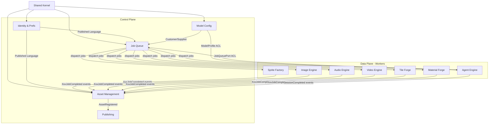

# DDD Bounded Contexts — Sorceress Game Dev AI Suite

> Arquitectura Domain-Driven Design para una suite de herramientas de game dev con IA.
> Stack: Rust + Tauri (desktop), workers independientes, modelos locales y APIs cloud.

---

## Índice

1. [Visión general y principios](#1-visión-general-y-principios)
2. [Bounded Contexts identificados](#2-bounded-contexts-identificados)
3. [Context Map](#3-context-map)
4. [Separación Control Plane / Data Plane](#4-separación-control-plane--data-plane)
5. [Arquitectura hexagonal por context](#5-arquitectura-hexagonal-por-context)
6. [Stack tecnológico por context (Rust crates)](#6-stack-tecnológico-por-context-rust-crates)
7. [Flujos de datos completos — 3 features](#7-flujos-de-datos-completos--3-features)
8. [Decisiones de diseño y trade-offs](#8-decisiones-de-diseño-y-trade-offs)

---

## 1. Visión general y principios

### El problema de dominio

Sorceress es una **suite de herramientas creativas con IA para game developers**. El dominio no es homogéneo: combina procesamiento pesado de medios (GPU, FFmpeg, modelos de difusión), orquestación de agentes de IA, gestión de proyectos y publicación. Cada herramienta tiene su propio lenguaje, sus propias reglas y sus propios invariantes.

### Por qué DDD

- Las herramientas hablan lenguajes distintos: "frame" en Sprite Tools es diferente a "frame" en Animation Tools.
- Los fallos deben estar contenidos: que Image Gen esté saturada no debe paralizar el Audio Editor.
- El procesamiento pesado (GPU, inferencia) debe estar aislado del Control Plane (UI, routing, config).
- La evolución de cada dominio (nuevos modelos, nuevos formatos) debe ser independiente.

### Principios de diseño

1. **Un Bounded Context = un Ubiquitous Language**. Ningún concepto traversal sin traducción explícita.
2. **Control Plane puro de lógica de negocio**. No toca GPU, no lee archivos grandes. Solo orquesta.
3. **Data Plane stateless por job**. Cada job es idempotente. El estado vive en el Context.
4. **Domain Events como moneda de cambio entre contexts**. Nunca llamadas directas cross-context en producción.
5. **Anti-Corruption Layers explícitas**. Toda traducción entre contexts pasa por un ACL documentado.

---

## 2. Bounded Contexts identificados

Se identifican **11 Bounded Contexts** más un **Shared Kernel**:

```
┌─────────────────────────────────────────────────────────────┐
│  CONTROL PLANE                                               │
│  ┌──────────┐  ┌──────────┐  ┌──────────┐  ┌────────────┐  │
│  │  Asset   │  │  Job     │  │  Model   │  │  Identity  │  │
│  │  Mgmt    │  │  Queue   │  │  Config  │  │  & Auth    │  │
│  └──────────┘  └──────────┘  └──────────┘  └────────────┘  │
└─────────────────────────────────────────────────────────────┘
┌─────────────────────────────────────────────────────────────┐
│  DATA PLANE                                                  │
│  ┌──────────┐  ┌──────────┐  ┌──────────┐  ┌────────────┐  │
│  │  Sprite  │  │  Image   │  │  Audio   │  │  Video     │  │
│  │  Factory │  │  Engine  │  │  Engine  │  │  Engine    │  │
│  └──────────┘  └──────────┘  └──────────┘  └────────────┘  │
│  ┌──────────┐  ┌──────────┐  ┌──────────┐                   │
│  │  Tile    │  │  Material│  │  Agent   │                   │
│  │  Forge   │  │  Forge   │  │  Engine  │                   │
│  └──────────┘  └──────────┘  └──────────┘                   │
└─────────────────────────────────────────────────────────────┘
┌─────────────────────────────────────────────────────────────┐
│  CROSS-CUTTING                                               │
│  ┌──────────────────────────────────────────────────────┐    │
│  │  Publishing Context (usa outputs de todos los demás) │    │
│  └──────────────────────────────────────────────────────┘    │
└─────────────────────────────────────────────────────────────┘
```

---

### 2.1 Asset Management Context

**Responsabilidad**: Gestión del ciclo de vida de todos los assets del proyecto del usuario. Es el "repositorio central" al que todos los contexts leen/escriben resultados. No procesa nada — solo guarda, organiza, versiona y expone.

**Ubiquitous Language**:

| Término | Significado en este context |
|---------|----------------------------|
| `Asset` | Cualquier archivo producido o importado (imagen, audio, video, sprite sheet) |
| `AssetVersion` | Versión inmutable de un asset (WORM: write-once, read-many) |
| `AssetTag` | Etiqueta libre asignada por el usuario o por procesamiento automático |
| `Collection` | Grupo lógico de assets relacionados (ej: "personaje goblin") |
| `Project` | Espacio de trabajo raíz que contiene Collections |
| `ImportSource` | Origen de un asset: uploaded, generated, derived |
| `DerivedFrom` | Relación de linaje: este asset viene de aquel |

**Entidades**:
```
Asset {
  id: AssetId,               // UUID
  project_id: ProjectId,
  collection_id: Option<CollectionId>,
  kind: AssetKind,           // Image | Audio | Video | SpriteSheet | Tileset | Material | Code
  name: String,
  tags: Vec<AssetTag>,
  import_source: ImportSource,
  created_at: Timestamp,
  versions: Vec<AssetVersionRef>,  // refs, no datos
}

AssetVersion {
  id: AssetVersionId,
  asset_id: AssetId,
  storage_path: StoragePath,       // path en filesystem del usuario
  checksum: Sha256,
  metadata: AssetMetadata,         // resolución, duración, formato…
  derived_from: Option<AssetVersionId>,
  created_at: Timestamp,
}

Collection {
  id: CollectionId,
  project_id: ProjectId,
  name: String,
  asset_ids: Vec<AssetId>,
}

Project {
  id: ProjectId,
  name: String,
  root_path: FilesystemPath,
}
```

**Value Objects**:
```
AssetKind         — enum discriminante
AssetTag          — String validado (max 64 chars, ASCII)
StoragePath       — path validado relativo al Project.root_path
Sha256            — [u8; 32]
AssetMetadata {
  width_px: Option<u32>,
  height_px: Option<u32>,
  duration_ms: Option<u64>,
  format: String,
  size_bytes: u64,
}
```

**Aggregate Root**: `Asset` (contiene sus versiones como parte del agregado).

**Domain Events**:
```
AssetImported       { asset_id, project_id, kind, storage_path }
AssetVersionCreated { asset_id, version_id, derived_from }
AssetTagged         { asset_id, tags_added, tags_removed }
AssetDeleted        { asset_id, project_id }
CollectionCreated   { collection_id, project_id }
```

**Repository Interface**:
```rust
trait AssetRepository {
    async fn save(&self, asset: &Asset) -> Result<()>;
    async fn find_by_id(&self, id: &AssetId) -> Result<Option<Asset>>;
    async fn find_by_project(&self, project_id: &ProjectId, filter: AssetFilter) -> Result<Vec<Asset>>;
    async fn find_by_collection(&self, collection_id: &CollectionId) -> Result<Vec<Asset>>;
    async fn save_version(&self, version: &AssetVersion) -> Result<()>;
    async fn find_version(&self, id: &AssetVersionId) -> Result<Option<AssetVersion>>;
    async fn delete(&self, id: &AssetId) -> Result<()>;
}

trait ProjectRepository {
    async fn save(&self, project: &Project) -> Result<()>;
    async fn find_by_id(&self, id: &ProjectId) -> Result<Option<Project>>;
    async fn list_all(&self) -> Result<Vec<Project>>;
}
```

**Application Services (Use Cases)**:
```
ImportAsset(project_id, file_path, kind, tags) -> AssetId
CreateDerivedAsset(source_version_id, storage_path, metadata) -> AssetId
TagAsset(asset_id, tags) -> ()
OrganizeIntoCollection(asset_ids, collection_name) -> CollectionId
DeleteAsset(asset_id) -> ()
ListProjectAssets(project_id, filter) -> Vec<AssetSummary>
GetAssetLineage(asset_id) -> AssetLineageTree
```

---

### 2.2 Job Queue Context

**Responsabilidad**: Recibir, priorizar, despachar y trackear jobs de procesamiento hacia el Data Plane. Es el "sistema nervioso" del Control Plane. No sabe qué hace cada job — solo que existe, tiene prioridad, tiene dependencias y tiene un destino.

**Ubiquitous Language**:

| Término | Significado |
|---------|-------------|
| `Job` | Unidad atómica de trabajo a despachar a un worker |
| `JobSpec` | Descripción del trabajo: tipo, parámetros, worker target |
| `JobPriority` | Urgencia relativa: Critical > High > Normal > Background |
| `JobStatus` | Estado del ciclo de vida: Pending → Queued → Running → Done/Failed/Cancelled |
| `Worker` | Proceso independiente capaz de ejecutar un tipo de job |
| `WorkerCapacity` | Slots disponibles en un worker (GPU slots, CPU slots) |
| `JobDependency` | Restricción: este job no puede empezar hasta que otro termine |
| `JobResult` | Output producido al completar: paths de archivos, métricas |
| `Retry` | Reintento automático ante fallo transitorio |

**Entidades**:
```
Job {
  id: JobId,
  spec: JobSpec,
  priority: JobPriority,
  status: JobStatus,
  worker_id: Option<WorkerId>,
  submitted_at: Timestamp,
  started_at: Option<Timestamp>,
  completed_at: Option<Timestamp>,
  retries: u8,
  max_retries: u8,
  result: Option<JobResult>,
  error: Option<JobError>,
  dependencies: Vec<JobId>,
  submitter: SubmitterId,   // qué context/usuario envió el job
}

Worker {
  id: WorkerId,
  kind: WorkerKind,   // ImageEngine | AudioEngine | SpriteFactory | …
  capacity: WorkerCapacity,
  status: WorkerStatus,
  last_heartbeat: Timestamp,
}
```

**Value Objects**:
```
JobSpec {
  worker_kind: WorkerKind,
  operation: String,         // "autosprite.extract_frames", "imagegen.generate"
  params: serde_json::Value, // opaco — cada worker interpreta
  timeout_ms: u64,
}
JobResult {
  output_paths: Vec<StoragePath>,
  duration_ms: u64,
  metadata: serde_json::Value,
}
JobPriority — enum con peso numérico
```

**Aggregate Root**: `Job`.

**Domain Events**:
```
JobSubmitted    { job_id, worker_kind, priority, submitted_by }
JobQueued       { job_id, queue_position }
JobDispatched   { job_id, worker_id }
JobStarted      { job_id, worker_id }
JobCompleted    { job_id, result }
JobFailed       { job_id, error, retries_remaining }
JobCancelled    { job_id, reason }
WorkerRegistered   { worker_id, worker_kind, capacity }
WorkerDied         { worker_id, last_heartbeat }
```

**Repository Interface**:
```rust
trait JobRepository {
    async fn save(&self, job: &Job) -> Result<()>;
    async fn find_by_id(&self, id: &JobId) -> Result<Option<Job>>;
    async fn find_pending_for_worker(&self, kind: WorkerKind) -> Result<Vec<Job>>;
    async fn find_by_submitter(&self, submitter: &SubmitterId) -> Result<Vec<Job>>;
    async fn update_status(&self, id: &JobId, status: JobStatus) -> Result<()>;
    async fn cancel(&self, id: &JobId, reason: &str) -> Result<()>;
}

trait WorkerRegistry {
    async fn register(&self, worker: &Worker) -> Result<()>;
    async fn update_heartbeat(&self, id: &WorkerId) -> Result<()>;
    async fn find_available(&self, kind: WorkerKind) -> Result<Vec<Worker>>;
    async fn mark_dead(&self, id: &WorkerId) -> Result<()>;
}
```

**Application Services**:
```
SubmitJob(spec, priority, dependencies) -> JobId
CancelJob(job_id, reason) -> ()
GetJobStatus(job_id) -> JobStatusView
ListJobsBySubmitter(submitter_id, filter) -> Vec<JobSummary>
RetryJob(job_id) -> JobId         // crea nuevo job con misma spec
GetQueueMetrics() -> QueueMetrics
RegisterWorker(kind, capacity) -> WorkerId
ReportWorkerHeartbeat(worker_id, capacity) -> ()
```

---

### 2.3 Model Configuration Context

**Responsabilidad**: Gestionar la configuración de los modelos de IA disponibles (locales y cloud), las rutas de enrutamiento (qué modelo usar para qué operación), las API keys, y los perfiles de calidad/velocidad. Desacopla las herramientas de saber dónde está el modelo.

**Ubiquitous Language**:

| Término | Significado |
|---------|-------------|
| `ModelProvider` | Origen del modelo: Local (GGUF, ONNX, PyTorch) o Cloud (OpenAI, Replicate, Stability) |
| `ModelProfile` | Combinación nombrada de modelo + parámetros + calidad |
| `RoutingRule` | Regla: "para operación X de dominio Y, usar ModelProfile Z" |
| `ModelCapability` | Lo que un modelo puede hacer: ImageGen, AudioGen, Inpainting… |
| `Quota` | Límite de uso (tokens, requests, costo) para un proveedor cloud |
| `FallbackChain` | Lista ordenada de alternativas si un modelo falla |
| `ModelCredential` | API key u OAuth token para un proveedor cloud |

**Entidades**:
```
ModelProfile {
  id: ModelProfileId,
  name: String,
  provider: ModelProvider,
  model_id: String,          // "stable-diffusion-xl-base-1.0", "gpt-4o", ...
  capabilities: Vec<ModelCapability>,
  params: ModelParams,       // cfg_scale, steps, temperature, etc.
  quality_tier: QualityTier, // Draft | Standard | High | Ultra
  cost_per_unit: Option<CostSpec>,
}

RoutingRule {
  id: RoutingRuleId,
  operation_pattern: String,   // glob: "imagegen.*", "audiogen.music"
  conditions: Vec<RuleCondition>, // user tier, asset size, gpu available
  target_profile_id: ModelProfileId,
  fallback_chain: Vec<ModelProfileId>,
  priority: u32,
}

ModelCredential {
  provider_id: ProviderId,
  credential_kind: CredentialKind, // ApiKey | OAuth | LocalPath
  encrypted_value: EncryptedBlob,
}
```

**Domain Events**:
```
ModelProfileCreated   { profile_id, name, capabilities }
ModelProfileUpdated   { profile_id, changed_fields }
RoutingRuleChanged    { rule_id, operation_pattern }
CredentialStored      { provider_id }
CredentialRevoked     { provider_id }
ModelAvailabilityChanged { model_id, available, reason }
```

**Application Services**:
```
ResolveModelForOperation(operation, context_hints) -> ModelProfile
AddModelProfile(spec) -> ModelProfileId
UpdateModelProfile(id, changes) -> ()
CreateRoutingRule(pattern, conditions, target) -> RoutingRuleId
StoreCredential(provider, credential) -> ()
TestModelConnectivity(profile_id) -> ConnectivityResult
GetQuotaUsage(provider_id) -> QuotaUsage
```

---

### 2.4 Identity & User Preferences Context

**Responsabilidad**: Gestión del usuario local (perfil, preferencias de UI, historial de uso, licencias). En un desktop app esto es simple — un único usuario — pero sus preferencias afectan routing (tier), límites de uso y configuración de UI.

**Ubiquitous Language**: `UserProfile`, `Preference`, `License`, `UsageHistory`, `Tier` (Free/Pro/Team).

**Entidades y eventos son simples** — este context es thin y upstream para todos.

---

### 2.5 Sprite Factory Context (Data Plane)

**Responsabilidad**: Todas las operaciones sobre sprites: extracción de frames de video, análisis de spritesheets existentes, slicing automático, conversión a pixel art. Es el worker especializado en sprites 2D.

**Ubiquitous Language**:

| Término | Significado en este context |
|---------|----------------------------|
| `SpriteSheet` | Grid de frames ordenados con metadata de animación |
| `Frame` | Imagen individual extraída de video o animación |
| `AnimationClip` | Secuencia nombrada de frames con FPS |
| `Sprite` | Objeto gráfico con bounding box, pivot y frames |
| `SliceGrid` | Configuración de corte: rows, cols, offsets, padding |
| `PixelArtStyle` | Parámetros de conversión: paleta, dithering, resolución target |
| `FrameExtraction` | Proceso de convertir video en frames individuales |
| `AtlasLayout` | Disposición óptima de sprites en una hoja |
| `MetaFile` | Archivo JSON/XML que describe el spritesheet (.ase, .atlas, .json) |

**Entidades**:
```
SpriteSheetJob {
  id: JobId,           // referencia al Job en Job Queue Context
  source_asset_id: AssetVersionId,
  config: SpriteSheetConfig,
  status: ProcessingStatus,
  output: Option<SpriteSheetOutput>,
}

SpriteSheetConfig {
  operation: SpriteOperation,  // AutoSprite | Slice | PixelArt | Analyze
  frame_extraction: Option<FrameExtractionConfig>,
  slice_config: Option<SliceConfig>,
  pixel_art_config: Option<PixelArtConfig>,
  atlas_layout: AtlasLayoutConfig,
  output_format: OutputFormat,  // PNG | WebP | APNG
  meta_format: MetaFormat,      // Aseprite | Unity | Godot | TexturePacker
}

SpriteSheet {
  frames: Vec<Frame>,
  clips: Vec<AnimationClip>,
  atlas_layout: AtlasLayout,
  meta: SpriteSheetMeta,
}
```

**Value Objects**:
```
FrameExtractionConfig { fps: f32, start_time_ms: u64, end_time_ms: Option<u64>, dedup_threshold: f32 }
SliceConfig { rows: u32, cols: u32, offset_x: i32, offset_y: i32, padding: u32, auto_detect: bool }
PixelArtConfig { target_width: u32, palette_size: u8, dithering: DitheringAlgorithm, edge_enhance: bool }
```

**Domain Events (internos del worker)**:
```
FrameExtractionCompleted  { job_id, frame_count, duration_ms }
SliceCompleted            { job_id, sprite_count }
PixelArtConversionDone    { job_id, output_asset_id }
SpriteSheetGenerated      { job_id, frame_count, output_asset_id, meta_asset_id }
```

**Integration Events (publicados hacia Job Queue / Asset Management)**:
```
SpriteJobCompleted { job_id, output_asset_ids: Vec<AssetId> }
SpriteJobFailed    { job_id, error: String, partial_outputs: Vec<AssetId> }
```

**Repository Interface**:
```rust
// Este context es principalmente un procesador, no un store
// Los assets se registran en Asset Management via eventos
trait SpriteJobRepository {
    async fn save_job(&self, job: &SpriteSheetJob) -> Result<()>;
    async fn find_job(&self, id: &JobId) -> Result<Option<SpriteSheetJob>>;
    async fn update_progress(&self, id: &JobId, progress: f32, message: &str) -> Result<()>;
}
```

**Application Services (comandos que recibe el worker)**:
```
ProcessAutoSprite(job_id, source_path, config) -> SpriteSheetOutput
AnalyzeSpriteSheet(job_id, source_path) -> SpriteSheetAnalysis
SliceSpriteSheet(job_id, source_path, slice_config) -> Vec<Sprite>
ConvertToPixelArt(job_id, source_path, pixel_art_config) -> PixelArtOutput
RenderTo2D(job_id, model_3d_path, camera_config) -> Vec<Frame>
```

---

### 2.6 Image Engine Context (Data Plane)

**Responsabilidad**: Generación y edición de imágenes mediante IA. Incluye: generación texto→imagen, background removal, image expansion (outpainting), inpainting. Trabaja con modelos de difusión locales (ComfyUI, diffusers) o APIs cloud.

**Ubiquitous Language**:

| Término | Significado |
|---------|-------------|
| `Prompt` | Descripción textual de la imagen deseada |
| `NegativePrompt` | Lo que NO debe aparecer |
| `Seed` | Número que fija el resultado para reproducibilidad |
| `DiffusionParams` | CFG scale, steps, sampler, scheduler |
| `ControlNet` | Red de control para guiar la generación con imagen de referencia |
| `Mask` | Máscara binaria para inpainting/outpainting |
| `LatentSpace` | Espacio interno del modelo donde ocurre la difusión |
| `Generation` | Resultado único de una operación de generación |
| `Batch` | Conjunto de generations con mismos params pero distinto seed |
| `StyleTransfer` | Aplicar el estilo de una imagen referencia a otra |

**Entidades**:
```
ImageJob {
  id: JobId,
  operation: ImageOperation,  // Generate | Inpaint | Outpaint | RemoveBg | Expand | StyleTransfer
  prompt: Option<Prompt>,
  reference_asset_ids: Vec<AssetVersionId>,
  mask_asset_id: Option<AssetVersionId>,
  params: DiffusionParams,
  model_profile_id: ModelProfileId,
  batch_size: u8,
  status: ProcessingStatus,
  outputs: Vec<GeneratedImage>,
}

GeneratedImage {
  id: GenerationId,
  job_id: JobId,
  seed: u64,
  output_path: StoragePath,
  generation_time_ms: u64,
  model_used: String,
}
```

**Value Objects**:
```
Prompt            { text: String, weight: f32 }
DiffusionParams { cfg_scale: f32, steps: u32, sampler: Sampler, scheduler: Scheduler, width: u32, height: u32 }
Mask              { path: StoragePath, feather_px: u32 }
```

**Domain Events**:
```
ImageGenerated    { job_id, generation_id, output_asset_id, seed }
BatchCompleted    { job_id, generation_ids: Vec<GenerationId> }
BackgroundRemoved { job_id, output_asset_id }
ImageExpanded     { job_id, output_asset_id, expansion_rect }
ImageJobFailed    { job_id, error }
```

---

### 2.7 Audio Engine Context (Data Plane)

**Responsabilidad**: Generación y edición de audio: SFX, música, voz. Cada tipo de audio tiene su propio sub-dominio pero viven en el mismo context porque comparten la representación de audio y las primitivas de edición.

**Ubiquitous Language**:

| Término | Significado |
|---------|-------------|
| `AudioClip` | Fragmento de audio con metadata (duración, sample rate, canales) |
| `SfxDescriptor` | Descripción semántica de un efecto de sonido: "footstep on gravel" |
| `MusicGenre` | Estilo musical: "chiptune 8-bit", "orchestral fantasy" |
| `BPM` | Tempo de una pieza musical |
| `Stem` | Pista individual de una composición (batería, bajo, melodía) |
| `VoiceLine` | Texto a sintetizar como voz de personaje |
| `VoiceProfile` | Características de una voz: tono, acento, emoción |
| `Waveform` | Representación de la señal de audio en el tiempo |
| `Loop` | AudioClip diseñado para reproducción en bucle continuo |

**Domain Events**:
```
SfxGenerated      { job_id, output_asset_id, descriptor }
MusicGenerated    { job_id, output_asset_id, duration_ms, bpm }
SpeechGenerated   { job_id, output_asset_id, text_length_chars }
AudioEdited       { job_id, output_asset_id, operations_applied }
AudioJobFailed    { job_id, error }
```

---

### 2.8 Tile Forge Context (Data Plane)

**Responsabilidad**: Generación y gestión de tilesets. Incluye: generación de tiles desde prompt, síntesis de tiles seamless (sin costuras en los bordes), detección de tileabilidad en imágenes existentes, creación de auto-tiles (Wang tiles, RPG Maker format).

**Ubiquitous Language**:

| Término | Significado |
|---------|-------------|
| `Tile` | Imagen cuadrada o rectangular que puede teselarse |
| `Tileset` | Colección organizada de tiles relacionados |
| `SeamlessTile` | Tile cuya textura es continua en todos los bordes |
| `WangTile` | Sistema de tiles con bordes etiquetados para auto-tiling |
| `TileVariant` | Variación de un tile base (dañado, mojado, cubierto de nieve) |
| `TileCategory` | Clasificación: Ground | Wall | Decoration | Animated |
| `Biome` | Contexto de mundo: forest, dungeon, desert, snow |
| `TileRule` | Regla de colocación: "este tile solo puede estar encima de aquel" |

**Domain Events**:
```
TileGenerated       { job_id, tile_id, output_asset_id }
TilesetCompleted    { job_id, tileset_id, tile_count, output_asset_ids }
SeamlessGenerated   { job_id, output_asset_id, seamless_score }
WangTilesetCreated  { job_id, output_asset_id, meta_asset_id }
TileJobFailed       { job_id, error }
```

---

### 2.9 Material Forge Context (Data Plane)

**Responsabilidad**: Generación de materiales PBR (Physically Based Rendering) para 3D. Incluye: generación de mapas (albedo, normal, roughness, metallic, AO, height), Material Forge desde prompt o imagen de referencia, y Corridor Chroma (conversión de corridor images a texturas game-ready).

**Ubiquitous Language**:

| Término | Significado |
|---------|-------------|
| `PBRMaterial` | Conjunto de mapas de textura para renderizado físicamente correcto |
| `AlbedoMap` | Color base de la superficie |
| `NormalMap` | Ilusión de relieve sin geometría adicional |
| `RoughnessMap` | Cuánto refleja de forma difusa la superficie |
| `MetallicMap` | Qué partes son metálicas |
| `AmbientOcclusionMap` (AO) | Sombras de contacto |
| `HeightMap` | Desplazamiento geométrico real |
| `MaterialPrompt` | Descripción textual: "rusted iron", "mossy stone" |
| `TexelDensity` | Resolución de textura por unidad de mundo |
| `TilingFactor` | Cuántas veces se repite la textura en la superficie |

**Domain Events**:
```
MaterialGenerated   { job_id, material_id, map_asset_ids: HashMap<MapKind, AssetId> }
MapExtracted        { job_id, kind, output_asset_id }
MaterialJobFailed   { job_id, error }
```

---

### 2.10 Agent Engine Context (Data Plane)

**Responsabilidad**: El Coding Agent con IA. Gestiona la sesión de agente, el plan de ejecución, la generación de código, el file manager, el preview en vivo y el loop de iteración. Es un context complejo con su propio sub-sistema de estado.

**Ubiquitous Language**:

| Término | Significado |
|---------|-------------|
| `AgentSession` | Sesión de trabajo del agente con su contexto acumulado |
| `Task` | Objetivo de alto nivel descrito por el usuario |
| `Plan` | Secuencia de pasos que el agente deriva del Task |
| `Step` | Unidad ejecutable del Plan: CreateFile, EditFile, RunCommand, SearchCode |
| `AgentThought` | Razonamiento interno del agente (chain-of-thought, visible al usuario) |
| `CodeChange` | Diff producido por el agente |
| `Checkpoint` | Estado del workspace en un momento dado (permite rollback) |
| `Preview` | Vista renderizada del resultado en el sandbox |
| `Conversation` | Historial de mensajes user↔agent en la sesión |
| `Workspace` | Sistema de archivos de trabajo del agente (aislado del proyecto principal) |
| `ToolCall` | Invocación de una herramienta por parte del agente: fs_read, run_test, search |

**Entidades**:
```
AgentSession {
  id: SessionId,
  task: Task,
  plan: Option<Plan>,
  status: SessionStatus,   // Planning | Executing | Paused | Completed | Failed
  conversation: Conversation,
  workspace: Workspace,
  checkpoints: Vec<Checkpoint>,
  created_at: Timestamp,
}

Plan {
  steps: Vec<Step>,
  current_step_index: usize,
  estimated_steps: u32,
}

Step {
  id: StepId,
  description: String,
  tool_calls: Vec<ToolCall>,
  status: StepStatus,
  output: Option<StepOutput>,
  agent_thought: Option<String>,
}

Workspace {
  root_path: FilesystemPath,
  files: Vec<WorkspaceFile>,
}

Checkpoint {
  id: CheckpointId,
  step_id: StepId,
  workspace_snapshot: WorkspaceSnapshot,
  created_at: Timestamp,
}
```

**Domain Events**:
```
SessionCreated      { session_id, task_description }
PlanGenerated       { session_id, step_count }
StepStarted         { session_id, step_id, description }
StepCompleted       { session_id, step_id, output }
CodeChangeProposed  { session_id, step_id, diff }
CheckpointCreated   { session_id, checkpoint_id }
SessionCompleted    { session_id, final_output }
SessionFailed       { session_id, step_id, error }
PreviewUpdated      { session_id, preview_url }
```

**Anti-Corruption Layer** (hacia LLM providers):
El agente usa modelos LLM pero el domain no sabe de "tokens", "temperature", "completions API". El ACL traduce:
- `Task` + `Conversation` → `LlmRequest` (tokens, messages array, system prompt)
- `LlmResponse` → `AgentThought` + `Vec<ToolCall>`

---

### 2.11 Video Engine Context (Data Plane)

**Responsabilidad**: Generación de video con IA (Video Gen) y extracción de animated sprites desde video generado (Quick Sprites). El video generado suele ser corto (2-8 segundos) y el foco es la utilidad para game art.

**Ubiquitous Language**:

| Término | Significado |
|---------|-------------|
| `VideoClip` | Secuencia de video de corta duración (seconds) |
| `VideoPrompt` | Descripción de lo que debe ocurrir en el video |
| `AnimationStyle` | Estilo visual: "pixel art", "2D cartoon", "painterly" |
| `MotionGuidance` | Dirección del movimiento: "character walks left" |
| `QuickSprite` | Pipeline completo: VideoGen + AutoSprite en un solo paso |

---

### 2.12 Publishing Context

**Responsabilidad**: Publicación del juego, gestión del layout, preview jugable en arcade. Es un context **downstream** de todos los demás — consume assets finales y los empaqueta.

**Ubiquitous Language**: `GameBuild`, `LayoutTemplate`, `ArcadeEntry`, `PublishTarget` (itch.io, GameJolt, web embed), `PlaySession`.

---

## 3. Context Map

### Diagrama de relaciones

```
                     ┌──────────────────────────────────────┐
                     │         SHARED KERNEL                 │
                     │  AssetId, JobId, StoragePath,         │
                     │  Timestamp, Checksum, ErrorKind       │
                     └──────────────────────────────────────┘
                                    │ usa
                     ┌──────────────┴──────────────────────────────┐
                     │                                             │
         ┌───────────▼──────────┐                    ┌────────────▼──────────┐
         │  Identity & Prefs    │◄──── conforma ─────│   Model Config        │
         │  (Upstream global)   │                    │   (Upstream global)   │
         └───────────┬──────────┘                    └────────────┬──────────┘
                     │ informa                                     │ router
                     ▼                                             ▼
         ┌───────────────────────────────────────────────────────────────────┐
         │                     JOB QUEUE CONTEXT                             │
         │              (Customer/Supplier con todos los engines)            │
         └───┬──────────┬──────────┬──────────┬──────────┬──────────┬───────┘
             │dispatch  │dispatch  │dispatch  │dispatch  │dispatch  │dispatch
             ▼          ▼          ▼          ▼          ▼          ▼
      ┌──────────┐ ┌──────────┐ ┌────────┐ ┌────────┐ ┌────────┐ ┌────────┐
      │  Sprite  │ │  Image   │ │ Audio  │ │ Video  │ │  Tile  │ │Material│
      │ Factory  │ │ Engine   │ │ Engine │ │ Engine │ │ Forge  │ │ Forge  │
      └─────┬────┘ └────┬─────┘ └───┬────┘ └───┬────┘ └───┬────┘ └───┬────┘
            │            │           │           │          │           │
            └──────────┬─┘           └─────┬─────┘          └─────┬────┘
                       │   publica          │ publica              │ publica
                       ▼  XxxJobCompleted   ▼                     ▼
         ┌────────────────────────────────────────────────────────────────┐
         │                   ASSET MANAGEMENT CONTEXT                     │
         │              (integra todos los outputs)                       │
         └────────────────────────────┬───────────────────────────────────┘
                                      │ AssetRegistered
                                      ▼
                          ┌───────────────────────┐
                          │   PUBLISHING CONTEXT   │
                          │   (downstream de todo) │
                          └───────────────────────┘

         ┌────────────────────────────────────────────────────────────────┐
         │                   AGENT ENGINE CONTEXT                         │
         │   (usa Job Queue para delegar processing + Asset Mgmt          │
         │    para guardar código generado + Model Config para LLMs)      │
         └────────────────────────────────────────────────────────────────┘
```

### Tipos de relaciones

| Upstream | Downstream | Tipo | Descripción |
|----------|------------|------|-------------|
| Identity & Prefs | Todos | **Published Language** | Expone UserProfile, Tier. Todos conforman. |
| Model Config | Job Queue | **Customer/Supplier** | Job Queue consulta qué modelo usar al despachar |
| Model Config | Todos los Engines | **Customer/Supplier** | Cada engine recibe ModelProfile en el job spec |
| Job Queue | Sprite Factory | **Customer/Supplier** | Job Queue es upstream; Sprite Factory despacha jobs según lo que Job Queue le manda |
| Job Queue | Image Engine | **Customer/Supplier** | Mismo patrón |
| Job Queue | Audio Engine | **Customer/Supplier** | Mismo patrón |
| Job Queue | Tile Forge | **Customer/Supplier** | Mismo patrón |
| Job Queue | Material Forge | **Customer/Supplier** | Mismo patrón |
| Job Queue | Video Engine | **Customer/Supplier** | Mismo patrón |
| Job Queue | Agent Engine | **Customer/Supplier** | Agent Engine también es un worker que recibe jobs |
| Todos los Engines | Asset Management | **Conformist** | Los engines publican eventos; Asset Management consume y registra. Los engines conforman el modelo de Asset del Asset Management Context para nombrar outputs. |
| Asset Management | Publishing | **Customer/Supplier** | Publishing sólo publica assets ya registrados en Asset Management |
| Agent Engine | Model Config | **ACL** | El Agent Engine tiene su propio modelo mental de "LLM" que traduce via ACL al ModelProfile de Model Config |
| Agent Engine | Job Queue | **Customer** | El Agent Engine puede enviar jobs de Image/Audio/etc. como parte de sus steps |

### Shared Kernel

El Shared Kernel es pequeño y estable. Contiene solo tipos primitivos compartidos:

```rust
// crate: sorceress-shared-kernel

pub struct AssetId(Uuid);
pub struct JobId(Uuid);
pub struct ProjectId(Uuid);
pub struct SessionId(Uuid);
pub struct StoragePath(PathBuf);    // validado: siempre relativo a project root
pub struct Timestamp(DateTime<Utc>);
pub struct Checksum(blake3::Hash);

pub enum ErrorKind {
    NotFound, ValidationError, ProcessingError, 
    ExternalApiError, InsufficientResources, Cancelled,
}

// Trait que todos los eventos deben implementar
pub trait DomainEvent: Send + Sync {
    fn event_id(&self) -> Uuid;
    fn occurred_at(&self) -> Timestamp;
    fn aggregate_id(&self) -> String;
    fn event_type(&self) -> &'static str;
}
```

### Publication map (quién publica, quién consume)

| Evento | Publicado por | Consumido por | Canal |
|--------|---------------|---------------|-------|
| `JobSubmitted` | Job Queue | Todos los Engines (cada uno escucha su `WorkerKind`) | Event bus |
| `JobCompleted` | Job Queue | UI (progress), Asset Management (registra output) | Event bus |
| `JobFailed` | Job Queue | UI (error display), Job Queue (retry logic) | Event bus |
| `SpriteJobCompleted` | Sprite Factory | Job Queue (marca job completo) | IPC/channel |
| `ImageGenerated` | Image Engine | Job Queue (marca job completo) | IPC/channel |
| `AssetVersionCreated` | Asset Management | Publishing (actualiza librería) | Event bus |
| `SessionCompleted` | Agent Engine | Asset Management (registra código generado) | Event bus |

---

## 4. Separación Control Plane / Data Plane

### Principio fundamental

```
Control Plane:  baja latencia, sin bloqueo, sin GPU, vive en el proceso Tauri principal
Data Plane:     alta latencia, bloqueante, puede usar GPU, vive en procesos separados
```

El Control Plane **nunca** llama a funciones del Data Plane directamente. Toda comunicación es **asíncrona via Job Queue**.

### 4.1 Control Plane

**Bounded Contexts del Control Plane**:
- Asset Management Context
- Job Queue Context
- Model Configuration Context
- Identity & User Preferences Context
- Publishing Context (la parte de orquestación)

**Responsabilidades**:
- Recibir acciones de la UI (Tauri commands)
- Validar inputs y crear Jobs
- Resolver qué modelo usar para cada operación
- Trackear progreso y notificar la UI
- Mantener el estado del proyecto (assets, colecciones)
- Gestionar la cola de jobs con prioridades
- Detectar workers caídos y reiniciar jobs
- Enrutar resultados: un output puede ser input de otro job

**Puertos y Adaptadores del Control Plane**:

```
Inbound:
  ├── Tauri IPC Adapter     (comandos desde la UI Svelte/Vue)
  ├── Worker RPC Adapter    (heartbeats y resultados de workers)
  └── HTTP Webhook Adapter  (callbacks de APIs cloud)

Outbound:
  ├── SQLite Repository     (jobs, assets, projects)
  ├── Filesystem Adapter    (lectura de paths, validación)
  ├── Worker IPC Adapter    (dispatch de jobs a workers via Unix socket / named pipe)
  ├── Event Bus Adapter     (tokio broadcast para eventos internos)
  └── Notification Adapter  (Tauri emit hacia frontend)
```

**Stack del Control Plane**:
- Proceso: Tauri app process (main + webview)
- Async runtime: tokio
- State: SQLite via sqlx (assets, jobs, config)
- IPC Tauri: `tauri::command` handlers
- Worker communication: Unix domain sockets (macOS/Linux) / named pipes (Windows)

### 4.2 Data Plane

**Bounded Contexts del Data Plane**:
- Sprite Factory Context
- Image Engine Context
- Audio Engine Context
- Video Engine Context
- Tile Forge Context
- Material Forge Context
- Agent Engine Context

**Cada worker es un proceso independiente**:

```
sorceress (Tauri app)
    │
    ├── sprite-worker     (proceso)  — FFmpeg, image processing, atlas packing
    ├── image-worker      (proceso)  — diffusers, ComfyUI client, rembg, PIL
    ├── audio-worker      (proceso)  — AudioCraft, Bark, AudioSep, FFmpeg
    ├── video-worker      (proceso)  — AnimateDiff, Stable Video Diffusion
    ├── tile-worker       (proceso)  — diffusers + custom tiling logic
    ├── material-worker   (proceso)  — ControlNet, normal map generation
    └── agent-worker      (proceso)  — LLM client, code execution sandbox
```

**Ciclo de vida de un worker**:

```
1. Tauri app lanza el worker como subprocess (std::process::Command)
2. Worker abre socket IPC y envía WorkerRegistered
3. Worker entra en loop: espera JobDispatched para su WorkerKind
4. Al recibir un job: procesa, reporta progress, envía JobCompleted/JobFailed
5. Control Plane detecta heartbeat timeout → WorkerDied → relanza
```

**Prioridades de la cola**:

```rust
pub enum JobPriority {
    Critical = 100,    // jobs bloqueantes de UI (preview en vivo, análisis rápido)
    High = 75,         // jobs iniciados por usuario directamente
    Normal = 50,       // jobs normales
    Background = 25,   // batch processing, pre-generación
}
```

**GPU slot management**:

```rust
pub struct GpuSlotManager {
    total_vram_mb: u32,
    allocated_slots: HashMap<JobId, u32>,  // job → VRAM reservada
}

// Los workers reportan su VRAM requirement al registrarse
// Job Queue no despacha si no hay VRAM suficiente → job queda Queued
```

---

## 5. Arquitectura hexagonal por context

### Patrón general (hexagonal / ports & adapters)

```
          ┌─────────────────────────────────────────────┐
          │              Application Service             │
          │    (orquesta entidades y puertos outbound)   │
          │                                             │
  ──►  [Inbound Port]  ──►  [Domain Logic]  ──►  [Outbound Port]  ──►
  UI       │                 Entities                   │         Repos
  IPC      │                 Value Objects              │         APIs
  HTTP     └─────────────────────────────────────────────┘        FS
```

### 5.1 Hexagonal del Job Queue Context

```
INBOUND PORTS (traits en el domain):
├── trait SubmitJobCommand { async fn execute(&self, cmd: SubmitJobCmd) -> Result<JobId> }
├── trait CancelJobCommand { async fn execute(&self, cmd: CancelJobCmd) -> Result<()> }
├── trait GetJobStatusQuery { async fn execute(&self, id: JobId) -> Result<JobStatusView> }
└── trait RegisterWorkerCommand { async fn execute(&self, cmd: RegisterWorkerCmd) -> Result<WorkerId> }

DOMAIN CORE:
├── JobScheduler      — lógica de priorización y despacho
├── WorkerPool        — gestión de workers disponibles
├── DependencyGraph   — resolución de job dependencies
└── RetryPolicy       — lógica de reintento con backoff

OUTBOUND PORTS (traits en el domain):
├── trait JobRepository       { save, find_by_id, find_pending, update_status }
├── trait WorkerRegistry      { register, heartbeat, find_available, mark_dead }
├── trait JobDispatcher       { dispatch(job, worker) -> Result<()> }
├── trait EventPublisher      { publish(event: &dyn DomainEvent) -> Result<()> }
└── trait GpuResourceManager  { can_allocate(vram_mb) -> bool; allocate; release }

ADAPTERS:
├── TauriCommandAdapter    — impl SubmitJobCommand, CancelJobCommand (inbound)
├── SqliteJobRepo          — impl JobRepository (outbound)
├── SqliteWorkerRegistry   — impl WorkerRegistry (outbound)
├── IpcJobDispatcher       — impl JobDispatcher via Unix socket (outbound)
├── TokioBroadcastPublisher — impl EventPublisher (outbound)
└── GpuVramTracker         — impl GpuResourceManager via nvml/wgpu query (outbound)
```

### 5.2 Hexagonal del Image Engine Context (worker process)

```
INBOUND PORTS:
├── trait ProcessImageJobCommand { async fn execute(&self, job: ImageJobSpec) -> Result<ImageJobOutput> }
└── trait ReportProgressPort     { fn report(&self, job_id: JobId, progress: f32, msg: &str) }

DOMAIN CORE:
├── ImageGenerationService    — construye el pipeline de difusión
├── BackgroundRemovalService  — gestiona el modelo de segmentación
├── OutpaintingService        — expande con preservación de contexto
└── PromptEnricher            — enriquece prompts con keywords de game art

OUTBOUND PORTS:
├── trait DiffusionBackend { generate(request) -> Result<Vec<ImageBuffer>> }
├── trait SegmentationBackend { remove_background(image) -> Result<ImageBuffer> }
├── trait ImageStorage     { save(buffer, path) -> Result<StoragePath> }
├── trait ProgressReporter { report(job_id, progress, msg) }
└── trait JobResultEmitter { emit_completed(job_id, outputs) | emit_failed(job_id, err) }

ADAPTERS:
├── IpcCommandReceiver         — impl ProcessImageJobCommand (inbound) via IPC socket
├── ComfyUiDiffusionAdapter    — impl DiffusionBackend via ComfyUI local API (outbound)
├── ReplicateApiAdapter        — impl DiffusionBackend via Replicate API (outbound)
├── OnnxSegmentationAdapter    — impl SegmentationBackend via ONNX Runtime (outbound)
├── LocalFilesystemStorage     — impl ImageStorage (outbound)
├── IpcProgressReporter        — impl ProgressReporter (outbound)
└── IpcResultEmitter           — impl JobResultEmitter (outbound)
```

### 5.3 Hexagonal del Agent Engine Context

```
INBOUND PORTS:
├── trait StartSessionCommand    { async fn execute(&self, task: Task) -> Result<SessionId> }
├── trait SendUserMessageCommand { async fn execute(&self, session_id, message) -> Result<AgentThought> }
├── trait ApproveStepCommand     { async fn execute(&self, session_id, step_id) -> Result<()> }
├── trait RollbackToCheckpoint   { async fn execute(&self, session_id, checkpoint_id) -> Result<()> }
└── trait GetSessionStateQuery   { async fn execute(&self, session_id) -> Result<SessionView> }

DOMAIN CORE:
├── AgentOrchestrator     — ciclo plan→execute→verify
├── PlanGenerator         — convierte Task en Plan via LLM
├── StepExecutor          — ejecuta ToolCalls en el workspace
├── CodeDiffer            — genera diffs legibles de CodeChanges
└── CheckpointManager     — snapshots del workspace

OUTBOUND PORTS:
├── trait LlmPort         { complete(messages) -> Result<LlmResponse> }           (ACL aquí)
├── trait WorkspacePort   { read_file, write_file, run_command, search_code }
├── trait PreviewPort     { render(workspace_path) -> Result<PreviewUrl> }
├── trait JobQueuePort    { submit_job(spec) -> Result<JobId> }                  (delega a otros engines)
├── trait SessionStore    { save_session, load_session, save_checkpoint }
└── trait EventEmitter    { emit(event: &dyn DomainEvent) }

ADAPTERS:
├── TauriCommandAdapter           — inbound commands desde UI
├── AnthropicLlmAdapter           — impl LlmPort via Anthropic API
├── OpenAiLlmAdapter              — impl LlmPort via OpenAI API
├── OllamaLlmAdapter              — impl LlmPort via Ollama local
├── SandboxedFilesystemAdapter    — impl WorkspacePort (restricción a workspace dir)
├── TauriWebviewPreviewAdapter    — impl PreviewPort (renderiza en webview Tauri)
├── IpcJobQueueAdapter            — impl JobQueuePort via IPC al Control Plane
└── SqliteSessionStore            — impl SessionStore
```

---

## 6. Stack tecnológico por context (Rust crates)

### Estructura del workspace Cargo

```toml
# Cargo.toml (workspace root)
[workspace]
members = [
  # Shared
  "crates/shared-kernel",

  # Control Plane
  "crates/asset-management",
  "crates/job-queue",
  "crates/model-config",
  "crates/identity",
  "crates/publishing",

  # Data Plane workers (binaries independientes)
  "workers/sprite-worker",
  "workers/image-worker",
  "workers/audio-worker",
  "workers/video-worker",
  "workers/tile-worker",
  "workers/material-worker",
  "workers/agent-worker",

  # Tauri app (orquesta Control Plane)
  "app/sorceress-tauri",

  # Integration tests
  "tests/integration",
]

resolver = "2"
```

### Dependencias por context

#### `crates/shared-kernel`
```toml
[dependencies]
uuid = { version = "1", features = ["v4", "serde"] }
serde = { version = "1", features = ["derive"] }
chrono = { version = "0.4", features = ["serde"] }
blake3 = "1"
thiserror = "1"
```

#### `crates/asset-management`
```toml
[dependencies]
sorceress-shared-kernel = { path = "../shared-kernel" }
sqlx = { version = "0.7", features = ["sqlite", "runtime-tokio", "chrono", "uuid"] }
tokio = { version = "1", features = ["full"] }
serde = { version = "1", features = ["derive"] }
serde_json = "1"
image = "0.25"        # para extraer metadata de imágenes
symphonia = "0.5"     # metadata de audio
```

#### `crates/job-queue`
```toml
[dependencies]
sorceress-shared-kernel = { path = "../shared-kernel" }
sqlx = { version = "0.7", features = ["sqlite", "runtime-tokio"] }
tokio = { version = "1", features = ["full"] }
tokio-util = "0.7"
serde_json = "1"
# No GPU deps — solo orquestación
```

#### `crates/model-config`
```toml
[dependencies]
sorceress-shared-kernel = { path = "../shared-kernel" }
sqlx = { version = "0.7", features = ["sqlite", "runtime-tokio"] }
keyring = "2"          # almacenamiento seguro de API keys (OS keychain)
glob = "0.3"           # matching de operation patterns
serde_json = "1"
```

#### `workers/sprite-worker`
```toml
[[bin]]
name = "sprite-worker"

[dependencies]
sorceress-shared-kernel = { path = "../../crates/shared-kernel" }
tokio = { version = "1", features = ["full"] }
# Procesamiento de imagen
image = "0.25"
imageproc = "0.24"
rayon = "1"             # paralelismo CPU
# Video
ffmpeg-next = "6"       # bindings a FFmpeg para extracción de frames
# Atlas packing
crunch = "0.1"          # rectangle packing para atlas
# Pixel art
kiddo = "4"             # KD-tree para cuantización de color
# Serialización de metafiles
serde_json = "1"
```

#### `workers/image-worker`
```toml
[[bin]]
name = "image-worker"

[dependencies]
sorceress-shared-kernel = { path = "../../crates/shared-kernel" }
tokio = { version = "1", features = ["full"] }
reqwest = { version = "0.11", features = ["json", "multipart"] }  # ComfyUI API, Replicate, Stability
image = "0.25"
ort = "2"               # ONNX Runtime — para background removal local (rembg-onnx)
candle-core = "0.3"     # Hugging Face Candle — inferencia local ligera
serde_json = "1"
base64 = "0.22"
```

#### `workers/audio-worker`
```toml
[[bin]]
name = "audio-worker"

[dependencies]
sorceress-shared-kernel = { path = "../../crates/shared-kernel" }
tokio = { version = "1", features = ["full"] }
reqwest = { version = "0.11", features = ["json"] }  # ElevenLabs, Replicate, Suno
rodio = "0.17"          # playback y operaciones básicas de audio
hound = "3"             # lectura/escritura WAV
symphonia = "0.5"       # decodificación de múltiples formatos
rubato = "0.15"         # resampleo de alta calidad
# FFmpeg para conversión
ffmpeg-next = "6"
```

#### `workers/agent-worker`
```toml
[[bin]]
name = "agent-worker"

[dependencies]
sorceress-shared-kernel = { path = "../../crates/shared-kernel" }
tokio = { version = "1", features = ["full"] }
reqwest = { version = "0.11", features = ["json", "stream"] }   # OpenAI, Anthropic, Ollama streaming
serde_json = "1"
# Filesystem operations en sandbox
walkdir = "2"
ignore = "0.4"          # .gitignore-style patterns para excluir archivos
similar = "2"           # diff generation
# Code execution sandbox (unsafe: process spawning con limits)
tokio-process = "1"     # subprocesses con timeout
```

#### `app/sorceress-tauri`
```toml
[dependencies]
tauri = { version = "2", features = ["protocol-asset"] }
sorceress-shared-kernel = { path = "../../crates/shared-kernel" }
sorceress-asset-management = { path = "../../crates/asset-management" }
sorceress-job-queue = { path = "../../crates/job-queue" }
sorceress-model-config = { path = "../../crates/model-config" }
sorceress-identity = { path = "../../crates/identity" }
sorceress-publishing = { path = "../../crates/publishing" }
tokio = { version = "1", features = ["full"] }
serde = { version = "1", features = ["derive"] }
serde_json = "1"
# Lanzador de workers
which = "6"             # localizar binarios de workers
```

### API Boundaries entre crates

```
Frontend (Svelte/Vue)
    │  Tauri IPC
    ▼
sorceress-tauri
    │  fn calls (async)
    ├──► sorceress-job-queue      → (IPC socket) → workers/*
    ├──► sorceress-asset-management
    ├──► sorceress-model-config
    └──► sorceress-publishing

sorceress-job-queue
    │  NO conoce sorceress-asset-management directamente
    │  Solo conoce shared-kernel types (JobId, AssetId)
    └──► shared-kernel

workers/* (procesos separados)
    │  Solo conocen shared-kernel
    │  Comunican via IPC (JSON sobre Unix socket)
    └──► shared-kernel
```

**Regla de oro**: Ningún `worker/*` puede tener como dependencia a ningún `crate/*` del Control Plane. La comunicación es solo via IPC. Esto garantiza que los workers puedan reemplazarse, actualizarse o correr en máquinas distintas.

---

## 7. Flujos de datos completos — 3 features

### 7.1 Auto-Sprite: Video → Sprite Sheet

**Descripción**: El usuario sube un video de una animación de personaje (ej: walk cycle grabado) y quiere obtener un spritesheet con metafile para Godot.

```
┌─────────────────────────────────────────────────────────────────┐
│ USUARIO                                                          │
│  1. Arrastra video.mp4 al panel Auto-Sprite                      │
│  2. Configura: 12 FPS, deduplicate threshold 0.92, format PNG,   │
│     meta: Godot                                                  │
│  3. Hace clic en "Generate"                                      │
└──────────────────────────┬──────────────────────────────────────┘
                           │ Tauri IPC command
                           ▼
┌─────────────────────────────────────────────────────────────────┐
│ CONTROL PLANE — sorceress-tauri                                  │
│                                                                  │
│  Handler: auto_sprite_command(video_path, config)                │
│    │                                                             │
│    ├─► asset-management: ImportAsset(video.mp4)                  │
│    │     → AssetImported { asset_id: "a1", kind: Video }         │
│    │                                                             │
│    ├─► model-config: ResolveModelForOperation("autosprite.*")    │
│    │     → (no model needed — CPU/GPU processing local)         │
│    │                                                             │
│    └─► job-queue: SubmitJob(                                     │
│            spec: {                                               │
│              worker_kind: SpriteFactory,                         │
│              operation: "autosprite.generate",                   │
│              params: { source_asset_id: "a1",                   │
│                        fps: 12, dedup: 0.92,                    │
│                        format: "PNG", meta: "Godot" }           │
│            },                                                    │
│            priority: High                                        │
│          )                                                       │
│          → JobSubmitted { job_id: "j1" }                        │
│                                                                  │
│    Returns job_id "j1" to frontend                               │
└──────────────────────────┬──────────────────────────────────────┘
                           │ JobSubmitted event
                           │ IPC socket dispatch
                           ▼
┌─────────────────────────────────────────────────────────────────┐
│ DATA PLANE — sprite-worker process                               │
│                                                                  │
│  Recibe: JobSpec { operation: "autosprite.generate", params }    │
│                                                                  │
│  SpriteFactory::process_autosprite(spec):                        │
│                                                                  │
│  PASO 1 — FrameExtraction                                        │
│    ffmpeg-next: extraer frames a 12 FPS → Vec<RgbaImage>        │
│    Deduplication: hash perceptual → eliminar frames similares    │
│    Progress: 0%→30% — reporta via IPC                           │
│    Event: FrameExtractionCompleted { frame_count: 48 }          │
│                                                                  │
│  PASO 2 — AtlasPacking                                          │
│    crunch::pack_rects(frame_sizes) → optimal layout             │
│    Render atlas PNG: pegar frames en grid                        │
│    Progress: 30%→70%                                            │
│                                                                  │
│  PASO 3 — MetaFile Generation                                    │
│    Godot .tres format: generar SpriteFrames resource            │
│    AnimationClip "default": frames 0..47, fps 12                │
│    Progress: 70%→95%                                            │
│                                                                  │
│  PASO 4 — Save outputs                                          │
│    Escribe: /project/assets/generated/spritesheet_a1.png        │
│    Escribe: /project/assets/generated/spritesheet_a1.tres       │
│    Progress: 95%→100%                                           │
│                                                                  │
│  Emite: SpriteJobCompleted {                                     │
│    job_id: "j1",                                                 │
│    output_asset_ids: [path_png, path_tres]                       │
│  }                                                               │
└──────────────────────────┬──────────────────────────────────────┘
                           │ SpriteJobCompleted via IPC
                           ▼
┌─────────────────────────────────────────────────────────────────┐
│ CONTROL PLANE — reacción al completion                           │
│                                                                  │
│  job-queue: update_status(j1, Completed, result)                 │
│    → JobCompleted event                                          │
│                                                                  │
│  asset-management: CreateDerivedAsset(                           │
│    source_version: a1,                                           │
│    path: spritesheet.png,                                        │
│    kind: SpriteSheet                                             │
│  )  → AssetVersionCreated { asset_id: "a2" }                    │
│                                                                  │
│  asset-management: CreateDerivedAsset(spritesheet.tres → "a3")  │
│                                                                  │
│  tauri::emit("job_completed", { job_id: "j1",                    │
│    assets: ["a2", "a3"] })                                       │
└──────────────────────────┬──────────────────────────────────────┘
                           │ Tauri event
                           ▼
                      FRONTEND: muestra preview del spritesheet,
                      permite ajustar clips y re-exportar
```

**Contexts participantes**: Asset Management, Job Queue, Sprite Factory
**Contextos NO participantes**: Image Engine, Audio Engine, Model Config (no se necesita modelo IA)
**Tiempo estimado**: 5-30 segundos según duración del video y FPS

---

### 7.2 Image Gen: Prompt → Game Art

**Descripción**: El usuario escribe "medieval knight, pixel art style, transparent background, game asset, 256x256" y quiere múltiples variantes para elegir.

```
┌─────────────────────────────────────────────────────────────────┐
│ USUARIO                                                          │
│  1. Escribe prompt                                               │
│  2. Selecciona: "Pixel Art Style" preset, 4 variantes, 256x256  │
│  3. Elige modelo: "Local - SDXL Turbo" (o "Cloud - Stability")  │
│  4. Clic "Generate"                                              │
└──────────────────────────┬──────────────────────────────────────┘
                           │ Tauri IPC command
                           ▼
┌─────────────────────────────────────────────────────────────────┐
│ CONTROL PLANE — sorceress-tauri                                  │
│                                                                  │
│  Handler: image_gen_command(prompt, style, model_selection)      │
│                                                                  │
│  PASO 1 — Resolver modelo                                        │
│  model-config: ResolveModelForOperation(                         │
│    operation: "imagegen.txt2img",                                │
│    hints: { quality: High, style: PixelArt, user_choice: SDXL } │
│  )                                                               │
│  → ModelProfile {                                                │
│      provider: Local,                                            │
│      model_id: "sdxl-turbo",                                    │
│      params: { cfg: 1.0, steps: 4, width: 256, height: 256 }   │
│    }                                                             │
│                                                                  │
│  PASO 2 — Enriquecer prompt (ACL: UI prompt → domain prompt)    │
│  "pixel art style" preset añade:                                 │
│    positive: "..., pixel art, 8-bit, pixelated, low resolution" │
│    negative: "blurry, smooth, photorealistic, 3D"               │
│                                                                  │
│  PASO 3 — Enviar job                                             │
│  job-queue: SubmitJob(                                           │
│    spec: {                                                       │
│      worker_kind: ImageEngine,                                   │
│      operation: "imagegen.txt2img",                              │
│      params: {                                                   │
│        prompt: <enriched>,                                       │
│        negative_prompt: <from preset>,                           │
│        model_profile_id: "mp-sdxl-turbo",                       │
│        batch_size: 4,                                            │
│        width: 256, height: 256,                                  │
│        seeds: [auto, auto, auto, auto]                           │
│      }                                                           │
│    },                                                            │
│    priority: High                                                │
│  ) → job_id: "j2"                                               │
└──────────────────────────┬──────────────────────────────────────┘
                           │ IPC dispatch
                           ▼
┌─────────────────────────────────────────────────────────────────┐
│ DATA PLANE — image-worker process                                │
│                                                                  │
│  Recibe: ImageJobSpec { operation: "txt2img", params }           │
│                                                                  │
│  ImageGenerationService::generate(spec):                         │
│                                                                  │
│  PASO 1 — Seleccionar backend                                    │
│  model_profile.provider == Local →                               │
│    usa ComfyUiDiffusionAdapter (ComfyUI corriendo local)        │
│    OR candle-core si modelo pequeño (<2GB VRAM)                  │
│                                                                  │
│  PASO 2 — Construir pipeline ComfyUI                             │
│  Construye workflow JSON para ComfyUI API:                       │
│  {                                                               │
│    "CheckpointLoader": { model: "sdxl_turbo.safetensors" },     │
│    "CLIPTextEncode": { text: prompt },                           │
│    "KSampler": { steps: 4, cfg: 1.0, batch: 4 },               │
│    "VAEDecode": {},                                              │
│    "SaveImage": {}                                               │
│  }                                                               │
│                                                                  │
│  PASO 3 — Enviar a ComfyUI y esperar                            │
│  POST http://localhost:8188/api/queue                            │
│  Websocket: escucha progreso, reporta via IPC                    │
│  Progress: 0%→90% durante los 4 steps del sampler               │
│                                                                  │
│  PASO 4 — Post-procesar                                          │
│  Recibe 4 imágenes → guarda como PNG                            │
│  (No se hace BG removal aquí — es un job separado si se pide)  │
│                                                                  │
│  Emite: ImageJobCompleted {                                      │
│    job_id: "j2",                                                 │
│    generations: [                                                │
│      { seed: 42, path: "gen_42.png" },                           │
│      { seed: 1337, path: "gen_1337.png" },                       │
│      ...                                                         │
│    ]                                                             │
│  }                                                               │
└──────────────────────────┬──────────────────────────────────────┘
                           │ ImageJobCompleted via IPC
                           ▼
┌─────────────────────────────────────────────────────────────────┐
│ CONTROL PLANE — reacción                                         │
│                                                                  │
│  Registra cada imagen como Asset (derived_from: ninguno)         │
│  Emite a frontend: tauri::emit("generations_ready", [...])       │
└──────────────────────────┬──────────────────────────────────────┘
                           ▼
                      FRONTEND: muestra 4 variantes en grid,
                      usuario elige 1, puede hacer "Remove BG"
                      (→ nuevo job para image-worker),
                      o "Add to Collection"
```

**Iteración: Remove Background**

Si el usuario hace clic en "Remove BG" sobre una generación:
```
Frontend → Tauri IPC: remove_background_command(asset_id: "gen_42")
  → job-queue: SubmitJob(ImageEngine, "imagegen.remove_bg", { asset_id })
    → image-worker: OnnxSegmentationAdapter (modelo U2Net local)
      → output: "gen_42_nobg.png" (RGBA PNG)
        → asset-management: CreateDerivedAsset(source: gen_42, nobg_path)
          → Frontend: actualiza preview con imagen sin fondo
```

**Contexts participantes**: Model Config, Job Queue, Image Engine, Asset Management
**Tiempo estimado**: 3-15 segundos para 4 imágenes (SDXL Turbo local, GPU)

---

### 7.3 AI Coding Agent

**Descripción**: El usuario quiere crear un sistema de partículas para su juego en Godot. Escribe: "Create a particle system for a fireball spell effect in Godot 4 GDScript, with burst emission and fade-out over 2 seconds".

```
┌─────────────────────────────────────────────────────────────────┐
│ USUARIO                                                          │
│  1. Abre el panel Coding Agent                                   │
│  2. Escribe la tarea en lenguaje natural                         │
│  3. (Opcional) Selecciona archivos del proyecto como contexto   │
│  4. Clic "Start"                                                 │
└──────────────────────────┬──────────────────────────────────────┘
                           │ Tauri IPC command
                           ▼
┌─────────────────────────────────────────────────────────────────┐
│ CONTROL PLANE — sorceress-tauri                                  │
│                                                                  │
│  Handler: start_agent_session(task, context_files)               │
│                                                                  │
│  model-config: ResolveModelForOperation(                         │
│    "agent.plan", hints: { task_complexity: High }               │
│  ) → ModelProfile { provider: Cloud, model: "claude-3-7-sonnet"}│
│                                                                  │
│  job-queue: SubmitJob(                                           │
│    spec: {                                                       │
│      worker_kind: AgentEngine,                                   │
│      operation: "agent.start_session",                           │
│      params: { task, context_files, model_profile_id }          │
│    },                                                            │
│    priority: Critical   ← bloquea UI, respuesta en tiempo real  │
│  ) → job_id: "j3", session_id: "s1"                             │
└──────────────────────────┬──────────────────────────────────────┘
                           │ IPC dispatch
                           ▼
┌─────────────────────────────────────────────────────────────────┐
│ DATA PLANE — agent-worker process                                │
│                                                                  │
│  Recibe: AgentJobSpec { operation: "start_session", params }     │
│                                                                  │
│  AgentOrchestrator::start(task, context_files, model_profile):  │
│                                                                  │
│  ═══════════════════ FASE 1: PLANNING ═══════════════════       │
│                                                                  │
│  PlanGenerator::generate(task):                                  │
│  → LlmPort (ACL): construct_messages(                           │
│      system: "You are a Godot 4 expert...",                      │
│      user: task,                                                 │
│      context: [file_contents]                                    │
│    )                                                             │
│  → AnthropicLlmAdapter: POST /messages (streaming)              │
│  → LLM responde con Plan:                                        │
│    Step 1: "Create fireball_particles.gd"                        │
│    Step 2: "Create fireball.tscn scene referencing script"       │
│    Step 3: "Add particle texture asset"                          │
│    Step 4: "Test: verify scene loads without errors"             │
│                                                                  │
│  Emite: PlanGenerated → IPC → frontend muestra el plan          │
│                                                                  │
│  ════════════════ FASE 2: EXECUTION (step 1) ══════════         │
│                                                                  │
│  StepExecutor::execute(step1):                                   │
│  → LlmPort: "Generate GDScript for ParticleSystem..."            │
│  → LLM responde con:                                             │
│    AgentThought: "I'll use GPUParticles2D with..."              │
│    ToolCall: CreateFile {                                        │
│      path: "scripts/fireball_particles.gd",                      │
│      content: "extends GPUParticles2D\n..."                      │
│    }                                                             │
│                                                                  │
│  WorkspacePort::write_file("scripts/fireball_particles.gd", ...) │
│  CodeDiffer: genera diff legible del cambio                      │
│  CheckpointManager: snapshot del workspace                       │
│                                                                  │
│  Emite: StepCompleted { step_id: 1, diff, thought }             │
│  → IPC → frontend muestra código generado con diff coloreado    │
│                                                                  │
│  ════════════════════ PAUSA PARA APROBACIÓN ══════════════      │
│  (si el usuario tiene modo "manual approval")                    │
│  Espera: UserApproved event antes de continuar                   │
│                                                                  │
│  ════════════════ FASE 2: EXECUTION (steps 2-4) ════════        │
│  [idem para steps 2, 3, 4]                                      │
│                                                                  │
│  PASO 3 — Step 3: necesita imagen de textura                    │
│  AgentOrchestrator detecta que se necesita un asset visual:     │
│  → JobQueuePort::submit_job(                                     │
│      ImageEngine, "imagegen.txt2img",                           │
│      { prompt: "fireball particle texture, circular glow,        │
│                 orange yellow, transparent bg, 64x64" }         │
│    ) → delegación al Image Engine Context                        │
│  Espera el resultado y usa el asset generado en el .tscn        │
│                                                                  │
│  ═══════════════════ FASE 3: PREVIEW ═══════════════════       │
│                                                                  │
│  PreviewPort::render(workspace_root):                            │
│  Abre Godot editor headless en el workspace para validar        │
│  → Si hay errores: LlmPort para diagnóstico y fix               │
│  → Si OK: genera screenshot del preview                         │
│                                                                  │
│  Emite: PreviewUpdated { preview_url }                          │
│  Emite: SessionCompleted { session_id, output_files }           │
│                                                                  │
└──────────────────────────┬──────────────────────────────────────┘
                           │ SessionCompleted via IPC
                           ▼
┌─────────────────────────────────────────────────────────────────┐
│ CONTROL PLANE — reacción final                                   │
│                                                                  │
│  asset-management: importar archivos generados                   │
│    (.gd, .tscn) como Assets kind: Code                          │
│                                                                  │
│  tauri::emit("session_completed", {                              │
│    session_id: "s1",                                             │
│    files: ["fireball_particles.gd", "fireball.tscn"],           │
│    preview_screenshot: "preview.png"                             │
│  })                                                              │
│                                                                  │
└──────────────────────────┬──────────────────────────────────────┘
                           ▼
                      FRONTEND: muestra código final con syntax
                      highlighting, preview del efecto, botón
                      "Copy to Project" que copia al proyecto
                      del usuario real
```

**Contexts participantes**: Model Config, Job Queue, Agent Engine, Image Engine (delegación), Asset Management
**Eventos de dominio disparados**: 12+ eventos a lo largo del flujo
**Iteración**: El usuario puede hacer clic en cualquier step, ver el diff, hacer rollback al checkpoint anterior, editar el código manualmente e indicar al agente "continúa desde aquí".

---

## 8. Decisiones de diseño y trade-offs

### 8.1 Por qué procesos separados para workers (no threads ni async tasks)

**Decisión**: Cada worker es un `std::process::Command` launch, no un tokio task.

**Razones**:
1. **Aislamiento de fallos**: Un crash en el modelo de difusión no mata la app Tauri.
2. **Memoria separada**: Los modelos de difusión consumen 4-20GB de VRAM/RAM. Separar procesos permite OS-level memory management.
3. **Hot reload de workers**: Actualizar un worker no requiere reiniciar la app.
4. **GPU sharing policy**: El OS o el driver puede gestionar el acceso GPU concurrente entre procesos separados más efectivamente que threads.

**Trade-off**: La comunicación IPC tiene overhead. Mitigación: los jobs son de larga duración (segundos/minutos), así que el overhead de IPC (microsegundos) es irrelevante.

### 8.2 Por qué SQLite para el Control Plane (no en-memory o sled)

**Decisión**: SQLite via sqlx para assets, jobs y config.

**Razones**:
1. **Persistencia**: El proyecto del usuario debe sobrevivir crashes y reinicios.
2. **Queries complejas**: Filtrar assets por tags, buscar jobs fallidos, etc. SQL es la herramienta correcta.
3. **Tamaño mínimo**: SQLite es una dependencia minúscula para una app desktop.
4. **ACID**: Los assets y sus versiones deben ser consistentes.

**Trade-off**: SQLite no es la mejor opción para alta concurrencia de escrituras. Mitigación: el Control Plane tiene baja frecuencia de escrituras (jobs se crean/actualizan a razón de decenas por minuto, no miles).

### 8.3 Por qué ComfyUI como backend de difusión (no diffusers directamente)

**Decisión**: image-worker habla con ComfyUI via HTTP API, no ejecuta difusión directamente.

**Razones**:
1. **Ecosistema**: ComfyUI tiene miles de custom nodes para ControlNet, LoRA, upscaling, etc.
2. **GUI paralela**: El usuario puede tener ComfyUI abierto independientemente para experimentar.
3. **Model management**: ComfyUI gestiona el caché de modelos en VRAM.
4. **Fallback**: Si ComfyUI no está disponible → switch automático a Replicate/Stability API.

**Trade-off**: Dependencia de un proceso externo. Mitigación: Tauri puede lanzar ComfyUI como subprocess embedded si el usuario no lo tiene instalado (distribution bundle).

### 8.4 Por qué separar Tile Forge de Image Engine

**Decisión**: Tile Forge es su propio bounded context, no un sub-servicio de Image Engine.

**Razones**:
1. **Ubiquitous Language distinto**: Los términos "seamless", "Wang tile", "biome", "tile rule" son del dominio de tiles, no del dominio de generación de imágenes en general.
2. **Invariantes distintos**: Un tile válido debe ser seamless (bordes continuos). Esta validación es una regla de negocio del dominio Tile, no de Image Engine.
3. **Pipeline distinto**: Tile generation implica técnicas específicas (circular padding, frequency domain tiling) que no aplican al Image Engine general.

### 8.5 Shared Kernel mínimo

**Decisión**: El Shared Kernel solo contiene primitivos de identidad y tipos de valor muy simples.

**Razones**: Evitar que el Shared Kernel se convierta en un "monolito compartido". Cada vez que se añade algo al Shared Kernel, todos los crates se recompilan y todos los equipos se ven afectados.

**Regla**: Si un tipo solo se usa en un context, vive en ese context. Solo va al Shared Kernel si cruza la frontera de al menos 3 contexts de forma frecuente.

---

## Apéndice A: Diagrama Mermaid del Context Map



## Apéndice B: IPC Protocol entre Control Plane y Workers

```
// Mensaje de Control Plane → Worker
{
  "msg_type": "dispatch_job",
  "job_id": "uuid",
  "operation": "autosprite.generate",
  "params": { ... },
  "model_profile": { ... },   // ya resuelto por Model Config
  "deadline_ms": 300000
}

// Mensaje de Worker → Control Plane (progress)
{
  "msg_type": "job_progress",
  "job_id": "uuid",
  "progress": 0.45,
  "message": "Extracting frames: 22/48"
}

// Mensaje de Worker → Control Plane (completion)
{
  "msg_type": "job_completed",
  "job_id": "uuid",
  "output_paths": ["path/a.png", "path/a.tres"],
  "duration_ms": 4230,
  "metadata": { "frame_count": 48, "atlas_size": "512x512" }
}

// Mensaje de Worker → Control Plane (heartbeat)
{
  "msg_type": "heartbeat",
  "worker_id": "uuid",
  "worker_kind": "SpriteFactory",
  "capacity": { "cpu_slots_free": 2, "vram_mb_free": 0 }
}
```

Transporte: **Unix Domain Socket** en macOS/Linux, **Named Pipe** en Windows.
Framing: longitud-prefijada (4 bytes big-endian) + JSON body.
Serialización: serde_json (simple, debuggable). Migrar a MessagePack si el overhead de serialización fuera un problema (poco probable dado el volumen).
